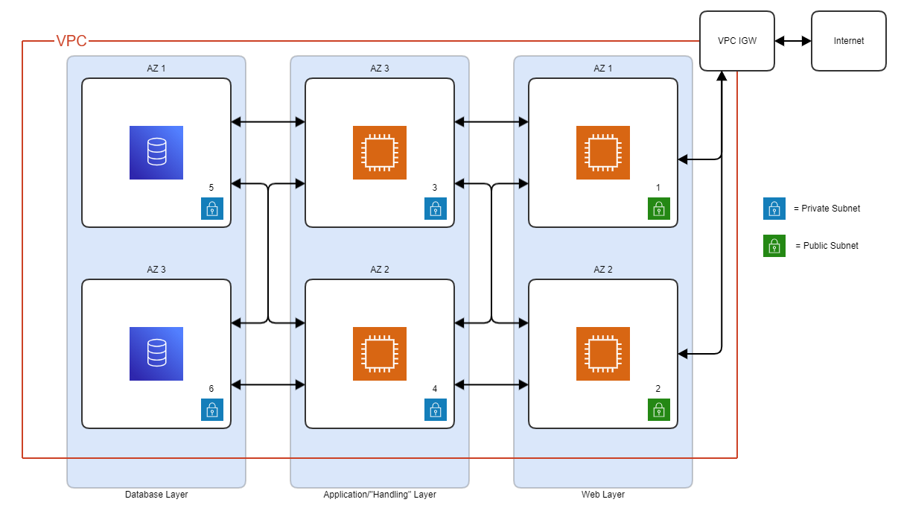
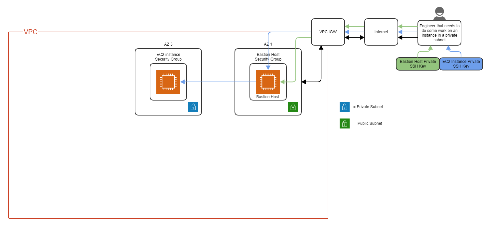

The below notes were taken while going through the AWS Cloud Practitioner Certification Preparation Learning Path on
Cloud Academy

[TOC]

# What is Cloud Computing? 

Cloud computing is a remote virtual pool of on-demand shared resources offering Compute, Storage, Database and Network
services that can be rapidly deployed at scale.

**Virtualization** - The ability to run multiple VM's, possibly running different OS', on one physical server.
* Hardware is shared among the VM's - this sharing controlled by the Hypervisor, which sits between the hardware and the
  VM's. The Hypervisor is itself software.
	* "instance" == "VM"

* Benefits include reduced costs due to the ability for multiple VM's to run on one physical machine, which
  allows the business (or cloud infrastructure provider), to save electricty, storage (of the physical machines), etc.

The 4 main services offered by a cloud infrastructure provider are:
* Compute 
* Storage
* Database
* Network

**It makes sense to host your cloud as close to the users of the cloud as possible, to cut down on latency**

## Cloud Deployment Models

1. Public Cloud
* Shared responsibility between the user (business/individual) and the provider (AWS, Microsoft ( Azure ), Google (Cloud
  Platform), Snowflake, etc).
	* Provider handles the physical storage and maintainance of the machines while the user is responsible for
	  security within the cloud and maintaining whatever system they are running.
* Capital expenditure is low (don't need to hardware and people to maintain said hardware)
* Operational expenditure is variable - you only pay for the resources you use.

2. Private Cloud
* Hardware is typically kept on premise
	* Virtualization is still a part of the system, but the hardware is managed by the company/individual as well.
* Typically more secure
* Costs more (have to maintain the physical machines, electricty, *regardless of whether you use them or not*)

3. Hybrid Cloud
* Blend of both of the above (note that this does mean you get the *worst* of both in addition to the best of both)

## Key Cloud Concepts

* On-Demand Resourcing
	* When you want a resource (larger EC2 instance, another DB, etc.) it is *almost* always available.
* Scalability
	* 'Up' and 'down' scalability - alters the power and performance of an instance.
	* 'In' and 'out' scalability - adds/removes the numbers of instances your system is using.
* Economy of scale
	* Large cloud providers can pass the part of the savings associated with virtualization onto the customer.
* Flexibility and Elasticity
	* Choose the exact architecture you need (number of instances, OS', etc.)
* Growth
	* Global datacenters allow the user to reach their end users on a global scale, not having to worry about
	  latency since the cloud infrastructure provider usually has resources around the world.
* Utility Based Metering
	* Only pay for what you use (or leave on...)
* Shared Infrastructure
	* Virtualization allows multiple services to run on one machine, thus allowing multiple users to use the same
	  physical machine (allows for economies of scale for the cloud provider)
* Highly Available
	* Having data copied to different places allows a resilience that would otherwise need to be architected on its
	  own.
* Security
	* Cloud providers are usually more secure since they have to comply with worldwide regulations.

## Cloud Service Models

1. Software as a Service (SaaS)
	* (Most applications fit this model) - allows some customization, however that customization is within the
	  context of the application.
2. Platform as a Service (PaaS)
	* Allows customization from the OS level and up (network, host hardware etc. managed by provider).
3. Infrastructure as a Service (IaaS)
	* Allows customization at the OS level and up (including virtual clouds). The hardware is typically managed by the provider.

## Common Use Cases of Cloud Computing 

* Migration of production services to the cloud (as opposed to on premises services)
* Peak season might but a strain on standard infrastructure; being based in the cloud would allow seasonal scaling
  ("Traffic Bursting")
* Backup & DR (Disaster Recovery)
* Web hosting of applications
* Test & Dev environments
* Low cost Proof of Concept
* Big Data & Data manipulation

## Data Center Architecture in the Cloud

* Location
	* public cloud providers will have regions worldwide, each region with multiple data centers
* Physical Security
	* Vendor is responsible for the physical security of their data center
* Mechanical & Electrical Infrastructure (CRAC (Computer Room Air Conditioning))
	* Generators, Fire Suppression, etc. are all on premise at the data center, and is therefore the responsibility
	  of the data center.
* Network Infrastructure (Switches/Routers/Firewalls)
	* The public cloud user is able to create configurations that simulate the logical effect of switches, routers
	  and firewalls.
	* In AWS, virtual clouds are called Virtual Private Networks (VPCs) and are configured by the end user. This
	  therefore means that the security & infrastructure *of the VPC* is the responsibility of the end user.
* Servers (Application/Directory/Database)
	* "instances" or "VMs" 
	* Providers offer services that are specific to hosting databases, or specific to high compute power
* Storage (NAS/SAN/Block Storage/Backup)
	* In the cloud, storage is effectively unlimited and highly scalable.

# Compute Fundamentals for AWS

* There are different types of compute resources on AWS - not only EC2

## EC2 - Elastic Cloud Compute

* EC2 is the "meat and potatoes" of AWS' compute infrastructure.

### AMIs - Amazon Machine Images

* An AMI is a template for a VM; this can include the OS, specific applications for your use case, custom configurations, etc.
* To create your own custom AMI:
	* Choose a basic AMI the first time you launch an EC2 instance (only specifying the OS you want for example),
	  and then once the instance is launched, you can install any applications related to your solution, configure
	  anything you like, install any applications that will need to be on all VM's of this type for your solution,
	  and save this entire setup as your own custom AMI.
	* This custom AMI can then be launched with all the configurations & installations already setup.
* AMI's are also available through the "Community AMIs" page and the "AWS Marketplace"

### Instance Types 

The key parameters of an instance type to pay attention to when launching are:
* vCPUs
* Memory (GB)
* Instance Storage
* Network Performance

* There are other parameters of lesser importance, all of which can be seen in the instance parameters table when
  launching your instance

* Instance types are grouped into families:
	* micro instances
		* very low cost - useful for low throughput purposes
	* general purpose
		* balanced mix of compute, memory and network capabilities
	* compute optimized
		* good for high performance front end servers, etc.
	* accelerated computing
		* GPU
		* FPGA - ( Field Programmable Gate Arrays )
			* used to create application specific hardware accelerations
			* High CPU performance, large memory and high network performance make these the go to for
			  solutions that require massive parallel processing; data science/genomics/financial computing
			  being some examples.
	* Memory optimized
		* lowest cost per GB of RAM than other instances
		* recommended for database applications/database components of a solution
	* Storage optimized
		* Use SSD backed instance storage, which offers high I/O thoughput.

### Instance Purchasing Options 

Different payment plans available:

* On-Demand Instances
	* launched at any time
	* flat rate per instance type
	* typically used for short term uses
* Reserved Instances
	* best applied to long term, predictable workloads (applications that you know need to be running for a set
	  period of time)
	* purchases for a set period of time for reduced cost (up to 75% reduced cost). Three options:
		1. All Upfront
			* complete payment for 1 or 3 year timeframe - highest discount.
		2. Partial Upfront
			* smaller upfront - smaller discount than All Upfront option.
		3. No Upfront
			* very small discount applied
* Scheduled Instances
	* pay for instances on a daily/weekly/monthly schedule 
	* **even if you don't use the instance, you will be charged**
	* less expensive than the On-Demand Instance, so good for recurring but predictably recurring use cases
* Spot Instances
	* Bid for unused EC2 resources.
	* Con: **Not guaranteed for a fixed period of time**
	* Pro: Can purchase large (expensive) EC2 instance types at a lower price
	* The "Spot Price" determines the price of an instance and bidding above that "gets" you the instance. If a
	  higher bid comes along while you are using the instance, **your instance will shut down**.
	  * Should only be used for tasks that can be interrupted/stopped - otherwise be prepared to continuously ensure
	    your bid price is above the spot price (either computationally or manually).
* On-Demand Capacity Reservations
	* allows you to reserve capacity (whether that is compute, memory, storage or network) within a particular
	  availability zone for any period of time.

### Tenancy 

"Tenancy" refers to the actual physical computer your VM is hosted on in the AWS data center.

* Shared Tenancy
	* your instance will be launched on any available host, most likely one that is shared with other AWS users.
	* AWS provides the security to ensure different users can't access each other's instances
	* this model is what allows "economies of scale" and makes cloud computing inexpensive.
* Dedicated Tenancy
	* Dedicated instances
		* hosted on hardware that no other AWS user can access
		* may be required by problem domain compliance requirements
		* more expensive
	* Dedicated Hosts
		* more visibility/control of the physical host than even the "Dedicated Instances" option.
		* again - may be required by problem domain compliance requirements

### User Data 

* commands that will run during the first boot cycle of the instance
* used to update software or OS'

### Storage Options

Two types:
1. Persistent Storage
	* attaching EPS (Elastic Block Storage) volumes
	* attached via AWS network - physically separated
	* can be detached from EC2 instances and maintain data 
	* data saved on EBS volumes are automatically copied to other volumes within the same availability zone for
	  backup purposes 
	* data can be encrypted and scheduled backup snapshots are possible
2. Ephemeral Storage
	* **deleted and gone forever when EC2 instance is stopped/terminated**
	* if instance is rebooted (think "continue instance use") - data is maintained
	* non-detachable

### Security

* Security group = "instance level firewall"
	* allows you to specify what traffic communicate with your instance (can be specified via IP range, protocol,
	  port range, inbound/outbound, etc.)
* Key-Pairs
	* Allows encrypted access to EC2 instances
	* Public Key = AWS keeps this to match to your private key
	* Private Key = your responsibility for safe keeping
	* **You can use the same key-pair for multiple instances** - this does mean that if your private key becomes
	  comprimised, whoever has the key would have access to all the instances associated with that key-pair.
* It is the user's responsibility to maintain and install latest OS updates & security patches released by the OS vendor
  - this is part of the shared responsibility model

## ECS - EC2 Container Service

ECS allows the user to run Docker-enabled applications packaged as containers across a cluster of EC2 instances,
**without requiring the user to manage a complex and administratively heavy cluster management system. **AWS Fargate**
manages this system for you.

Docker is software that allows everything an application needs to run to be put into a logical container, and that
container can then be run on any operating system.

Two different ECS Cluster deployement models:
1. Fargate Launch
	* the user is only required to specify CPU, memory and networking policies (in addition to having your
	  applications packaged in containers)
	* This is the option that trades lower customization for lower management overhead.
2. EC2 Launch
	* This is the option that trades higher management overhead for higher customization.
	* The user is responsible for patching and scaling instances, specifying instance types and how many
	  applications should be in a cluster.

* Monitoring of your ECS cluster and containers is provided by AWS CloudWatch
* An ECS Cluster is comprimised of multiple EC2 instances
* Security Groups, Elastic Load and Autoscaling can be applied.
* The cluster can be comprised of different EC2 instance types.
* **Clusters can only scale in a single region** (this is different from availability zones; clusters can span multiple
  zones).
* Containers can be scheduled to be deployed across the cluster.

## ECR - Elastic Container Registry

ECR provides a secure location to store and manage your docker images. This service allows developers to push, pull and
manage their library of docker images in a central and secure location

There are a few components used in ECR:

1. Registry
	* The component that hosts/stores docker images as well as create image repo's	
	* The default URL for the registry is:
	`https://<aws_account_id>.dkr.ecr.<region>.amazonaws.com`
2. Autorization Token 
	* **Before your docker client can access the registry (push & pull), it needs to be authenticated with an
	  Autorization token
	* To start the authorization process, run the following command using the AWS CLI (might need to be installed):
	`$ aws ecr get-login --region <region> --no-include-email`
	* The above command's output will be a docker login command:
	`docker login -u AWS -p <password>`
	* Authorization tokens last for 12 hours before the above process need to be performed again.
3. Repo 
	* Standard repo concept - allows grouping of docker images in whatever manner the user would like.
4. Repo Policy 
	* Repo policy's can be set up by the principal of the repo - who can then setup which actions different users
	  can perform on various repo's.
5. Image 
	* Once all the above has been completed, you/the user can push/pull docker images from your ECR.

## EKS - Elastic Container Service for Kubernetes

Kubernetes is an open source container orchestration tool designed to automate deploying, scaling and operating
containerized applications.

EKS allows the user to run Kubernetes across their infrastructure without having to interact with the Kubernetes
management system, known as the control plane. The AWS account owner only need to provision and maintain the worker
nodes if using EKS.

Kubernetes:
	* The control plane contains API's, the kubelet processes and the Kubernetes Master.
	* The control plane allocates containers onto nodes (according to CPU needs)
	* The control plane tracks the state of all Kubernetes objects, continually monitoring them.
EKS takes care of all the above processes for the AWS users

Worker nodes:
	* Kubernetes clusters are composed of nodes (worker machine - One-Demand EC2 instance on AWS)
	* Every node that is created uses a specific AMI (in order for Docker & Kubernetes to run on it)
	* Once the worker nodes are setup by the user, they can be connected to EKS with an endpoint

### Setting up EKS

1. Create an EKS Service Role
	* Create an IAM (Identity & Access Management) service role that allows EKS to provision and configure specific
	  resources. The EKS role needs the following permission policies:
		* AmazonEKSServicePolicy
		* AmazonEKSClusterPolicy
2. Create an EKS Cluster VPC
3. Install kubectl and AWS-IAM-Authenticator
	* kubectl = Kubernetes command line utility
4. Create your EKS Cluster (using above information)
5. Configure kubectl for EKS
	* run `$ update-kubeconfig` via AWS CLI to create a kubeconfig file for your EKS cluster
6. Provision and configure worker nodes
7. Configure worker nodes to join EKS Cluster

## Elastic Beanstalk Service 

**Elastic Beanstalk Service is free to use. However, any resources that Beanstalk sets up for your application (Compute,
Storage, Database or Network) are charged using the standard pricing of those resources.**

Elastick Beanstalk is a service that takes your uploaded code and automatically provisions and deployes the resources
needed to make the application operational.
	* This service is likely the most useful for engineers who may not have the familiarity, skills or desire to
	  manage the deployment, provisioning and monitoring of developed applications.

* Able to operate with a variety of platforms and programming languages, some examples being:
	* Single Container Docker
	* Multicontainer Docker
	* Preconfigured Docker
	* Python

Key Components:
* Application Version
	* reference to a specific version of the code/application that typically resides in S3
* Environment 
	* The Environment refers to the entire system of your deployed application (EC2 and S3 for example)
	* At this stage, the application has been deployed as a solution and is operational within the environment 
* Environment Configurations 
	* Parameters that dictate how the environment will have its resources provisioned by Beanstalk.
* Environment Tier
	* Applications that are communicating with other servers (usually via HTTP requests using port 80) are run in a
	  *web server environment*. AWS infrastructure usually used includes:
	  	* Route 53
		* Elastic Load Balancer
		* Auto Scaling
		* EC2
		* Security Groups
	* Applications that are doing backend jobs/processing of some kind are run in a *worker environment*. AWS
	  infrastructure usually used includes:
		* SQS Queue
		* IAM Service Role
		* Auto Scaling
		* EC2
* Configuration Template 
	* A template that provides the framework for creating a new, unique, environment.
* Platform
	* The set of components that can build your application when using Elastic Beanstalk (OS, server type,
	  programming language)

The typical Elastic Beanstalk workflow looks like the following:


## Lambda 

"AWS Lambda is a serverless compute service that allows you to run your application code without having to manage EC2
instances."

[1 Hour video on AWS Lambda and serverless apps](https://www.youtube.com/watch?v=EBSdyoO3goc)

* "Serverless" doesn't actually mean "without servers" - it just means that the cloud infrastructure provider handles
  **all** the management of Compute resources for you (EC2 provisioning, scaling, etc). Because of this, the user doesn't
  have to worry about the Computer resources, and thus it is a "Serverless architecture" from the vantage point of the
  engineer.
* **Going serverless allows the user to spend  more time on writing code related to the business problem and less time
  on DevOps**
* The user only pays for Compute resources when Lambda is in use via Lambda Functions
* AWS Lambda charges Compute power per 100 milliseconds of use only when your code is running, in addition to the number
  of times your code runs.

All of the above makes **AWS Lambda highly scalable**; pay for what you use, and don't worry managing all the Compute
resources you need for you solution to run.

1. Upload code to Lambda (make sure Lambda supports the language your code is written in).
2. Configure Lambda Functions to execute upon specific triggers from supported event sources.
3. Once the trigger is initiated, Lambda will run your using only the required resources.

## AWS Batch

Used to manage and run batch computing workloads in AWS (mostly used for high specificity cases that require large
amounts of compute power). 

Components:

1. Jobs 
	* A "job" is a class of work to be done by AWS Batch.
	* Could be an executable program, a script, or an application within an ECS Cluster.
	* Jobs can have different states such as 'Submitted','Pending','Running','Failed',etc.
2.
3. Queues
	* jobs are placed into queues (multiple queues can have different priorities)
	* AWS Batch can bid on Spot instances on your behalf.
4. Scheduling
	* The scheduler takes care of ensuring the high priority items are run first (assuming dependencies are met).
5. Compute Environments 
	* Managed (*i.e. managed by Batch*)
		* Handles the provisioning, scaling and termination of compute resources based on need.
		* This environment is created as an ECS Cluster
	* Unmmanaged (*i.e. managed by the user*)
		* Greater customization = greater administration (by the user)
		* The user must create the ECS cluster.

As one would expect, this service lends itself to solutions that require/depend on parallel processing (in the Data
Science world, this could take the form of bagged models (GLM's, random forests, etc.))

## Lightsail

Similar to EC2, Lightsail is an VPS (Virtual Private Server), similar to EC2, however there are fewer configurable steps
during its creation.

* Designed to be simple compute resources that a small business or single user could use on an ongoing basis, or just as
  a "one-off" resource.

Lightsail can be accessed via the AWS Console under the Compute category and has a one-page setup.

Choose:
1. Region/availability zone
2. Instance image (OS) 
3. Blueprint (whether you want any apps pre-installed)
4. Launch Script (if you want)
5. Key-Pair (by default one is provided, however you can choose your own)
6. Instance plan (how much you pay)
	* Although the price is calculated as 31.25 days * 24 hours per day (aka monthly rate) - 
	* Instances are charged as On-Demand (only pay for it when using it).
7. Name for Lightsail instance
	* Also prompted to add 'tags' to help organize your Lightsail instances 

* Use the "Connect" tab to view IP to connect to via SSH.
* Use the "Snapshots" tab to backup the information on your instance.

* **Deleting your instance and shutting down are different.**

## ELB - Elastic Load Balancer

The main function of an ELB is to help manage and control the flow of inboud requests destined to a group of targets by
distributing these requests evenly across the targeted resource group
* Targets could be EC2 instances, Lambda functions, different Docker containers, etc.
* Targets can be in a single Availability Zone (AZ) or across multiple AZs

* The "Elastic" in the name means that an ELB will automatically scale up or down as incoming traffic
  increases/decreases *without any management on the part of the user*.
	* Dynamic scaling can be setup simply.

**ELB Types**

* See [this table](https://aws.amazon.com/elasticloadbalancing/features/#compare) for a comparison of the different ELB
  types

1. Application Load Balancer (ALB)
	* ALBs operate at level 7 of the [OSI model](https://en.wikipedia.org/wiki/OSI_model)
	* Flexible feature set for applications using HTTP/HTTPS protocols.
	* **Operates at the request level.**
	* Advanced routing, TLS (Transport Layer Security) termination and visibility features targeted at application
	  architectures.
	* Target groups can be setup so all requests of a specific protocol are routed to that group, through a specific
	  port.
2. Network Load Balancer (NLB)
	* NLBs operate at level 4 of the [OSI model](https://en.wikipedia.org/wiki/OSI_model)
	* Ultra-high performance while maintaining very low latency.
	* **Operates at the connection level.**
	* Can handle millions of requests per second.
3. Classic Load Balancer
	* Used for applications that were built in the existing EC2 Classic Environment.
	* **Operates at both the connection and request level.**
	* This should only be used for an existing application running in the EC2-Classic network (legacy AWS
	  infrastructure)

**ELB Components**

1. Listeners
	* Defines how inbound connections are routed to target groups based on ports and protocols set as **conditions**
	  (think `if else` statements).
2. Target Groups
	* A group of resources to which the ELB will route requests.
	* One ELB can have multiple different target groups, each associated with different listener configurations and
	  associated rules.
3. Rules
	* Rules (think `if else` statements) define how an incoming requests gets routed to which target group.
4. Health Checks
	* The ELB can (and does) contact each target within a target group using a specific protocol to receive a
	  response. If that response doesn't come back, the ELB marks that target as 'unhealthy' and stop sending
	  traffic to that target.
5. ELB Schemes
	* 5.1 Internet-Facing ELB
		* As the name suggests, this ELB scheme handles connections/requests coming from other
		  applications/servers through the internet. Due to this, this ELB scheme has a public DNS and
		  associated Public IP.
	* 5.2 Internal ELB
		* This scheme is only used for communication within an applciation/system/solution. Therefore, this ELB
		  only has a internal IP address and can therefore only communicate with requests that come from within
		  the users VPC.
6. ELB Nodes
	* Each AZ you intend to work in needs to have its own ELB node
7. Cross-Zone Load Balancing
	* Allows the ELB to send requests to targets that aren't in its AZ.

* An ELB can contain 1 or more listeners, each listener can contain 1 or more rules, each rule can contain 1 or more
  conditions. **All conditions result in a single action.**

### SSL Server Certificates 

SSL = Secure Sockets Layer
	* SSL is a cryptographic protocol, similar to TLS (Transport Layer Security)

* HTTPS requests will sometimes need to be used in lieu of HTTPS requests to ensure an encrypted connection between a
  client sending a request and your ALB.
	* In order set this up, you will an SSL certificate.
* The server certificate that the user will need to set up is an *X.509 certificate* (digital ID provisioned by a
  Certificate Authority and managed by AWS Certificate Manager ( ACM ))
	* This certificate is used to terminate the connection between the client and your application/solution, and
	  only then is the request decrypted and sent to the resources in the ELB target group.

* ACM allows you to provision and configure any SSL certifcates that will be used inside your AWS solution (most AZ's
  are supported). If the AZ you are in isn't supported, you will have to configure a certificate using IAM.

## EC2 Auto Scaling 

As the name suggests, EC2 Auto Scaling means that a solution can scale its compute resources up or down, based on
demand, so that the user doesn't have to worry about overloading any resources, and also doesn't have to worry about
spending money on resources they aren't using.

**Components**

1. Create a Launch Configuration or Launch Template
	* **This must be setup prior to setting up the Auto Scaling Group** - otherwise the group wouldn't know what
	  instance type and specifications to use when launching a new instance.
	* Launch Configuration and Launch Templates are very similar, the only real difference being that a Template
	  allows the user to specify a few advanced options, and has the entire setup process on one webpage (as opposed
	  to the Launch Configuration, which goes through multiple webpages.)
	* One of the two options is needed in order to specify new instance parameters such as:
		* the AMI to use.
		* the instance type to use.
		* whether the instance should have a public IP.
		* the storage volume the instance should use .
		* the security groups (if any) the new instance should be associated with.
2. Create an Auto Scaling Group
	* Select the Launch Template or Configuration that new instance will be launched from.
	* Set up the "Starting Instance" count.
	* Set up the minimum and maximum number of instances that your solution can scale between.
	* Set up the conditions that need to be met for "Scaling Up" (i.e. Average CPU usage >= 75% for 3 minutes).
	* Set up the conditions that need to be met for "Scaling Down" (i.e. Average CPU usage <= 30% for 3 minutes).
	* Set up AZs in which new instances will be created.

### Combining ELB & EC2 Auto Scaling 

Although ELBs and EC2 Auto Scaling *can* be used independently, they work best together.
	* If you have a fixed number of instances/compute resources in a target group of an ELB, if you need more, the
	  user will have to manually add more. If you need less, the user will have to manually remove some.
	* If you have an EC2 Auto Scaling group without an ELB, how are you going to distribute traffic/requests evenly
	  across your instances?

* ELBs allows incoming traffic to be *averaged* across all resources within a target group.
* EC2 Auto Scaling can be setup to *scale* the resources in that target group.

* To associate an ALB or NLB, you must associate the auto scaling group with the ALB or NLB target group. This is
  performed by editing the configuration of the Auto Scaling Group from the AWS Management Console.
	* Note that there are two sections that are related to ELBs; the "Classic Load Balancer" field and the "Target
	  Groups" field. The former is for the legacy ELB version (see above), and the latter ('Target Groups') should
	  be used for all newly created ALBs or NLBs.

# Storage Fundamentals for AWS

There are more storage options provided by AWS than those listed here, however the "big three" if you will are:

* EBS - Elastic Block Volume
	* Low latency
	* Should be used like a traditional hard drive
* S3 - Simple Storage Service
	* Best for large objects that don't require frequent reading and writing.
* EFS - Elastic File Storage
	* "Traditional" file system

## EBS - Elastic Block Storage

Provides storage to EC2 instances via 'EBS Volume'

* Persistent, block level storage connect to EC2 instances via AWS network.
* An EBS volume can be attached/accessed to/by **only one** EC2 instance, however multiple EBS volumes can be attached
  to a single instance.
* 'Snapshots' (aka backups) can be performed manually or setup to run on a scheduled basis.
	* Theses backups are stored in an S3 bucket.
	* EBS volumes can be recreated from snapshots
	* Snapshots can be copied from one availability region to another

**Reliability**
* Every write to an EBS volume is repeated multiple times to protect against a complete loss of data.
* **Volumes can only be attached to an EC2 instance in the same availability zone**

### Volume Types

* Having two volume options (below) allow the user to trade performance for cost in the best manner for their solution.
* Different volume types have different IOPS (Input/Output per Second) thresholds

1. SSD (Solid State Drive)
	* Best for smaller blocks of data.
	* There are two sub-types of SSD's:
		* 1.1 General Purpose SSD
		* 1.2 Provisioned IOPS SSD
			* Highest performance EBS volume (best for low-latency requirements)
2. HDD (Hard Disk Drive)
	* Best for larger blocks of data.
	* Designed for workloads that require a higher rate of throughput.
	* There are two sub-types of HDD's:
		* 2.1 Throughput optimized HDD
			* Best for large blocks of data that are still throughput intensive
			* **These volumes can NOT be used as boot volumes for instances**
		* 2.2 Cold HDD
			* Best for large blocks of data that don't need to be accessed frequently.
			* **These volumes can NOT be used as boot volumes for instances**

There are a few ways to create an EBS volume

1. During the launch of an EC2 instance
2. As a standalone EBS volume that can be atttached to an EC2 instance when required

During the creation of the volume, the user can choose:
* Whether to create the volume from a snapshot (of a previous volume) OR start a blank volume
* Size
* Volume type 
* **What happens to the volume when the EC2 instance terminates**
* To encrypt or not to encrypt

## S3 - Simple Storage Service 

* Most common storage service in AWS (applicable to many use cases).
* Theoretically unlimited storage.
* Supports individual files sizes up to 5 TB.
* S3 is object based - meaning **it does not store objects (files) in a traditional hierarchy**. The address space is
  flat and therefore each object has a unique URL by which it can be accessed.
	* You **can** create folders/directories **within** a bucket to help with organization; however, S3 itself is
	  not a hierarchical file system.
		* Each object saved in S3 has a "key", which can be thought of as the filepath (it includes and
		  directories within the bucket). The "full path" aka full URL for an object within S3 will be its
		  bucket name and the object key.
* S3 is a regional service; to ensure data persistence, AWS makes multiple copies of your data within different AZs
  within the region you selected. This provides "Eleven 9's" worth of data integrity (99.999999999% durability = very
  low likelihood of losing data).
* Availability is **not** the same as Durability; AWS provides 99.5% - 99.99% data *Availability*, which means you will
  be able to access your saved data 99.5% - 99.99% of the time. *Durability* refers to the the likelihood your data
  isn't lost or corrupted.
* **Data versioning is an option.**

To save an object in S3 (manually):
1. Create an S3 bucket with a **globally unique name**.
	* This can be accessed via the AWS Management Console, and selecting "S3" under the "Storage" header.
	* This means that your bucket name has to be unique **across all of AWS** (can't just be unique *to you*).
	* by default, your account has a soft limit of 100 buckets, however this can be increased by contacting AWS.

### Storage Classes

Different storage classes allows the user to choose the tradeoffs between cost and accessibility that best suits the
problem they are working on. There are 6 different storage classes:

1. S3 Standard
	* general purpose storage
		* High throughput and low latency
	* Lifecycle rules are an option 
		* Lifecycle rules allow the user to setup a configuration that automatically moves objects saved in S3
		  to a different storage class (i.e. if you haven't accessed some data in a while but still want to keep
		  it around for the "just in case" moments, you can have that data moved to a less expensive and less
		  easily accessible storage class).
	* SSL encryption is available for data both at rest in an S3 bucket and in transit to/from and S3 bucket.
2. S3 Intelligent Tiering (S3 INT)
	* Best for use cases where the data access rate is unknown in advance.
	* S3 INT has two subclasses; Frequent Access and Infrequent Access.
		* **These subclasses are not the same as the "meta" versions with the same name; these subclasses are
		  "within" the logical set of "S3 INT"**
	* By default, an object is placed in the Frequent Access tier; if it hasn't been accessed in 30 days, it is
	  moved to the Infrequent Access tier. As soon as it is accessed again, it is moved back to the Frequent Access
	  tier and the clock starts again.
	* Lifecycle rules are an option.
	* SSL encryption is available.
3. S3 Standard Infrequent Access (S3 S-IA)
	* Similar to the Infrequent Tier subclass of the S3 INT storage class (above).
	* Designed for object that aren't going to be accessed frequently (duh).
	* Lifecycle rules are an option.
	* SSL encryption is available.
4. S3 One Zone Infrequent Access (S3 Z-IA)
	* Designed for object that aren't going to be accessed frequently (duh).
	* Durability of Eleven 9's, however this is *within a single AZ, as opposed to S3 S-IA, which has the same
	  Durability but across multiple AZs*. This change offers the user a 20% decrease in cost.
	* Lifecycle rules are an option.
	* SSL encryption is available.

Glacier Classes:

* A fraction of the cost of the above storage classes, the tradeoff being you don't get instance access to your
  data.
* Best suited for "Cold Storage" - objects that will likely not need to be accessed but need to be kept around
  "just in case".
* Eleven 9's of Durability.
* **No GUI for moving objects into Glacier "Vaults" (as they are called);** the GUI can only be used to create
  the vaults. After that, data must be moved into the vaults via APIs, SDKs, or the AWS CLI (or, through
  Lifecycle rules set up in the more frequent access classes).

5. S3 Glacier
	* Data *can* be accessed via 3 different routes, each with a different cost (listed in descending order relative
	  to cost):
		1. Expedited
			* Available in 1-5 minutes
			* Data must be under 250 MB.
		2. Standard
			* Available in 3-5 hours.
			* Any size.
		3. Bulk
			* Available in 5-12 hours.
			* Used for retrieving PB's of data at a time.
6. S3 Glacier Deep Archive (S3 G-DA)
	* Minimal access.
	* Retrieval available within 12 hours (only one option).

* Check out [this link](https://aws.amazon.com/s3/pricing) for pricing information.
* Check out [this link](https://aws.amazon.com/s3/storage-classes/?nc=sn&loc=3) for a performance summary of all S3
  classes.
* Remember that the user gets 99.999999999% data durability by replicating the data across multiple AZ's within a single
  region.
	* If the user needs to access their data across region, they will need to configure *Cross Region Replication*,
	  which, as the name implies, replicates data across regions.

## EFS - Elastic File System

* **Can be concurrently accessed by multiple (up to thousands...) of EC2 instances**
* Uses a "traditional" hierarchical structure
* EFS automatically "auto scales"; the user doesn't need to provision "more space"
* Throughput and IOPS also dynamically scale
* [Is not supported for instances using a Windows OS](https://docs.aws.amazon.com/AWSEC2/latest/WindowsGuide/AmazonEFS.html)
	* another reason to hate windows...
	* Checkout [AWS FSx](https://aws.amazon.com/fsx/) for Windows
* AWS Region agnostic.

Once the EFS is created, the user can create "mount points" within their VPC; once this is performed, any EC2 instance
can read and write data to the EFS.

## AWS Snowball & Snowmobile

* If the user needs to transfer a large amount of data to be the cloud (or from the cloud to on-premises in the case of
  a DR plan), AWS offers two options:
	* Snowball:
		* AWS ships a physical device (the "snowball") to the user that can contain 50TB - 80TB of data.
			* dust, water, and tamper resistant.
		* Multiple devices can be used to scale to Petabyte size.
		* This/These devices are then shipped back to AWS where the are uploaded to S3.
		* Configured for high speed data transfer. Each snowball has the following recievers installed,
		  supporting 10 Gigabit transfer speeds:
			* RJ45 (Cat6)
			* SFP+ Copper
			* SFP+ Optical
		* Encrypted by default
		* HIPAA Compliant
	* Snowmobile:
		* Exabyte-scale transfer service.
		* A "snowmobile" is a 45 foot long shipping container pulled by a semi-truck to the user to which data
		  can be uploaded and then sent back to AWS.
		* Can transfer up to 100PB per snowmobile.

# Database Fundamentals for AWS

* Database: Any mechanism for storing, managing and retrieving information
* **"Databases are the foundation of modern application development. A database's implementation and how data is
  structured will determine how well an application will perform as it scales."**
* **Each database type is optimized to support a specific type of workload. Matching an application with the appropriate
  database type is essential for highly performant and cost-efficient operation.**

9 AWS Database Categories:

1. Relational Databases
2. Key-Value Databases
3. Document Databases
4. In-Memory Databases
5. Graph Databases
6. Columnar Databases
7. Time Series Databases
8. Quantum Ledger Databases
9. Search Databases

Choosing a database strategy:

* Choosing a database used to be a platform choice (as opposed to a choice based on the problem domain/technology); 3-4
  vendors would be considered, and once one was chosen (most likely based off of price point), *every application would
  be built using the chosen platform*. While one *can* make a database type work for most solutions, that doesn't make
  that database type the "right" choice.
* Choosing a database type should be based on the data itself; it is possible, sometimes logical, to have a single
  application use more than one database type.

2 Workload Types:
1. Operational Workloads
	* OLTP ( Online Transactional Processing ) applications are the most common built applications and are centered
	  around a set of common business processes that are: **Regular, Repeatable and Durable.**
	* Usually powered by relational databases.
2. Analytical Workloads
	* OLAP ( Online Analytics Processing ) applications are those used for data analysis and machine learning. **The
	  goal is to gain insight.** Workloads are often retrospective, streaming and predictive.

There are two "meta types" of databases:
1. Relational Databases
	* Used for structured data
	* Schemas are the logical blueprint of how data relates to other data. Schemas need to be full designed before
	  any data can be entered into a relational database.
		* Schema changes are costly in terms of time and computation. Additionally, schema changes run the risk
		  of corrupting data.
	* "Schema's are designed based on reporting requirements. This means that a database's expected output drives
	  the creation of the database and how data is stored inside it."
		* Personal (i.e. not in the course) note/opinion: I'm not sure how much I agree with this; this implies
		  that application developers and DBA's "work backward" from the use case to how the data should be
		  structured. What if a new requirement arises? It seems more logical to me to create a schema that maps
		  what the data represents (the "information" so to speak) together in a logical manner.
	* Modeling Data
		* Structured data is almost always stored in tables.
			* Tables have Primary Keys (PKs) that uniquely identify the information in that table.
			* Tables have Foreign Keys (FKs) that are PKs in another table.
	* Data Integrity
		* "ACID" is the acronym for the governing principles of databases that ensure data is reliable and
		  accurate:
			* Atomicity:
				* Refers to the elements that make up a single database transaction.
				* Transactions are treated as "all or nothing"; they either succeed completely or fail
				  completely.
			* Consistency
				* Refers to the database's state.
				* Transactions **must** take the database from one valid state to another valid state.
			* Isolation
				* Refers prevents one transaction from interfering with another.
			* Durability
				* Refers to data changes being permanent once the transaction is committed to the
				  database. 
		* Keys 
			* PKs and FKs are constrained to ensure database stability.
			* **Entity Integrity**: Every table must have a PK that is unique to that table and the PK can
			  not be blank for null
			* **Referential Integrity**: Every value in a FK column exists as a PK in its originating table.
	* Data Normalization
		* Data is stored in relational databased to be highly normalized.
		* Normalization is a process where information is organized efficiently and consistently before storing
		  it.
	* Scaling and Sharding
		* A "Shard" is a copy of an exact copy of databases schema, possibly filled with slightly different
		  information.
		* Example: A Shard might contain all data for a set of customers in a specific geographic zone. Another
		  shard would contain the same data for a different set of customers in a different geographic zone.
		* Scaling:
			* Horizontal: Adding a copy of the database server (aka "Sharding")
			* Vertical: Growing the server (more memory, CPU, disk volume).
				* Vertical scaling has limits (dictated by the physical components of the server). Once
				  this limit is reached, the database must be sharded to grow.
2. Non-relational Databases
	* Used for unstructured and semi-structured data
	* Shema-less (which allows unstructured and semi-structured data stored).
		* This aspect allows application developers to not have to wait for a database schema to be fully mapped
		  out before "getting to the real problem".
	* NoSQL
		* NoSQL = "Not Only SQL"
		* Broad term that encompasses different database models, some basic common characteristcs being:
			* Non-relational.
			* Open-source (typically this is the case - this isn't a necessity).
			* Schema-less.
			* Horizontally scalable.
				* "Shared Nothing" Architecture - each node has one shard of the NoSQL database, and can
				  thus work independently of all other processes on other nodes.
			* Do not adhere to ACID constraints.
				* By relaxing the "Consistency" principle of ACID, NoSQL systems can be highly durable
				  and available. Relaxing the Consistency principles isn't a problem with NoSQL because
				  NoSQL solutions were designed for inconsistent data.
		* Most NoSQL databases access their data using their own custom API, or possibly a combination of their
		  own custom API and "traditional" SQL. **There isn't a universal query language that is supported by
		  all NoSQL databases.**
	* Some examples of NoSQL databases models are:
		1. Key-value Databases
			* (think a database whose entire structure is similar to a map/Python dictionary)
		2. Document Store Database
			* Example: A database whose structure is similar to JSON; there can be nested keys, and the
			  values can only be accessed by going "down the hierarchy".
		3. Graph Store Database
	* Advantages of NoSQL over SQL:
		* Scaling is easier (horizontal instead of vertical scaling).
		* NoSQL = less consistency, higher scalability/performance.
		* SQL = more consistency, more difficult/less scalability.

## RDS - Relational Database Service

AWS's grouping of relational database engines. There are 6 options:

1. Amazon Aurora
	* AWS's cloud-native version of MySQL and PostGreSQL.
2. MySQL
	* Considered the #1 open source relational database management system.
3. PostGreSQL
	* Close #2 behind MySQL for open source DB's.
4. MariaDB
5. Oracle
6. Microsoft SQL Server

* Choose the instance type that you will run your DB on based on the problem domain; general purpose might be the best
  option for one problem, but memory-optimized might be needed for another.
* Multi AZ:
	* If the user wants to have a failover for the RDS DB in case something happens to the primary instance, select
	  *Multi AZ* when deploying the primary instance. This creates a second copy of the primary RDS instance in a
	  separate AZ within the same region as the primary one.
	* Replication of data from the primary instance to the secondary instance happens syncronously.
	* If the primary instance does fail (for whatever reason), the RDS failover process takes places
	  automatically without the need for user input. RDS will update the DNS record to point to the secondary
	  instance for you.
	* Fore more info, check [this link](https://cloudacademy.com/course/using-rds-multi-az-read-replicas/)
* Storage Scaling:
	* Storage Autoscaling is an option that can be selected for the following RDS engines:
		* MySQL, PostGreSQL, MariaDB, Oracle and Microsoft SQL Server.
			* All use EBS volumes for storage.
		* When setting storage autoscaling, the user must set the minimum (start size) of the DB and the maximum
		  size to which the DB can scale.
	* Amazon Aurora	uses shared cluster storage, and thus doesn't need to be manually set to autoscale; autoscaling
	  is automatically configured.
* Compute Scaling:
	* Vertical (enhancing performance of current instance(s)) or Horizontal scaling (increasing the count of
	  instances) can be scheduled, or happen immediately.
	* "Read Replicas" are copies of your database that can be created so that 'read only' traffic has a dedicated
	  instance. This allows the read and write functionality to each have a dedicated instance (the read replica
	  updates itself from the main DB on an asyncronous interval).
* Snapshots can be setup on a recurring interval.

### Creating a RDS DB

1. Click on 'RDS' from the AWS Management Console
2. Create a DB.
	* (there is an option to restore from S3 as well)
3. Choose the DB creation method: Standard or Easy:
	* Standard: allow the user to configure more specifications.
	* Easy: as it sounds, gets the user up and running faster with fewer configurable options (kind of like the
	  "Lightsail" of Storage).,
4. Choose a DB engine type (see above for options).
5. Choose the engine version
6. Choose a template:
	* "Production", "Dev/Test" and "Free Tier"
7. Create a DB instance identifier (note this is not the name of a table).
8. Choose DB instance size.
9. Choose storage type and the minimum and maximum storage (for storage).
10. Choose to enable/not enable Multi AZ.
11. Walk through the Standard configurations, selecting the appropriate methods for your use case. 

* Note that at the end of the RDS DB setup, there will be a section that has the estimate of the monthly cost of running
  your DB.

## Nonrelational Databases

### DynamoDB 

* AWS's Key-Value (NoSQL) Database 
* Associative array == dictionary == hash table/array (all very similar JSON)
	* **Key must be unique**
		* Most likely good to have a naming convention for keys to ensure the structure is organized.
* Data is stored and retrieved using `get`, `put` and `delete` commands
* Queries are based on the key
* Used for high performance applications with single digit latency.
* **Not optimized for search operations; it is very expensive to scan the entire key-value store**
* Use cases:
	* Commonly used for in-memory data caching. They can speed up applications by minimizing reads and writes to
	  slower disk-based systems.
* Advantages of DynamoDB:
	* Fully managed by AWS
	* Schema-less
	* Highly available
	* Fast (regardless of size (unlike relational DBs))
* Disadvantages of DynamoDB:
	* Eventual Consistency
		* This means that there is the possibility that stale data is returned from a query.
	* Queries are less flexible than SQL
		* Computation will have to be done in the application itself.
	* Workflow limitations:
		* Maximum record size of 400 KB
		* maximum indexes per table: 20 global, 5 secondary.
	* Provisioned throughput
		* IOPS must be set in advance; therefore if the user exceeds this threshold, the query will fail.

#### Creating a DynamoDB

Since DynamoDB is a NoSQL DB, there are fewer specifications required to get things up and running.

The bare minimum to get a DynamoDB started:

1. Choose a Table Name
2. Choose a PK for that table (used to partition across hosts for scalability and availability).
3. Accept remaining defaults
4. Create the DB

if you don't want to accept all the defaults, there are a few more options:

(continued from 2 above)
3. Add a secondary index
	* 1 query can only use 1 index, so if you want to search across multiple attributes, you will need to create
	  additionaly indices.
4. Select Read/Write Capacity
	* AWS bases the cost of DynamoDB on the amount of read/write capacity units.
	* by default, there are 5 read capacity units and 5 write capacity units (RCUs and WCUs).
	* There are two capacity modes the user can choose from:
		* Provisioned: The user sets the RCUs and WCUs 'up front'. This is useful if the workload is
		  known in advance.
		* On-Demand: As the name implies, RCUs and WCUs are **not** specified up front, and are scaled on
		  demand. **This is more expensive than the Provisioned mode,** and therefore should be used when you
		  are unsure what traffic you will have. Once you have an estimate of your RCUs and WCUs needed for
		  performance, you should switch to Provisioned mode to be more cost effective.
5. Set Encryption protocols
	* By default, data is encrypted at rest.

### DocumentDB 

* Designed to store, query and index JSON data.
* Scale horizontally
* Simiilar to key-value stores, however the value can be another key-value pair (nested however many times one would
  like). In the abstract, the values in Document Databases are called "Documents".
* Data inside a document can be queried, as opposed to a key-value database where the entire value is returned from a
  single query.
* Use cases:
	* commonly used for storing sensor data from IoT devices.

### Keyspaces (Apache Cassandra) 

* AWS's Column Store database
* Uses a "keyspace" to define the data it contains.
	* Keyspace = set of column families that are similar to table in a relational database.
		* A column family consists of multiple rows.
		* Each row can contain a different number of columns.
		* **Each column is limited to its row.** (in other words, columns do not span all rows in a column
		  family)
		* Each row has a the following components:
			* Row Key (unique identifier)
			* one or more columns. Each column contains a name-value pair, and a timestamp of the datetime
			  the data was inserted (in order to find the more recent version of that data).
* Efficient for data compression and partitioning, as well as applications ther rely heavily on parallel processing.

### ElastiCache

* AWS's In-Memory data store options (best for real-time data access applications)
	* **Not technically a database**; since it is a "data storage" option, it is included here.
* Primary use case is to provide an application with inexpensive access to data with sub-millisecond latency.
* cached data == stale data 
	* The price you pay for not having to query the database is the data isn't the most up-to-date.
	* Caching should provide a speed or cost advantage. It doesn't make sense to cache data that is dynamic or that
	  is seldom accessed.

There are two subtypes:
1. ElastiCache for Redis
2. ElastiCache for Memcached

### Neptune

* AWS's Graph Database
* Used for storing graphical data (e.g. networking applications)
* Components are:
	1. Nodes/Vertices - represent logical entities.
	2. Edges - represent the relationship between two (or more) vertices.
* Many Graph databases use their own proprietary query language
* Use cases:
	* Network based applications
	* Problems whose data can be modeled via a graph.

### Timestream

* AWS's Time Series database
* Timestamps are almost always the key in a time series databases

### Quantum Ledger 

* AWS's ledger database
* Useful for recording transactions of an application
* **All data is immutable**
	* the action of updating data creates a new version of the record.
	* changes to the database do not overwrite existing database records.
* Uses hashing to verify that data hasn't been changed.
	* Uses blockchain technology when creating hashes:
		* Uses the data **and the hash of the previous data** to create the new hash value.
		* Due to using this technology, data that is stored in a quantum ledger database can not be altered
		  without leaving a trace (even by a skilled programmer). Thus, this database is good for uses cases
		  where auditability might be a concern.
* Use cases:
	* Banking
	* Insurance applications (to track the history of claims)

### Elasticsearch Service

* AWS's search database
* Search databases often work with highly unstructured data that is far from consistent.
* Indexes are stored as JSON documents
* Uses an inverted index for fast full text searches.
	* Inverted Index: Lists every unique word in a document and identifies all documents where each word occurs.

# Network Fundamentals for AWS

The pillar of the networking on AWS is the VPC - Virtual Private Cloud. For a comprehensive tutorial, check [the
documentation](https://docs.aws.amazon.com/vpc/latest/userguide/what-is-amazon-vpc.html)

## VPC

* VPCs are **isolated** segments of the AWS cloud; they can be thought of as distinct 'computational universes' that
  aren't connected to other VPCs (or the internet) by default.
* Default = 5 VPCs per region per AWS account.
* High level view of creating a VPC:
	1. Give your VPC a name.
	2. Define an IP address range the VPC can use - in the form of a CIDR block (Classless Inter-Domain Routing).

## Subnets

* "A VPC subnet is a range of IP addresses in your VPC. You can add one or more subnets in each Availability Zone, but
  **each subnet must reside entirely within one Availability Zone and cannot span zones**"
* Subnets are a subset of your VPC.
* In the same way that the VPC must have a CIDR block assigned to it, each subnet must have a CIDR block assigned to it.
* Subnets can communicate with other subnets within a VPC be default.
* A route table is a set of rules that determine how traffic flows into, out of and within your VPC.
* Subnets are private by default (i.e. not connected to the internet). To make a subnet public, an internet gateway
  (IGW) must be attached to your VPC, and then the address of the IGW must be added to the route table of the subnet you
  would like to make public.
* Subnets must be associated within an AZ within the region of your VPC.
* For high resiliency and availability, it is best to replicate services and their subnets across multiple AZs.
	* In the image below, services are replicated across AZs. If one of the 3 AZs fails, there won't be an
	  interruption in service.



* Note that not all IP addresses in a subnet's CIDR block are available to be assigned to various hosts:
	* Certain IPs are reserved for AWS networking, DNS, and other routing services.

## NACLs - Network Access Control Lists 

* [AWS Documentation](https://docs.aws.amazon.com/vpc/latest/userguide/vpc-network-acls.html)
	* "A network access control list (NACL) is an optional layer of security for your VPC that acts as a firewall
	  for controlling traffic in and out of **one or more** subnets."
* **Allow/Deny traffic at the network level**.
* NACLs are network firewalls. They determine what traffic is allowed to flow into/out of one or more subnets.
	* Note that this is not the same as route tables.
	* Route tables define **how** traffic moves **within** a subnet.
* NACLs define rules for both inbound and outbound traffic.
* Rules in NACLs are executed in a similar fashion to `if elif else` statements:
	* Once a condition is met, the action associated with that condition is executed and traffic is denied/allowed
	  accordingly. **No conditions are checked after one is met.**
* **Stateless**

## Security Groups

* **Control traffic at the instance level ( as opposed to the network level (NACLs) )**.
* Different setup from NACLs in that there isn't a "Allow/Deny" field in the setup table; with Security Groups, if there
  is a row specifying a Type, Protocol, Port, etc, then that type of traffic is allows. In short, if the traffic is
  specified in the security group, it's allows to communicate with the instance. If it isn't in the Security Group, it
  is denied.
* **Stateful**

## NAT Gateway 

* NAT = Network Access Translation
* "A NAT Gateway allows intances within a private subnet to access the internet while blocking all traffic that
  originates from the internet."
	* This is necessary because the user is responsible for keeping the OS' of instances within a private subnet up
	  to date.
* NAT Gateways are logically located within a public subnet (and therefore access the internet the same way any other
  resource in the public subnet does - through the IGW).

## Bastion Hosts

* Since instances within a private subnet are, by designe, not able to be accessed via the internet, there needs to be a
  way to access these instance for developers/engineers to work; enter Bastion Hosts.
* Bastion hosts are EC2 instances used for developers/engineers to access EC2 instances within a private subnet.

In the image below:
* The engineer has two private SSH keys on his machine; one that accesses the bastion host and one that accesses the EC2
  instance in the private subnet.
* Working backwards (from EC2 instance to dev computer):
	* The security group of the EC2 instance in the private subnet must be configured to allow traffic from the
	  bastion host in the public subnet (via SSH).
	* The security group of the bastion host must be configured to allows traffic from the developer's/engineer's
	  computer (via SSH).
	* The NACL of the public subnet allows traffic from the IGW.
	* **SSH Agent Forwarding** allows the developer to use the bastion host and "jump" to the EC2 instance he wants
	  to work on.



## VPN & Direct Connect

**VPN**
* In order for a VPN to work your VPC in AWS, your VPC needs to be configured with a virtual gateway.
* The machine frmo which you want to connect to your VPC will need to have a customer gateway configured.
* A VPN tunnel is then created between the customer gateway and the virtual gateway.
* The route table of the private subnet will need to have the virtual gateway & target machine IP set up as well.

**Direct Connect**
* Does **not** use the internet to connect to a remote machine (i.e. your traffic doesn't cross public networks).
* Uses a "middleman" (Direct Connect Location) to connect the user to AWS:
	* The user has a router on premises that connects to a their router at the Direct Connect Location.
	* The users router **at the Direct Connect Location** connects to AWS' router, **also at the Direct Connect
	  Location.**
	* This router connects to a virtual gateway associated with the users AWS infrastucture.
* You can still use a VPN over Direct Connect, although it isn't necessary since your traffic is on a private network.

## VPC Peering

* Connects two VPC's together.
	* 1:1 connections only - so if you want to connect 3 or more VPC peers, they will have to be pairwise.
* Can connect VPCs in the same region or in different regions.
* The CIDR blocks can't have **any** overlap of two connected VPC's.

## Transit Gateway 

* Similar to VPC Peering, although the AWS Transit Gateway allows the user to connect a VPC to more than one other VPCs.
* Can be thought of as a 'central hub' for VPC connections - it drastically reduces the number of connections the user
  has to manage:
	* If X is connected to a Transit Gateway, it can access everything else that is connected to the Transit
	  Gateway.

# Management Fundamentals for AWS 

* All of the tools below can be found from the AWS Management Console, under the "Management Tools" header.

## Config

* With cloud based architectures having the ability to adapt to problem domain changes, the architecture can constantly
  be changing (as it is designed too), and therefore hard to keep track of. Config is AWS' tool to make managing your
  resources easier.
* There are many questions that typically come into play in managing resources, some being:
	* What resources do we have?
	* Are there any security vulnerabilities?
	* How are the resources linked within the environment?
	* Do we have a history of the changes made to the architecture?
	* Is the infrastructure compliant with domain specific governance/compliance controls?
	* Do we have accurate auditing informaion?
* AWS Config captures changes to your AWS environment so that managing your resources is easier. Some things Config does:
	* Act as a resource inventory
	* Capture resources changes
	* Store configuration history
	* Provide a snapshot of configurations (at timepoint *t*)
	* Send notifications about changes
	* Provide AWS CloudTrail integration (tracks who made an architecture change)
	* Use Rules to check compliance
	* Perform security analysis
	* Identify relationships between resources.
* **Config does not capture the above information for all AWS resources**.
	* Check [this link](https://docs.aws.amazon.com/config/latest/developerguide/resource-config-reference.html) to
	  see which AWS resources are covered.
* **Config is region specific.** This means that if you have resources in more than one region (which is probable), you
  will have to set up Config to track the environment in both regions separately.
	* You can choose to track all resources within a region or, you can choose to track all resources that apply to
	  this region (best for resources such as IAM that are 'region-agnostic').

## CloudTrail

* CloudTrail is the "verion control" for AWS' cloud architecture.
* CloudTrail records and tracks all API requests in the user's AWS account. These requests could come from a number of
  different sources:
	* AWS SDKs
	* AWS CLI
	* AWS Management Console
	* Another AWS Service (e.g. if Autoscaling instantiates a new EC2 instance, this will be recorded by CloudTrail
	  and the "user" would be the Autoscaling service).
* CloudTrail events are logged, and the log is stored in an S3 bucket.
* Log files can be stored for as long as the user would like.
* Can be integrated with Config.
* Can be very effective for security analysis (events have metadata stored with them, such as the time the API request
  was made, as well as the IP that initiated it.)
* CloudTrail logs can also serve as evidence that domain specific compliance standards are being met.

## Trusted Advisor

* Trusted Advisor recommends improvements to your solution across all resources based on best practices. These could
  include:
	* Cost Optimization
	* Performance improvement opportunities
	* Potential Security weaknesses
	* Fault tolerance best practices
* Not all "best practice recommendations" are available for anyone with an AWS account:
	* Business and Enterprise support plans provide access to ALL the Trusted Advisor checks (50+)
	* Any AWS account has access to 6 core checks. These free 6 checks are split between the "Performance" and
	  "Security" categories:
		* Performance:
			* Service Limits
		* Security:
			* Security Groups - Specific Ports Unrestricted
			* EBS Public Snapshots
			* RDS Public Snapshots 
			* IAM Use
			* MFA on root account
* Some additional features include:
	* Trusted Advisor Notifications:
		* free opt-in or opt-out 
		* tracks resource check changes and cost saving estimates over 7 days and can be emailed to up to 3
		  recipients
	* Exclude Items:
		* Allows you to manually configure resources classes you want excluded from Trusted Advisor checks.
	* Action Checks:
		* Hyperlinks that show you the documentation associated with a particular problem.
		* Example: if you are approaching the maximum number of VPC's within a region, the action check would
		  point you to a support page where you can ask for an increase in your "VPC allowance."
	* Access Management:
		* Trusted Advisor is tightly integrated with IAM and thus you can configure the level of access
		  Trusted Advisor is granted.
	* Refresh:
		* Determines the rate that checks are "re-checked" (default is every 24 hours).

## CloudWatch

* CloudWatch is designed to create & monitor service specific metrics. The main uses cases are:
	* Help maintain a good user experience.
	* Insight into the performance of your environment/solution.
	* Ability to right-size any problems and scale effectively.
	* Effective RCA of service interruptions.
	* Identify how to prevent future failures and outages.
* Different services are designed for different purposes, and thus have their own unique metrics:
	* For example, the EC2 service might have a "CPU utilization" metric while the S3 service might have a "total
	  number of objects" metric.
* You can also configure custom metrics for your application.
* CloudWatch offers two monitoring modes:
	1. Basic 
		* default
		* records metrics every 5 minutes
	2. Detailed
		* records metrics every minute
		* **costs extra money**
* Alarms
	* Alarms have 3 possible states:
		1. OK - the metric associated with the alarm is in the predefined threshold.
		2. Alarm - the metric associated with the alarm is outside the predefined threshold.
		3. Insufficient Data - Not enough data has been collected to determine the alarm state.
* Logging
	* CloudWatch is very effective at collecting logs in one place.
		* e.g. if you have 20 front end hosts directing traffic to the backend of your application, and some
		  event occurs that puts 10 of those hosts out of service, CloudWatch can collect all the log info
		  associated with that event in one place, as opposed to going to each individual host once it is back
		  up and finding out what happened on an individual basis.
	
## Health Dashboards

Two types of dashboard, both of which are used to identify potential problems that would affect your cloud-based solution.

1. Service Health Dashboard 
	* A complete health check of all AWS services in all regions: [link here](http://status.aws.amazon.com/)
	* Each service can take on one of four values:
		1. Service is operating normally
		2. Informational message
		3. Service Degredation
		4. Service Disruption
	* Ability to view service status of each service within each region **for the past year**.
		* Can help with RCA of issues related to a users solution
2. Personal Health Dashboard 
	* Notifies you of any service interruptions that may affect the resources and services that you are using within
	  your AWS account. [link here](http://phd.aws.amazon.com/)
	* Provides a simple overview of the health of AWS services that might affect resources running from your account.

## Cost Management & Customer Support 

Cost Management services provided by AWS are:

1. TCO Calculator (cost of migrating to AWS)
	* TCO = Total Cost of Ownership
	* Allows the user to compare costs of an AWS Cloud based solution to an on-premises solution.
	* Anyone can use this - you don't need an AWS account/to already be using AWS.
2. Billing Dashboard (check recent costs)
	* 3 separate graphs to look at:
		1. Spend Summary Graph
			* Shows the previous months total cost.
			* Shows the amount spend month-to-date.
			* Estimates total amount you will spend by month end.
		2. Spend by Service Graph
			* Shows percentage of total cost by service.
		3. Service by Spend Graph
			* Shows amount spent on service.
3. Cost Explorer (analyze long term spending trends)
	* Similar to Billing Dashboard, but offers more graphs to view expenditure (as opposed to just 3).
	* Graphs data for up to 12 months, forecasts expenditure for up to 3 months.
	* Offers way to filter expenditure data.
	* Note that custom graphs are not possible - **if you want a more in depth look at expenditures, use "Cost and
	  Usage Reports" to download the CSV of expenditure data and play with it in whatever way you like.
4. AWS Budgets (limit spending)
	* Allows you to set service limits and alert you if you exceed them
	* There are 3 budget types:
		1. Cost Budgets
			* Set a cost limit for a service.
		2. Usage Budgets
			* Set a usage limit for a service.
		3. Reserved Instance Utilization Budgets
			* Makes sure your reserved instances are operating at their desired levels (an EC2 instance that
			  is just idling probably isn't a good use of money).
5. Consolidated Billing (simplify your bills)
	* If your company has separate AWS accounts, Consolidated Billing can consolidate all cost into one place (gee,
	  who woulda thought...)
	* There is the potential for cost savings if you meet some volume thresholds.

Customer Support services provided by AWS are:

1. Basic
	* Default support tier for all users.
	* Features offered:
		* Customer service and Communities (documentation, white papers, open-source stuff).
		* Trusted Advisor's six core checks.
		* Access to Personal Dashboard.
2. Developer
	* ideal for individual users experimenting with AWS.
	* Features offered:
		* Customer service and Communities (documentation, white papers, open-source stuff).
		* Trusted Advisor's six core checks.
		* Access to Personal Dashboard.
3. Business
	* ideal for multiple accounts, supporting a production environment on AWS, and using 1-2 services heavily.
	* Features offered:
		* Customer service and Communities (documentation, white papers, open-source stuff).
		* All Trusted Advisor service checks.
		* Access to Personal Dashboard and Health API.
4. Enterprise
	* ideal for multiple accounts that support large scale, business critical systems.
	* Features offered:
		* Customer service and Communities (documentation, white papers, open-source stuff).
		* All Trusted Advisor service checks.
		* Access to Personal Dashboard and Health API.

* There are differences in the level/promptness of support you will receive from AWS, depending on which plan you
  choose. You can [check the documenation to see how this plays out](https://aws.amazon.com/premiumsupport/plans/)

# Architecture Fundamentals for AWS

* Note that these notes are Architecture Fundamentals for AWS *at the Cloud Practitioner level*.

## AWS Global Infrastructure

The AWS global infrastructure is composed of 4 key elements:
1. Availability Zones (AZs)
	* AZs are a "within"/a subset of regions.
	* The physical server(hardware) centers of AWS.
	* Compute, Storage, Network and Database resources are provisioned within AZs.
	* There can be multiple server(hardware) centers per AZ.
	* Each AZ is isolated from the others in a region; they use separate power sources and connectivity providers in
	  order make isolate service disruptions.
	* Making use of at least two AZs per component of your application/solution is a best practice in case one AZ
	  fails.
2. Regions
	* **Not all AWS services are available in every region.**
	* [Click here](https://aws.amazon.com/about-aws/global-infrastructure/regional-product-services) for a link to
	  which services are available in which regions (updated daily).
		* This must be considered when architecting your infrastructure.
		* Some services are classed as global services and therefore aren't tied to any specific region.
	* A set of AZs.
	* Regions acts independently of the other regions.
	* A region will have at least two AZs.
	* Global regions help to maintain data compliance laws.
	* Utilizing multiple regions *can* be useful (if your use case is a global company for example).
3. Edge Locations
	* Deployed in highly populated areas around the world.
	* Edge locations are used to by AWS CloudFront and AWS Lambda@Edge to cache data and reduce latency. This is
	  called a global content delivery network (CDN).
	* **Primarily used by end-users**
4. Regional Edge Caches
	* Have a larger cache-width than each of the individual edge locations.
	* Regional Edge Caches sit between Edge Locations and Origin servers(hardware).
	* Data is retained for longer at Regional Edge Caches.
	* Edge locations can retrieve data from Regional Edge Caches (assuming it is still valid/there) instead of going
	  all the way to the origin server(hardware).

## DR - Disaster Recovery

**Cloud Storage and DR**

* Issues with traditional backup methods for DR:
	* backup drives may be stored in the same physical location as the production system storage. If this were to be
	  the case and a physical disaster occurred that effected the production system storage, the backups would
	  likelye be effected as well.
	* Scalability - As infrastucture expands, so will the needs of your backup storage.
	* Costs - An effective backup solution is a huge upfront cost for the user.
	* Availability - If your backup storage isn't cloud based, you (the user) might run into some delays retrieving
	  your data from an off site location.
* Benefits of Cloud Storage for DR:
	* Cost Efficient
	* Scalable 
	* Available and durable
	* Secure and reliable
	* **Zero maintainance of hardware**
	* Off-site Storage
	* Easy to test DR plans

**Considerations when planning a DR Storage Solution**

The values of the below two concepts will largely determine the path your DR plan takes:
* RTO - Recovery Time Objective
	* The maximum amount of time in which a service can remain unavailable before it is classed as damaging to the
	  business/objective.
* RPO - Recovery Point Objective
	* The maximum amount of time for which data could be lost for a service.

* How will the user move the data in/out of AWS?
	* Direct Connection?
	* VPN Connection?
	* Internet Connection ?
* If you need to transfer large amounts of data as part of a DR plan, check out AWS Snowball & Snowmobile
* How quickly do you need your data back?
	* Depend on RTO requirement (and are therefore solution/problem dependent).
	* For example, if your RTO is 1 hour (meaning if a service is out for more than an hour there is catastrophic
	  damage to your business), this eliminates some services from your DR plan (S3 Glacier Storage classes, for
	  example).
* How much data do you need to import/export?
	* Calculate your target transfer rate:
		* check out [this link](http://www.thecloudcalculator.com/calculators/file-transfer.html) and you can
		  input the necessary inputs (or the available inputs e.g. AWS Glacier IOPS and how much data you might
		  need to transfer from your Glacier.)

### Using S3 as a Data Backup Solution

* Easily scalable and customizable (user can optimize the Durability, Availability & Cost for their needs)
* Remember that the user gets 99.999999999% data durability by replicating the data across multiple AZ's within a single
  region.
	* If the user needs to access their data across region, they will need to configure *Cross Region Replication*,
	  which, as the name implies, replicates data across regions.
	* From a DR perspective, this can reduce latency in the event that one region you are relying on is unavailable
	  for some reason.
* Multipart upload to S3:
	* AWS recommends that any objects larger than 100 MB utilize multipart uploading, which "chunks" the data and
	  uploads one chunk at a time, reassembling everything once all chunks are in S3.
		* There are multiple benefits of this service, a couple being:
			1. Speed & Throughput - Since multiple parts can be uploaded in parallel, the user can reach the
			   end goal (having the entire object uploaded to S3) faster.
			2. Interruption Recovery - If there is a network issue (or any technological issue for that
			   matter), uploading in chunks ensures that only the chunk that was interrupted has to be
			   reuploaded and then the process can continue. The user won't run into a situation where the
			   entire object is 95% uploaded, there is a network error, and they they have to start all over
			   again from 0.
* Security:
	* Since S3 offers in-transit and static encryption, S3 is a good option for making sure your don't inadvertenly
	  leak sensitive data.
	* IAM Policies - Used to restrict access to S3 buckets depending on identities and permissions.
	* Bucket Policies - JSON policies are assigned at the bucket level and control who has access to the buckets
	  contents.
	* Access Control Lists - Allows a more granular way of assigning permission relative to IAM policies (read,
	  write, execute, etc.)
	* Lifecycle Policies - Used to automatically move data between S3 classes.
	* MFA Delete - Multifactor Authenticated Delete ensure that a user has to enter a 6 digit code to delete an
	  object, ensuring objects aren't accidentally deleted.
	* Versioning - "git for data" does what one would think; saves the object **each time a change is made**. This
	  obviously requires more space than if it were not configured.

### AWS Artifact

AWS Artifact allows the user of AWS services to see how those services align with compliance requirements of a specific
industry.

* Can be accessed from the AWS Management Console
* Specifies the scope of compliance for the combinations of AWS services and the regions/AZ's they reside in.

### AWS Storage Gateway 

* Sits between the users on-premises data storage and a backup to AWS S3

There are a few options available:
1. Stored Volume Gateways:
	* Primary storage is the on-premises data center
	* Used to backup local storage volumes to S3 on an interval basis
2. Cached Volume Gateways:
	* Primary data storage is S3
	* Local data storage is used as a 'cache' for recently accessed data (cached volume).
3. Gateway-Virtual Tape Library
	* "Virtual Tape Library is a cloud based tape backup solution, replacing physical components with virtual ones,
	  while utilizing your existing tape backup application infrastructure."
	* Components:
		* Storage Gateway: Configured as a Tape-Gateway acting as a VTL with a capacity of 1500 virtual tapes.
		* Virtual Tapes: Virtual equivalent to a physical tape cartridge with capacity of 100 GB - 2.5 TiB. Data
		  stored on VT's are backed by S3 and visible in the virtual Tape library.
		* Virtual Tape Library (VTL): Virtual equivalent to a Tape Library containing Virtual Tapes.
		* Tape Drives: Each VTL comes with 10 Tape Drives, presented as iSCSI devices to your backup applications.
		* Media Changer: A virtual device presented as an iSCSI device to backup applications that manages tapes
		  between your Tape Drive and VTL.
		* Archive: Equivalent to an off-site storage facility, giving you the ability to archive tapes from your
		  VTL to AWS Glacier.

### Strategies 

* [4 Strategies Overview](https://www.ecloudgate.com/Doc/DisasterRecovery_Overview)
* [4 Strategies
  Overview(AWS)](https://docs.aws.amazon.com/wellarchitected/latest/reliability-pillar/plan-for-disaster-recovery-dr.html)

#### Backup & Restore

* For on-premises or cloud based solutions, data is backed up to S3 using Storage Gateway, should a disaster occur,
  restored from the appropriate S3 bucket(s).
* Data can be restored via an internet connection, or (if lots of data needs to be restored), AWS Import/Export can be
  used to ship physical containers from which data can be restored.
* RTO in 24 hours or less.
* RPO in hours.

#### Pilot Light

* Similar to its namesake, the Pilot Strategy is to have the core components of a system duplicated. From this small
  "pilot light" of components, the rest of the system can be rapidly provisioned and be up and running.
* **Note that "core components" are solution dependent**; it isn't always going to be X, Y and Z that are the "core
  compenents". The architect will have to decide this.
* Typically, you should have pre-configured AMI's from which new EC2 instances can be deployed.
* Will have slightly better RPO/RTO than the "Backup & Restore" strategy since the core components are already up and
  running.
* Environments can be scripted using CloudFormation.
* Any DNS can be updated to point at front end servers once they are up and running in AWS.

#### Warm Standby

* Similar to the pilot light strategy, although expended; in addition to the "core components"/"pilot light" always
  running, additional services are duplicated and always running as well.
* Front end servers would be on the least powerful EC2 instances, however they would always be running.
* The on-premises system and cloud based backup system run side by side, however the backup system isn't scaled to
  handle production throughput unless a disaster occurs, at which point it can be scaled (either vertically or
  horizontally).
* Any DNS can be updated to point at cloud based front end servers if a disaster occurs.

#### Multi Site

* Two, production throughput capable systems are run side by side. Route 53 can be used to route the majority (or 100%)
  of the traffic to the on-premises solution by default.
* If something happens to the on-premises system, changing the Route 53 loading is all that needs to be configured to
  route all traffic to the cloud based solution.
	* Ensuring that autoscaling and ELBs are setup in the cloud environment to dynamically adjust to the new
	  thoughput will make your life a lot easier.
* Lowest RTO/RPO, at the highest cost.

Regardless of the strategy that fits your needs/cost, DR plans should be rigorously tested.

## Well Architected Framework

The AWS "Well Architected Framework" is a set of best practices that have been refined over the years across different
problem domains that typically lead to well architected systems.

There are 5 pillars of the well architected framework:

1. [Operational Excellence](https://docs.aws.amazon.com/wellarchitected/latest/operational-excellence-pillar/welcome.html)
	* Definition: Creating, running and maintaining systems to help solve a problem.
	* Based on 3 best practices:
		1. Organization
		2. Prepare 
		3. Operate 
		4. Evolve
	* 6 Design Principles:
		1. Perform operations as code
			* AKA you can/should define your environment/system/solution with code wherever you can; remove
			  as much possibility for human error as possible.
		2. Annotate documentation
		3. Make frequent, small, reversible changes
		4. Refine operations procedures frequently 
		5. Anticipate failure 
		6. Learn from operational failure 
2. [Security](https://docs.aws.amazon.com/wellarchitected/latest/security-pillar/welcome.html)
	* Definition: Managing and securing your infrastructure by protecting your data.
	* Based on 5 best practices:
		1. Identity & Access Management
		2. Detective Controls
		3. Infrastructure Protection
		4. Data Protection
		5. Incident Response
	* 6 Design Principles:
		1. Implement a strong identity foundation
			* Implement the principle of "least privilege" for highly sensitive data.
		2. Enable traceability
		3. Apply security at all layers
			* i.e. VPCs, subnets, security groups.
		4. Automate security best practices
		5. Protect data in transit and at rest
		6. Prepare for security events
	
3. [Reliability](https://docs.aws.amazon.com/wellarchitected/latest/reliability-pillar/welcome.html)
	* Definition: The ability of a system to perform its intended function correctly and consistently. 
	* Based on 4 best practices:
		1. Foundations
		2. Workload architecture 
		3. Change management
		4. Failure management
	* 5 Design Principles:
		1. Test recovery procedure
		2. Automatically recover from failure
		3. Scale horizontally to increase aggregate system availability
		4. Stop guessing capacity
		5. Manage change in automation
4. [Performance Efficiency](https://docs.aws.amazon.com/wellarchitected/latest/performance-efficiency-pillar/welcome.html)
	* Definition: The efficient use of computational resources to meet requirements.
	* Based on 4 best practices:
		1. Selection
		2. Review
		3. Monitoring
		4. Tradeoffs
	* 5 Design Principles:
		1. Democratize advanced technologies
			* Make advanced technology implementation easy.
		2. Go global in minutes
		3. User serverless architectures
		4. Experiment more often
		5. Consider mechanical sympathy
5. [Cost Optimization](https://docs.aws.amazon.com/wellarchitected/latest/cost-optimization-pillar/welcome.html)
	* Definition: (it's in the name) - Minimize cloud computation costs.
	* Based on 4 best practices:
		1. Practice cloud financial management
		2. Expenditure and Usage Awareness
		3. Cost effective resources
		4. Manage demand and supply resources
	* 5 Design Principles:
		1. Implement cloud financial management
		2. Adopt a consumption model
		3. Measure overall efficiency
		4. Stop spending money on undifferentiated heavy lifting
			* i.e. don't use traditional data centers unless you have a good reason.
		5. Analyze and attribute expediture.

# Security Fundamentals for AWS

At the heart of security for AWS is the [AWS Shared Responsibility Model](https://aws.amazon.com/compliance/shared-responsibility-model/).

Overview:
* The user is responsible for the security level of the resources that are **in** the cloud (i.e. access to/from said
  resources), while AWS is responsible for the security *of the cloud itself.*


## IAM - Identity & Access Management

* **IAM is a global service - it applies to all regions in AWS.**
* Identity Management: Authenticating who has has access to your AWS account.
	* Answers the question, "Who is the user?"
* Access Management: Determining what (services) an identity can access within your AWS account.
	* Answers the question, "What can this user do?"
		* for example:
			* Can this user read and write to an RDS instance, or only read?
			* Can this user configure EC2 autoscaling settings or not?
			* Can this user change Route 53 configurations or not?
* IAM is only as strong as you (the user) configure it.
* Components of IAM:
	* Users 
		* used to identify distinct identities/users.
	* Groups
		* groups of users.
	* Roles
		* objects that a different identities can adopt to assume a new set of permissions.
	* Policy Permissions
		* JSON policies that define what services can and can not be accessed.
	* Access Control Mechanisms
		* Mechanisms that govern how a resource can be accessed.
* IAM is found under the "Security, Identity & Compliance" tab of the AWS Management Console.
* The IAM dashboard includes:
	* IAM sign in link - this is url that would be provided to users who will need access to the AWS Management
	  Console (or at least some pieces of it).
	* A summmary of the IAM resources (e.g. how many users, groups, policies that are currently active).
	* A list of AWS IAM best practices and whether your account has met them.

### Users

* A *User* can represent a human who requires access to operate and maintain your AWS environment **or** it can be an
  account that represents an application that needs permissions to access certain resources in your AWS environment
  programmatically.
* A *User* can be created manually from the Management Console, or programmatically with the AWS CLI, Tools for Windows
  Powershell or the IAM HTTP API.
* Creating a *User* has 7 steps:
	1. Create a username
	2. Define the AWS access type:
		* AWS Management Console (manual/for humans).
			* if this is selected, a password will need to be created for the username.
		* Programmatic access.
			* If this is selected, an access key ID and secred access key ID will issued and associated with
			  the username for use with AWS CLIs and SDKs.
	3. Define password (if access type = AWS Management Console)
	4. Permissions assignment.
		* Can be accomplished by adding the user to a predefined group.
		* Can be accomplished by copying permissions from another user.
		* Can be accomplished by attaching existing policies to the new user.
	5. Review and confirm information
	6. Create the user
	7. Download security credentials of the new user (can also be emailed to the user)
* Once the user is created, it will be assigned an ARN (Amazon Resource Name), which is a unique identifier of the
  object.

### Groups 

* Any users within a group inherit the permissions applied to that group.
* Using groups to assign permissions is a best practice.
	* instead of making the same change to 10 individual user objects, make the change once to the policy
	  permissions of the group which the 10 users are a part of.
* Groups are not used in the authentication process but are used to authorize access through AWS policies.
* Groups are usually defined by job role or specific requirements.
* Creating a Group has 3 steps:
	1. Set up the Group name
	2. Assign permissions to the group via policies.
	3. Review and create.
* Once a group is created, users can be assigned to said group.
* **There is a default maximum of 100 groups per AWS account.** To increase, the user will need to contact AWS.
* **A User can only be associated with 10 groups.**

### Roles 

* "An IAM role is similar to an IAM user, in that it is an AWS identity with permission policies that determine what the
  identity can and cannot do in AWS. However, instead of being uniquely associated with one individual, a role is
  intended to be assumable by anyone who needs it."
  [Documentation](https://docs.aws.amazon.com/IAM/latest/UserGuide/id_roles.html)
* Allow users (*which could be an application*) to adopt a set of temporary set of IAM permissions to access specific
  resources.
	* For example:
		* If an application is hosted on an EC2 instance and needs to access some objects in an S3 bucket, you
		  could either keep the keys needed to access the S3 bucket on the EC2 instance, which is not only a bad
		  practice but a managerial burdern. Instead, you should associated an IAM role with the EC2 instance,
		  which accomplishes the same goal.
* Roles don't have access keys or credentials assigned to them; the credentials are dynamically assigned by AWS.
* Roles can be assigned to multiple EC2 instances, and thus changes to the role will apply to all those instances.
* There are 4 different types of Roles:
	1. Service Role
		* This Role will be assumed by computational resources in order to communicate with other resources in
		  your cloud infrastructure.
	2. Service-Linked Role
		* Predefined to specific services by AWS (can't be altered by the user).
		* Example services: Amazon Lex - Bots, Amazon Lex - Channels
	3. Cross-Account Access Role
		* Allows one AWS account to communicate and configure select options of a different AWS account
		* 2 Components:
			1. The 'Trusting' Account - This is the account that has the resources that need to be accessed.
			2. The 'Trusted' Account - This is the account that contains Users that need to access resources
			   in the 'Trusting' account.
		* To create a Cross-Account Access Role:
			1. The role must be created in the Trusting account.
			2. A 'Trust' is established with the Role by the AWS account number of the Trusted account.
			3. Permissions are applied to the Role via policies.
			4. The Users in the trusted account have a policy attached.
	4. Identity Provider Access Role
		* 3 different options:
			1. Grant access to web identity providers 
				* Creates a trust for Users using Amazon Cognito, Amazon, Facebook, Google or another
				  provider.
			2. Grant Web Single Sign on to SAML Providers 
				* Allows access for users coming from a Security Assertion Markup Language (SAML)
				  provider.
			3. Grant API access to SAML Providers 
				* Allows access from SAML providers via the AWS CLI, SDK or API calls.

### Policies 

* Policies are used to assign permissions to Users, Groups and Roles.
* Formatted as JSON, policies will have the following names:
	1. Version
		* Specifies the policy language version (looks like/is a date - most likely a convention on AWS' part to
		  keep things easy to track).
	2. Statement 
		* Is an array (i.e. multiple policies can be within the same statement)
		* Defines the main element of the policy.  2.1. Sid
			* Statement ID - unique identifier (which will be needed when there are multiple policies per
			  statement).  2.2. Action
			* The action that will either be allowed or denied. **Actions are effectively API calls for
			  different services. This means that there will **not** be a uniform structure of actions for
			  all policies (different services have different use cases and therefore have different API
			  calls).  2.3. Effect
			* This element can either be set to "Allow" or "Deny" and determines whether the Action element
			  will be allowed or denied.
			* **The default is Deny** 2.4. Resource
			* This element specifies the actual resource you wish the 'Action' and 'Effect' to be applied
			  to.
			* AWS uses ARNs (Amazon Resource Name)s to specify resources. These follow the below syntax:
				* `arn:partition:service:region:account-id:resource`
				* The value of the `resource` in the above code will depend on the Action you are using.
				  2.5. Condition
			* Optional element 
			* Allows you to control when the permission will be effective (i.e. if these conditions are met
			  then the permission is allowed/denied).

```JSON
{
  "Version": "2012-10-17",
  "Statement": [
    {
      "Sid": "FirstStatement",
      "Effect": "Allow",
      "Action": ["iam:ChangePassword"],
      "Resource": "*"
    },
    {
      "Sid": "SecondStatement",
      "Effect": "Allow",
      "Action": "s3:ListAllMyBuckets",
      "Resource": "*"
    },
    {
      "Sid": "ThirdStatement",
      "Effect": "Allow",
      "Action": [
        "s3:List*",
        "s3:Get*"
      ],
      "Resource": [
        "arn:aws:s3:::confidential-data",
        "arn:aws:s3:::confidential-data/*"
      ],
      "Condition": {"Bool": {"aws:MultiFactorAuthPresent": "true"}}
    }
  ]
}
```

There are 2 IAM Policy Types:
* Managed Policies
	* Can be attached to multiple Users, Groups & Roles
	* 2 subtypes:
		* AWS Managed Policies
			* These are preconfigured by AWS and cover most permissions
			* Examples: AmazonS3FullAccess, AmazonS3ReadOnlyAccess
		* Customer Managed Policies
			* Configured by the customer.
			* 3 ways to create a Customer Managed Policy:
				1. Copy any AWS Managed Policy and edit as needed.
				2. Policy Generator: create a policy by choosing options from dropdown boxes.
				3. Create your own policy: write your own JSON policy from scratch.
			* All policies should be validated using the "Validate Policy" button (in all of the 3 steps
			  above).
* Inline Policies
	* Can **not** be attached to multiple Users, Groups & Roles; these are directly embedded into a specific User,
	  Group or Role.
	* To create an inline policy, you will have to select the "Permission Tab" within the Users/Group/Role tab, and
	  click the button to add an inline policy (keep point is it is performed *through* the IAM object it will be
	  applied to).
	* This policy, once created, will not show up in a drop down list of AWS Managed or Customer Managed dropdown
	  list.
* If there are conflicting permissions for any IAM object (User, Group or Role), **any "Deny" permission will override
  any number of "Allow" permissions.**

## MFA - Multi-Factor Authentication 

* Add another layer of security
	* Perhaps useful for users of an AWS account that have a lot of powerful permissions.
* Uses a 6 digit random sequence of numbers
* Prior to MFA working, it must be configured for a given User through the IAM console:
	1. Select the User 
	2. Go to the 'security credentials' tab
	3. Change 'Assigned MFA Device' from 'No' by editing it.
		* Google Authenticator is a good virtual MFA option to use and is supported by AWS.

## Identity Federation (IdP)

* Allows you to access and manage AWS resources even if you don't have a user account within IAM.
* Effectively allows users to "bootstrap" a User IAM object using an account from another provider.
	* Allows a Single Sign On (SSO) solution for users.
	* Think "Would you like to sign in using your Google/Gmail Account?" type of thing.
* Prior to users being able to do this, a trust relationship must be setup between the IdP and your AWS account. There
  are 2 types of IdP supported by AWS:
	1. OpenID
		* Examples: Facebook, Google, Amazon
	2. SAML
		* Example: Microsoft Active Directory

## KMS - Key Management Service 

* AWS managed service that allows management of encryption keys to securely encrypt/decrypt data.
* **KMS only encrypts data at rest (i.e. S3 buckets). KMS does not encrypt data in transit/motion.**
	* To encrypt data in transit, another method would need to be used (such as an SSL)
* Administrators at AWS do NOT have access to your keys within KMS and they cannot recover these keys should you lose
  the keys themselves, or access to these keys.
	* It is the reponsibility of the user to designate a KMS administrator and that administrators responsibility to
	  manage the encryption keys.
* Works seamlessly with CloudTrail (makes compliance and potential audits easier).
* KMS is region specific. This means if your solution/system spans multiple regions, you would need to setup KMS in each
  region where data encryption is needed.
* There are 4 main components of KMS:
	1. Customer Master Keys (CMKs)
		* Main key type in KMS.
		* 3 subtypes of CMKs:
			1. Customer Managed
				* Cost extra, but other the greatest control/flexibility.
				* The user is able to create/delete/disable the key, configure key policies & Grants, as
				  well as adjust the key rotation periods.
			2. AWS Managed
				* The user is unable to modify these keys, although you can still track their usage.
				* These keys are created and used by the services that integrate with KMS directly.
			3. AWS Owned
				* The user can't view or track these keys; they are abstracted away from your AWS account.
				* Examples of services that use these are DynamoDB and S3 Master Key.
	2. Data Encryption Keys (DEKs)
		* Created by CMKs, however they can be used outside of KMS to perform encryption, either in non-AWS
		  applications or by other AWS services.
	3. Key Policies
		* Key policies determine who can do what with the key (e.g. who can use the key encrypt data, who can
		  administer the CMK to perform functions such as deleting and revoking the key).
	4. Grants
		* Grants allow you to programmatically delegate your permissions to another principal or user.


## Inspector

* Inspector helps you detect security risks in your applications, as well as on the EC2 instances your applications run
  on.
* Inspector is agent based, and this agent must be installed on the EC2 instances you want it to run on. Once installed,
  you can choose which security checks are run for that particular instance, and this can vary from instance to instance.
* Inspector has built in libraries of known best practices that are run against your system.
* There are 9 main components of Inspector:
	1. Amazon Inspector Role
		* The Inspector role needs to be created to allow Inspector access to the EC2 instance you want to
		  inspect for security vulnerabilities.
		* This role can be created in IAM and will need read only access to all EC2 instances (or all those that
		  you want checked).
	2. Assessment Target
		* These are groupings of EC2 instances that you want to run a security evaluation on.
		* Can be managed and organized via tags.
	3. AWS Agents
		* AWS Agents must be installed on the instances that you want to run security checks on.
		* Since Inspector is an AWS managed service, the user doesn't need to worry about keeping the agent
		  software up to date; this will be performed automatically.
	4. Assessment Templates
		* Assessment templates are a blueprint for how you want an assessment to be run. They can include:
			* The rule packages you want to use.
			* The duration you want the assessment to run (AWS recommends 1 hour).
			* Whether SNS (Simple Notification Servce) should notify you under certain conditions (e.g. when
			  the assessment starts/finishes).
	5. Rule Packages
		* Rule packages are predefined security best practices that Inspector stores in a pre-built library.
		  When creating an assessment plan, you can choose which rule packages you want to use.
		* **Not all rule packages can be run on all OS'**. There are some rule packages that can only be run on
		  Linux distributions.
		* There are a few different rule packages:
			* Common Vulnerabilities and Exposures
				* publically known referenced list of security threats (think open source "check for
				  this security risk" list).
				* This list is constantly updated.
			* Center for Internet Security (CIS) Benchmarks
			* Security Best Practices
				* Looks for weaknesses in common security best practices.
				* **Only for Linux distributions.**
		* Each rule within a rule package will have an associated severity:
			1. High: High risk security vulnerabilities that should be addressed immediately.
			2. Medium: Medium risk security vulnerabilities that should be addressed after all High risk
			   Findings are addressed.
			3. Low: Low risk security vulnerabilities that should only be addressed after all High and
			   Medium risk vulnerabilities are addressed.
			4. Informational: Not a security risk, but information related to your EC2 instance/application
			   that is of interest.
	6. Assessment Run
		* This is the action of assessing the EC2 instance(s); you can configure how long you want the
		  assessment to run, however, again, AWS recommends 1 hour.
		* This is when Telemetry data is sent back to Inspector.
		* Multiple assessment runs can occur at the same time, so long as there isn't any overlap in the targets
		  of the two (or more) assessment runs.
	7. Telemetry
		* Telemetry refers to the data that the agent collects during the assessment run; this is data that is
		  checked against the rule packages you defined to determine which (if any) security vulnerabilities
		  your EC2 instance/application is susceptible to.
		* Telemetry is sent from the agent back to Inspector, which then encrypts the Telemetry and stores it
		  temporarily in an S3 bucket. To create an assessment report, Inspector retrieves this data from the S3
		  bucket and decrypts it.
		* This data is sent over a Transport Layer Security (TLS) protected channel.
		* Telemetry data is deleted after 30 days.
	8. Assessment Report
		* This is the output of an assessment run; there are two types of assessment reports:
			1. Findings Report: For when you are only interested in any security concerns.
				* lists  which targets were assessed, which rule packages were used, and a detailed
				  report of the findings.
			2. Full Report: For when you want a more comprehensive list of what was performed in the
			   assessment run, including things that aren't a security concern.
	9. Findings
		* Findings are security vulnerabilities.
		* For each finding, an explanation is given as well as guidance on how to solve the problem.


## Other IAM Services 

* In the "Account Settings" you can set the password policy for all users of the AWS account.
* Credential Report:
	* A CSV file containing a list of all IAM users and credentials with self-explanatory columns.
* You can use AWS Security Token Service to give trusted users temporary credentials, in place of a username and
  password, that can access your AWS resources. 

# "Not-Cleanly-Classifiable" Fundamentals for AWS 

* An Elastic IP address (EIP) is a static and public IP address that you can associate with an EC2 instance. EIPs have
  the benefit of not changing when you stop and start an EC2 instance, whereas the default public IP that comes with an
  EC2 instance may change. This gives you the benefit of a reliable IP address to associate with your EC2 instance.

## Introduction to DNS & Content Delivery on AWS

### AWS Route 53

* DNS = Domain Name System
	* Responsible for the translation of domain names (e.g. amazon.com) to correct IP addresses (machines).
* Route 53 = AWS's DNS
* Hosted Zones 
	* hosted zones are containers that hold information about how you want to route traffic for a given domain name.
	* 2 Types:
		* Public Hosted Zone: Determines how traffic is routed on the internet and can be created when you
		  register your domain with route 53.
		* Private Hosted Zone: For an AWS VPC, determines how traffic is routed within the VPC.
* Domain Types:
	* TLDs - Generic Top-Level Domains
		* Used to determine what type of information a user might find on the website.
	* Geographic Domains 
		* Used to determine the geographic location of the site itself (e.g. '.uk', '.com.au')
* [ Resource Record Types ](https://docs.aws.amazon.com/Route53/latest/DeveloperGuide/ResourceRecordTypes.html)
* Routing Policies - When you create a resource record set, you must choose a routing policy that will be applied to
  it, and this then determines how route 53 will respond to these queries.
	* Simple Routing Policy 
		* Used for single resources that perform a single function.
		* Think a small, static website where performance doesn't really matter.
	* Failover Routing Policy
		* Allows you to route traffic based on the health of the targets.
		* Specify a primary and secondary resource, and traffic will only be directed to the secondary resource
		  if the primary resource is unresponsive.
	* Geo-Location Routing Policy
		* Allows you to route traffic based on the location of the request.
		* Example: if a request comes from an IP in India, you might wan to route that differently than traffic
		  that comes from Russia.
	* Geoproximity Routing Policy
		* Similary to Geo-Location routing, however this routing policy is based on both the location of the
		  requesting IP (the client), and the responding IP (the server).
	* Latency Routing Policy
		* Used for situations where there are multiple instances of a resource, and you want route 53 to route
		  traffic based on which server will provide the lowest latency.
	* Multivalue Answer Routing Policy
		* Allows you to get a response from a DNS request from up to 8 records that are picked at random.
		* Can help with load balancing.
	* Weighted Routing Policy
		* Used when there are multiple resources that perform the same purpose.
		* Allows you to route traffic based on weights; send it to resource A 20% of the time, resource B 40% of
		  the time, etc.
### AWS CloudFront 

* AWS' fault-tolerant and globally scalable content delivery network service.
	* The whole goal of this service is to reduce latency; if some data that your application serves is relatively
	  unchanging, then CloudFront will cache that data in different places around the world so that requests from
	  Asia don't have to travel all the way to Ohio (where your AWS hosted resource is located) to retrieve said
	  data. It can simply go to the closest "Edge Location", where the data is cached.
* Distributes requests to the closest "edge" (are they referring to graph theory edges here?) based on the users
  location. This ends up having the lowest latency using cached data.
* Edge Locations = sites deployed in major cities around the world.
* Distributions:
	* CloudFront uses distributions to control which source data it needs to redistribute and to where
	* OAI = Origin Access Identity. An OAI is a cloudfront user that can serve as a intermediary between outside
	  requests and your server **if your server is an S3 bucket**. The reason you might want to do this is for
	  security reason; giving the world access to the object URL in your S3 bucket might be undesired based on use
	  case.
	* The user will need to configure which edge locations they want their cached data to be stored at.
* Note that RDS instances can **not** be used as endpoints/servers for CloudFront.

## Securing AWS Organizations with Service Control Policies (SCPs)

* All of the below can be configured via the *AWS Organizations* "portal" (for lack of a better word), which is under
  the "Governance" tab within the AWS Management Console.
* Check out the [full documentation here](https://docs.aws.amazon.com/organizations/latest/userguide/orgs_introduction.html)

### AWS Organizations

* For a sufficiently large system, there may come a time when more than one AWS account is needed to partition different
  access levels, roles, and organizational units. For example:
	* There might be an entire team dedicated to security and compliance of the system, each member of the team
	  under the umbrella of one AWS account.
	* Another team might be in charge of billing, each member of the team under the umbrella of that AWS account.
	* et cetera.
* "The more accounts you have the more distributed your environment becomes and the associated security risks and
  exposure increase and multiply". 
* **AWS organizations are designed to bring multiple accounts under one umbrella.**
* AWS organizations have a few key components:
	1. Organizations 
		* An Organization is an element that serves to form a hierarchical structure of multiple AWS accounts.
		* Can be thought of as a hierarchical graphical tree of your entire AWS account structure.
	2. Root
		* The Root object is at the top of the hierarchy - all accounts will fall under this object and within
		  any AWS Organization, there can only be one Root object.
	3. Organizational Units (OUs)
		* Organizational Units are objects/concepts that provided the means of categorizing different AWS
		  accounts within an Organization.
		* Used to group together different AWS accounts.
	4. Accounts
		* The different AWS accounts (ID by a 12 digit account number) associated with your AWS Organization
		  that are used to provision and manage resources.
	5. Service Control Policies (SCPs)
		* Allow you to control what Services and Features are available from a given AWS account within and
		  Organization.
		* SCPs can be applied at any level of the Organization hierarchy, and will be applied to all child
		  objects: For example:
			* You could create an SCP that only allows access to RDS services. You could then apply this SCP
			  to your "Database" Organizational Unit, and any AWS accounts (and therefore users associated
			  with those accounts), would only be able to access Amazon RDS services.
* The primary benefit of AWs Organizations is the ability to manage multiple accounts from a single account, known as
  the Master Account. Additionally, this can help consolidate billing efforts.
* Steps to set up an AWS Organization:
	1. Choose an AWS Account that will be the Master Account.
		* It is best practice that this Master account does **not** actually provision/manage any AWS resources;
		  it simply manages the Organization.
		* This Master account has various responibilities:
			1. Create additional AWS accounts within the Org.
			2. Invite other accounts to join the Org.
			3. Remove AWS accounts from the Org.
			4. Apply security features via SCPs to different levels of the Org.
	2. Choose an Org Type:
		1. Enable All Features 
		2. Enable Only Consolidated Billing
		* If you want to use SCPs (which is kind of the point), you will need to select 'Enable All Features'
	3. Create OUs and invite/create AWs Accounts to join the Org.

### SCPs 

* SCPs do **not** grant a user access to AWS resources, they set the boundaries around which services can even have
  access granted to them. Permissions will still need to be configured at the User/Group/Role level via IAM within an
  AWS account.
	* In the same way that IAM "Deny" policies will always override an "Allow" policy, the same applies for SCPs; if
	  a Group has a policy that grants them access to a policy defined by the AWS account the Group is associated
	  with, but the Master Account sets up and SCP that denies access this same service, the Group will be denied
	  access to this service.
	* ""Additionally, if a User/Group/Role within an AWS account is allowed access to service X *before a , 
* In order to create SCPs, the Master Account will need the following permission enabled:
	`organizations:EnablePolicyType`
	`organizations:DescribeOrganization`
* Since multiple SCPs can be created and attached to individual accounts or OUs, it is important to understand the
  inheritance of SCP resembles that of set intersections (see the below image). You can also
  [check the documentation](https://docs.aws.amazon.com/organizations/latest/userguide/orgs_manage_policies_inheritance_auth.html)


* SCPs do not affect resource based policies, they only affect principals managed by your accounts in your Org.
* SCPs affectt all users and roles in an AWS account, including the root user (of that account).
* If you disable SCPs for any reason, all SCPs will be deleted. If you want to reconfigure the same SCPs, you will have
  to do so manually as **the default is to grant FullAWSAccess.**
* The following elements are not affected by SCPs:
	* Any actions performed by the Master Account.
	* SCPs do not affect service-linked roles.
	* SCPs do not affect managing CloudFront keys.

## WAF, Firewall Manager & Shield

### WAF - Web Application Firewall

* "AWS WAF helps prevent web sites and web applications from being maliciously attacked by common web attack patters
  (such as SQL injection)"
* WAF Components:
	* Conditions 
		* Conditions allow you to specify what elements of the incoming HTTP or HTTPS request you want WAF to be
		  monitoring for.
		* Some WAF conditions include:
			* Cross-site scripting
				* **One of the largest vulnerabilities found in web applications today**
				* Scripts that have been written to maliciously gain access to client side data via a
				  normally trusted web page/application.
			* Geo match
				* Allow/Block requests from specific geographies.
				* Note that geography based request filtering will first pass through CloudFront. So if
				  you are using the CloudFront service in your solution, setting up Geo match conditions
				  in WAF is redundant and a waste of time.
			* IP addreses
				* Allow/Block requests from specific IP ranges.
			* Size constraints
				* Allow/Block requests based on the size of various parts of the request.
			* SQL injection attacks
			* String and regex matching
	* Rules 
		* Rules are composed of more than one condition. In order for the action associated with a rule to be
		  carried out, **all conditions associated with that rule must be met (it is an `AND` conditional).
			* For example, if you have a rule that says "Allow requests if 1) the request originates from
			  Oklahoma AND 2) the request is from X list of IP addresses", and a request comes in that is
			  from Oklahoma but not in the specified IP list, the request will be denied.
	* Web ACLs (Access Control Lists)
		* ACLs have three possible actions: Allow, Block or Count.
* Similar to NACLs, Web ACLs rules are executed in the order that they are listed within the web ACL. This means that a
  request will take the action of the first rule that it matches, even if there is another rule further down the list
  that the request would also match. Given this, a good structure for a Web ACL is:
	1. Explicitly allow requests from "whitelisted" IPs; IPs that you know aren't malicious.
	2. Explicitly block requests from "blacklisted" IPs; IPs that you know are malicious.
	3. Finally, list the various rules composed of WAF conditions to identify bad requests.

### Firewall Manager 

* Firewall Manager is designed to help the user manage WAF in a multi-account setting - the AWS Organization.
* In order to make use of the Firewall Manager, the AWS Organization must have been enable with all features (not just
  consolidated billing)
* [Full documentation here](https://aws.amazon.com/firewall-manager/)

### Shield 

* Closely related to WAF and Firewall Manager
* Designed to protect your infrastructure against Distributed Denial of Service (DDoS) attacks. A DDoS attack sends a
  high volume of requests to a server from multiple distributed services, preventing legitimate requests from getting
  through as well as severely limiting the performance of the server.
* There are multiple types of DDoS attacks:
	* SYN Flood
	* DNS query Flood
	* HTTP flood/Cache-busting
* AWS Shield has two options:
	* Standard
		* Free to AWS account holders.
		* Offers DDoS protection against common layer 3 (Network) and layer 4 (Transport) DDoS attacks.
		* Integrated with CloudFront and Route 53.
	* Advanced 
		* Costs extra.
		* Offers DDoS protection at layer 3, layer 4 and layer 7 of the OSI model.

