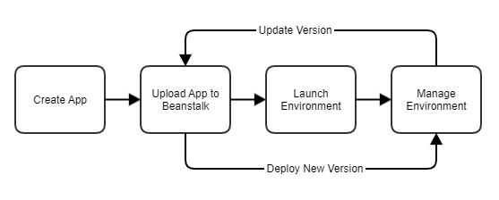

The below notes were taken while going through the AWS Cloud Practitioner Certification Preparation on Cloud Academy

[TOC]

# What is Cloud Computing? 

Cloud computing is a remote virtual pool of on-demand shared resources offering Compute, Storage, Database and Network
services that can be rapidly deployed at scale.

**Virtualization** - The ability to run multiple VM's, possibly running different OS', on one physical server.
* Hardware is shared among the VM's - this sharing controlled by the Hypervisor, which sits between the hardware and the
  VM's. The Hypervisor is itself software.
	* "instance" == "VM"

* Benefits include reduced costs due to the ability for multiple VM's to run on one physical machine, which
  allows the business (or cloud infrastructure provider), to save electricty, storage (of the physical machines), etc.

The 4 main services offered by a cloud infrastructure provider are:
* Compute 
* Storage
* Database
* Network

**It makes sense to host your cloud as close to the users of the cloud as possible, to cut down on latency**

## Cloud Deployment Models

1. Public Cloud
* Shared responsibility between the user (business/individual) and the provider (AWS, Microsoft ( Azure ), Google (Cloud
  Platform), Snowflake, etc).
	* Provider handles the physical storage and maintainance of the machines while the user is responsible for
	  security within the cloud and maintaining whatever system they are running.
* Capital expenditure is low (don't need to hardware and people to maintain said hardware)
* Operational expenditure is variable - you only pay for the resources you use.

2. Private Cloud
* Hardware is typically kept on premise
	* Virtualization is still a part of the system, but the hardware is managed by the company/individual as well.
* Typically more secure
* Costs more (have to maintain the physical machines, electricty, *regardless of whether you use them or not*)

3. Hybrid Cloud
* Blend of both of the above (note that this does mean you get the *worst* of both in addition to the best of both)

## Key Cloud Concepts

* On-Demand Resourcing
	* When you want a resource (larger EC2 instance, another DB, etc.) it is *almost* always available.
* Scalability
	* 'Up' and 'down' scalability - alters the power and performance of an instance.
	* 'In' and 'out' scalability - adds/removes the numbers of instances your system is using.
* Economy of scale
	* Large cloud providers can pass the part of the savings associated with virtualization onto the customer.
* Flexibility and Elasticity
	* Choose the exact architecture you need (number of instances, OS', etc.)
* Growth
	* Global datacenters allow the user to reach their end users on a global scale, not having to worry about
	  latency since the cloud infrastructure provider usually has resources around the world.
* Utility Based Metering
	* Only pay for what you use (or leave on...)
* Shared Infrastructure
	* Virtualization allows multiple services to run on one machine, thus allowing multiple users to use the same
	  physical machine (allows for economies of scale for the cloud provider)
* Highly Available
	* Having data copied to different places allows a resilience that would otherwise need to be architected on its
	  own.
* Security
	* Cloud providers are usually more secure since they have to comply with worldwide regulations.

## Cloud Service Models

1. Software as a Service (SaaS)
	* (Most applications fit this model) - allows some customization, however that customization is within the
	  context of the application.
2. Platform as a Service (PaaS)
	* Allows customization from the OS level and up (network, host hardware etc. managed by provider).
3. Infrasture as a Service (IaaS)
	* Allows customization at the OS level and up (including virtual clouds). The hardware is typically managed by the provider.

## Common Use Cases of Cloud Computing 

* Migration of production services to the cloud (as opposed to on premises services)
* Peak season might but a strain on standard infrastructure; being based in the cloud would allow seasonal scaling
  ("Traffic Bursting")
* Backup & DR (Disaster Recovery)
* Web hosting of applications
* Test & Dev environments
* Low cost Proof of Concept
* Big Data & Data manipulation

## Data Center Architecture in the Cloud

* Location
	* public cloud providers will have regions worldwide, each region with multiple data centers
* Physical Security
	* Vendor is responsible for the physical security of their data center
* Mechanical & Electrical Infrastructure (CRAC (Computer Room Air Conditioning))
	* Generators, Fire Suppression, etc. are all on premise at the data center, and is therefore the responsibility
	  of the data center.
* Network Infrastructure (Switches/Routers/Firewalls)
	* The public cloud user is able to create configurations that simulate the logical effet of switches, routers
	  and firewalls.
	* In AWS, virtual clouds are called Virtual Private Networks (VPCs) and are configured by the end user. This
	  therefore means that the security & infrastructure *of the VPC* is the responsibility of the end user.
* Servers (Application/Directory/Database)
	* "instances" or "VMs" 
	* Providers offer services that are specific to hosting databases, or specific to high compute power
* Storage (NAS/SAN/Block Storage/Backup)
	* In the cloud, storage is effectively unlimited and highly scalable.

# Compute Fundamentals for AWS

* There are different types of compute resources on AWS - not only EC2

## EC2 - Elastic Cloud Compute

* EC2 is the "meat and potatoes" of AWS' compute infrastructure.

### AMIs - Amazon Machine Images

* An AMI is a template for a VM; this can include the OS, specific applications for your use case, custom configurations, etc.
* To create your own custom AMI:
	* Choose a basic AMI the first time you launch an EC2 instance (only specifying the OS you want for example),
	  and then once the instance is launched, you can install any applications related to your solution, configure
	  anything you like, install any applications that will need to be on all VM's of this type for your solution,
	  and save this entire setup as your own custom AMI.
	* This custom AMI can then be launched with all the configurations & installations already setup.
* AMI's are also available through the "Community AMIs" page and the "AWS Marketplace"

### Instance Types 

The key parameters of an instance type to pay attention to when launching are:
* vCPUs
* Memory (GB)
* Instance Storage
* Network Performance

* There are other parameters of lesser importance, all of which can be seen in the instance parameters table when
  launching your instance

* Instance types are grouped into families:
	* micro instances
		* very low cost - useful for low throughput purposes
	* general purpose
		* balanced mix of compute, memory and network capabilities
	* compute optimized
		* good for high performance front end servers, etc.
	* accelerated computing
		* GPU
		* FPGA - ( Field Programmable Gate Arrays )
			* used to create application specific hardware accelerations
			* High CPU performance, large memory and high network performance make these the go to for
			  solutions that require massive parallel processing; data science/genomics/financial computing
			  being some examples.
	* Memory optimized
		* lowest cost per GB of RAM than other instances
		* recommended for database applications/database components of a solution
	* Storage optimized
		* Use SSD backed instance storage, which offers high I/O thoughput.

### Instance Purchasing Options 

Different payment plans available:

* On-Demand Instances
	* launched at any time
	* flat rate per instance type
	* typically used for short term uses
* Reserved Instances
	* best applied to long term, predictable workloads (applications that you know need to be running for a set
	  period of time)
	* purchases for a set period of time for reduced cost (up to 75% reduced cost). Three options:
		1. All Upfront
			* complete payment for 1 or 3 year timeframe - highest discount.
		2. Partial Upfront
			* smaller upfront - smaller discount than All Upfront option.
		3. No Upfront
			* very small discount applied
* Scheduled Instances
	* pay for instances on a daily/weekly/monthly schedule 
	* **even if you don't use the instance, you will be charged**
	* less expensive than the On-Demand Instance, so good for recurring but predictably recurring use cases
* Spot Instances
	* Bid for unused EC2 resources.
	* Con: **Not guaranteed for a fixed period of time**
	* Pro: Can purchase large (expensive) EC2 instance types at a lower price
	* The "Spot Price" determines the price of an instance and bidding above that "gets" you the instance. If a
	  higher bid comes along while you are using the instance, **your instance will shut down**.
	  * Should only be used for tasks that can be interrupted/stopped - otherwise be prepared to continuously ensure
	    your bid price is above the spot price (either computationally or manually).
* On-Demand Capacity Reservations
	* allows you to reserve capacity (whether that is compute, memory, storage or network) within a particular
	  availability zone for any period of time.

### Tenancy 

"Tenancy" refers to the actual physical computer your VM is hosted on in the AWS data center.

* Shared Tenancy
	* your instance will be launched on any available host, most likely one that is shared with other AWS users.
	* AWS provides the security to ensure different users can't access each other's instances
	* this model is what allows "economies of scale" and makes cloud computing inexpensive.
* Dedicated Tenancy
	* Dedicated instances
		* hosted on hardware that no other AWS user can access
		* may be required by problem domain compliance requirements
		* more expensive
	* Dedicated Hosts
		* more visibility/control of the physical host than even the "Dedicated Instances" option.
		* again - may be required by problem domain compliance requirements

### User Data 

* commands that will run during the first boot cycle of the instance
* used to update software or OS'

### Storage Options

Two types:
1. Persistent Storage
	* attaching EPS (Elastic Block Storage) volumes
	* attached via AWS network - physically separated
	* can be detached from EC2 instances and maintain data 
	* data saved on EBS volumes are automatically copied to other volumes within the same availability zone for
	  backup purposes 
	* data can be encrypted and scheduled backup snapshots are possible
2. Ephemeral Storage
	* **deleted and gone forever when EC2 instance is stopped/terminated**
	* if instance is rebooted (think "continue instance use") - data is maintained
	* non-detachable

### Security

* Security group = "instance level firewall"
	* allows you to specify what traffic communicate with your instance (can be specified via IP range, protocol,
	  port range, inbound/outbound, etc.)
* Key-Pairs
	* Allows encrypted access to EC2 instances
	* Public Key = AWS keeps this to match to your private key
	* Private Key = your responsibility for safe keeping
	* **You can use the same key-pair for multiple instances** - this does mean that if your private key becomes
	  comprimised, whoever has the key would have access to all the instances associated with that key-pair.
* It is the user's responsibility to maintain and install latest OS updates & security patches released by the OS vendor
  - this is part of the shared responsibility model

## ECS - EC2 Container Service

ECS allows the user to run Docker-enabled applications packaged as containers across a cluster of EC2 instances,
**without requiring the user to manage a complex and administratively heavy cluster management system. **AWS Fargate**
manages this system for you.

Docker is software that allows everything an application needs to run to be put into a logical container, and that
container can then be run on any operating system.

Two different ECS Cluster deployement models:
1. Fargate Launch
	* the user is only required to specify CPU, memory and networking policies (in addition to having your
	  applications packaged in containers)
	* This is the option that trades lower customization for lower management overhead.
2. EC2 Launch
	* This is the option that trades higher management overhead for higher customization.
	* The user is responsible for patching and scaling instances, specifying instance types and how many
	  applications should be in a cluster.

* Monitoring of your ECS cluster and containers is provided by AWS CloudWatch
* An ECS Cluster is comprimised of multiple EC2 instances
* Security Groups, Elastic Load and Autoscaling can be applied.
* The cluster can be comprised of different EC2 instance types.
* **Clusters can only scale in a single region** (this is different from availability zones; clusters can span multiple
  zones).
* Containers can be scheduled to be deployed across the cluster.

## ECR - Elastic Container Registry

ECR provides a secure location to store and manage your docker images. This service allows developers to push, pull and
manage their library of docker images in a central and secure location

There are a few components used in ECR:

1. Registry
	* The component that hosts/stores docker images as well as create image repo's	
	* The default URL for the registry is:
	`https://<aws_account_id>.dkr.ecr.<region>.amazonaws.com`
2. Autorization Token 
	* **Before your docker client can access the registry (push & pull), it needs to be authenticated with an
	  Autorization token
	* To start the authorization process, run the following command using the AWS CLI (might need to be installed):
	`$ aws ecr get-login --region <region> --no-include-email`
	* The above command's output will be a docker login command:
	`docker login -u AWS -p <password>`
	* Authorization tokens last for 12 hours before the above process need to be performed again.
3. Repo 
	* Standard repo concept - allows grouping of docker images in whatever manner the user would like.
4. Repo Policy 
	* Repo policy's can be set up by the principal of the repo - who can then setup which actions different users
	  can perform on various repo's.
5. Image 
	* Once all the above has been completed, you/the user can push/pull docker images from your ECR.

## EKS - Elastic Container Service for Kubernetes

Kubernetes is an open source container orchestration tool designed to automate deploying, scaling and operating
containerized applications.

EKS allows the user to run Kubernetes across their infrastructure without having to interact with the Kubernetes
management system, known as the control plane. The AWS account owner only need to provision and maintain the worker
nodes if using EKS.

Kubernetes:
	* The control plane contains API's, the kubelet processes and the Kubernetes Master.
	* The control plane allocates containers onto nodes (according to CPU needs)
	* The control plane tracks the state of all Kubernetes objects, continually monitoring them.
EKS takes care of all the above processes for the AWS users

Worker nodes:
	* Kubernetes clusters are composed of nodes (worker machine - One-Demand EC2 instance on AWS)
	* Every node that is created uses a specific AMI (in order for Docker & Kubernetes to run on it)
	* Once the worker nodes are setup by the user, they can be connected to EKS with an endpoint

### Setting up EKS

1. Create an EKS Service Role
	* Create an IAM (Identity & Access Management) service role that allows EKS to provision and configure specific
	  resources. The EKS role needs the following permission policies:
		* AmazonEKSServicePolicy
		* AmazonEKSClusterPolicy
2. Create an EKS Cluster VPC
3. Install kubectl and AWS-IAM-Authenticator
	* kubectl = Kubernetes command line utility
4. Create your EKS Cluster (using above information)
5. Configure kubectl for EKS
	* run `$ update-kubeconfig` via AWS CLI to create a kubeconfig file for your EKS cluster
6. Provision and configure worker nodes
7. Configure worker nodes to join EKS Cluster

## Elastic Beanstalk Service 

**Elastic Beanstalk Service is free to use. However, any resources that Beanstalk sets up for your application (Compute,
Storage, Database or Network) are charged using the standard pricing of those resources.**

Elastick Beanstalk is a service that takes your uploaded code and automatically provisions and deployes the resources
needed to make the application operational.
	* This service is likely the most useful for engineers who may not have the familiarity, skills or desire to
	  manage the deployment, provisioning and monitoring of developed applications.

* Able to operate with a variety of platforms and programming languages, some examples being:
	* Single Container Docker
	* Multicontainer Docker
	* Preconfigured Docker
	* Python

Key Components:
* Application Version
	* reference to a specific version of the code/application that typically resides in S3
* Environment 
	* The Environment refers to the entire system of your deployed application (EC2 and S3 for example)
	* At this stage, the application has been deployed as a solution and is operational within the environment 
* Environment Configurations 
	* Parameters that dictate how the environment will have its resources provisioned by Beanstalk.
* Environment Tier
	* Applications that are communicating with other servers (usually via HTTP requests using port 80) are run in a
	  *web server environment*. AWS infrastructure usually used includes:
	  	* Route 53
		* Elastic Load Balancer
		* Auto Scaling
		* EC2
		* Security Groups
	* Applications that are doing backend jobs/processing of some kind are run in a *worker environment*. AWS
	  infrastructure usually used includes:
		* SQS Queue
		* IAM Service Role
		* Auto Scaling
		* EC2
* Configuration Template 
	* A template that provides the framework for creating a new, unique, environment.
* Platform
	* The set of components that can build your application when using Elastic Beanstalk (OS, server type,
	  programming language)

The typical Elastic Beanstalk workflow looks like the following:

## Lambda 

"AWS Lambda is a serverless compute service that allows you to run your application code without having to manage EC2
instances."

[1 Hour video on AWS Lambda and serverless apps](https://www.youtube.com/watch?v=EBSdyoO3goc)

* "Serverless" doesn't actually mean "without servers" - it just means that the cloud infrastructure provider handles
  **all** the management of Compute resources for you (EC2 provisioning, scaling, etc). Because of this, the user doesn't
  have to worry about the Computer resources, and thus it is a "Serverless architecture" from the vantage point of the
  engineer.
* **Going serverless allows the user to spend  more time on writing code related to the business problem and less time
  on DevOps**
* The user only pays for Compute resources when Lambda is in use via Lambda Functions
* AWS Lambda charges Compute power per 100 milliseconds of use only when your code is running, in addition to the number
  of times your code runs.

All of the above makes **AWS Lambda highly scalable**; pay for what you use, and don't worry managing all the Compute
resources you need for you solution to run.

1. Upload code to Lambda (make sure Lambda supports the language your code is written in).
2. Configure Lambda Functions to execute upon specific triggers from supported event sources.
3. Once the trigger is initiated, Lambda will run your using only the required resources.

## AWS Batch

Used to manage and run batch computing workloads in AWS (mostly used for high specificity cases that require large
amounts of compute power). 

Components:

1. Jobs 
	* A "job" is a class of work to be done by AWS Batch.
	* Could be an executable program, a script, or an application within an ECS Cluster.
	* Jobs can have different states such as 'Submitted','Pending','Running','Failed',etc.
2.
3. Queues
	* jobs are placed into queues (multiple queues can have different priorities)
	* AWS Batch can bid on Spot instances on your behalf.
4. Scheduling
	* The scheduler takes care of ensuring the high priority items are run first (assuming dependencies are met).
5. Compute Environments 
	* Managed (*i.e. managed by Batch*)
		* Handles the provisioning, scaling and termination of compute resources based on need.
		* This environment is created as an ECS Cluster
	* Unmmanaged (*i.e. managed by the user*)
		* Greater customization = greater administration (by the user)
		* The user must create the ECS cluster.

As one would expect, this service lends itself to solutions that require/depend on parallel processing (in the Data
Science world, this could take the form of bagged models (GLM's, random forests, etc.))

## Lightsail

Similar to EC2, Lightsail is an VPS (Virtual Private Server), similar to EC2, however there are fewer configurable steps
during its creation.

* Designed to be simple compute resources that a small business or single user could use on an ongoing basis, or just as
  a "one-off" resource.

Lightsail can be accessed via the AWS Console under the Compute category and has a one-page setup.

Choose:
1. Region/availability zone
2. Instance image (OS) 
3. Blueprint (whether you want any apps pre-installed)
4. Launch Script (if you want)
5. Key-Pair (by default one is provided, however you can choose your own)
6. Instance plan (how much you pay)
	* Although the price is calculated as 31.25 days * 24 hours per day (aka monthly rate) - 
	* Instances are charged as On-Demand (only pay for it when using it).
7. Name for Lightsail instance
	* Also prompted to add 'tags' to help organize your Lightsail instances 

* Use the "Connect" tab to view IP to connect to via SSH.
* Use the "Snapshots" tab to backup the information on your instance.

* **Deleting your instance and shutting down are different.**

## ELB - Elastic Load Balancer

The main function of an ELB is to help manage and control the flow of inboud requests destined to a group of targets by
distributing these requests evenly across the targeted resource group
* Targets could be EC2 instances, Lambda functions, different Docker containers, etc.
* Targets can be in a single Availability Zone (AZ) or across multiple AZs

* The "Elastic" in the name means that an ELB will automatically scale up or down as incoming traffic
  increases/decreases *without any management on the part of the user*.
	* Dynamic scaling can be setup simply.

**ELB Types**

* See [this table](https://aws.amazon.com/elasticloadbalancing/features/#compare) for a comparison of the different ELB
  types

1. Application Load Balancer (ALB)
	* ALBs operate at level 7 of the [OSI model](https://en.wikipedia.org/wiki/OSI_model)
	* Flexible feature set for applications using HTTP/HTTPS protocols.
	* **Operates at the request level.**
	* Advanced routing, TLS (Transport Layer Security) termination and visibility features targeted at application
	  architectures.
	* Target groups can be setup so all requests of a specific protocol are routed to that group, through a specific
	  port.
2. Network Load Balancer (NLB)
	* NLBs operate at level 4 of the [OSI model](https://en.wikipedia.org/wiki/OSI_model)
	* Ultra-high performance while maintaining very low latency.
	* **Operates at the connection level.**
	* Can handle millions of requests per second.
3. Classic Load Balancer
	* Used for applications that were built in the existing EC2 Classic Environment.
	* **Operates at both the connection and request level.**
	* This should only be used for an existing application running in the EC2-Classic network (legacy AWS
	  infrastructure)

**ELB Components**

1. Listeners
	* Defines how inbound connections are routed to target groups based on ports and protocols set as **conditions**
	  (think `if else` statements).
2. Target Groups
	* A group of resources to which the ELB will route requests.
	* One ELB can have multiple different target groups, each associated with different listener configurations and
	  associated rules.
3. Rules
	* Rules (think `if else` statements) define how an incoming requests gets routed to which target group.
4. Health Checks
	* The ELB can (and does) contact each target within a target group using a specific protocol to receive a
	  response. If that response doesn't come back, the ELB marks that target as 'unhealthy' and stop sending
	  traffic to that target.
5. ELB Schemes
	* 5.1 Internet-Facing ELB
		* As the name suggests, this ELB scheme handles connections/requests coming from other
		  applications/servers through the internet. Due to this, this ELB scheme has a public DNS and
		  associated Public IP.
	* 5.2 Internal ELB
		* This scheme is only used for communication within an applciation/system/solution. Therefore, this ELB
		  only has a internal IP address and can therefore only communicate with requests that come from within
		  the users VPC.
6. ELB Nodes
	* Each AZ you intend to work in needs to have its own ELB node
7. Cross-Zone Load Balancing
	* Allows the ELB to send requests to targets that aren't in its AZ.

* An ELB can contain 1 or more listeners, each listener can contain 1 or more rules, each rule can contain 1 or more
  conditions. **All conditions result in a single action.**

### SSL Server Certificates 

SSL = Secure Sockets Layer
	* SSL is a cryptographic protocol, similar to TLS (Transport Layer Security)

* HTTPS requests will sometimes need to be used in lieu of HTTPS requests to ensure an encrypted connection between a
  client sending a request and your ALB.
	* In order set this up, you will an SSL certificate.
* The server certificate that the user will need to set up is an *X.509 certificate* (digital ID provisioned by a
  Certificate Authority and managed by AWS Certificate Manager ( ACM ))
	* This certificate is used to terminate the connection between the client and your application/solution, and
	  only then is the request decrypted and sent to the resources in the ELB target group.

* ACM allows you to provision and configure any SSL certifcates that will be used inside your AWS solution (most AZ's
  are supported). If the AZ you are in isn't supported, you will have to configure a certificate using IAM.

## EC2 Auto Scaling 

As the name suggests, EC2 Auto Scaling means that a solution can scale its compute resources up or down, based on
demand, so that the user doesn't have to worry about overloading any resources, and also doesn't have to worry about
spending money on resources they aren't using.

**Components**

1. Create a Launch Configuration or Launch Template
	* **This must be setup prior to setting up the Auto Scaling Group** - otherwise the group wouldn't know what
	  instance type and specifications to use when launching a new instance.
	* Launch Configuration and Launch Templates are very similar, the only real difference being that a Template
	  allows the user to specify a few advanced options, and has the entire setup process on one webpage (as opposed
	  to the Launch Configuration, which goes through multiple webpages.)
	* One of the two options is needed in order to specify new instance parameters such as:
		* the AMI to use.
		* the instance type to use.
		* whether the instance should have a public IP.
		* the storage volume the instance should use .
		* the security groups (if any) the new instance should be associated with.
2. Create an Auto Scaling Group
	* Select the Launch Template or Configuration that new instance will be launched from.
	* Set up the "Starting Instance" count.
	* Set up the minimum and maximum number of instances that your solution can scale between.
	* Set up the conditions that need to be met for "Scaling Up" (i.e. Average CPU usage >= 75% for 3 minutes).
	* Set up the conditions that need to be met for "Scaling Down" (i.e. Average CPU usage <= 30% for 3 minutes).
	* Set up AZs in which new instances will be created.

### Combining ELB & EC2 Auto Scaling 

Although ELBs and EC2 Auto Scaling *can* be used independently, they work best together.
	* If you have a fixed number of instances/compute resources in a target group of an ELB, if you need more, the
	  user will have to manually add more. If you need less, the user will have to manually remove some.
	* If you have an EC2 Auto Scaling group without an ELB, how are you going to distribute traffic/requests evenly
	  across your instances?

* ELBs allows incoming traffic to be *averaged* across all resources within a target group.
* EC2 Auto Scaling can be setup to *scale* the resources in that target group.

* To associate an ALB or NLB, you must associate the auto scaling group with the ALB or NLB target group. This is
  performed by editing the configuration of the Auto Scaling Group from the AWS Management Console.
	* Note that there are two sections that are related to ELBs; the "Classic Load Balancer" field and the "Target
	  Groups" field. The former is for the legacy ELB version (see above), and the latter ('Target Groups') should
	  be used for all newly created ALBs or NLBs.

# Storage Fundamentals for AWS

## EBS - Elastic Block Storage

Provides storage to EC2 instances via 'EBS Volume'

* Persistent, block level storage connect to EC2 instances via AWS network.
* An EBS volume can be attached/accessed to/by **only one** EC2 instance, however multiple EBS volumes can be attached
  to a single instance.
* 'Snapshots' (aka backups) can be performed manually or setup to run on a scheduled basis.
	* Theses backups are stored in an S3 bucket.
	* EBS volumes can be recreated from snapshots
	* Snapshots can be copied from one availability region to another

**Reliability**
* Every write to an EBS volume is repeated multiple times to protect against a complete loss of data.
* **Volumes can only be attached to an EC2 instance in the same availability zone**

### Volume Types

* Having two volume options (below) allow the user to trade performance for cost in the best manner for their solution.
* Different volume types have different IOPS (Input/Output per Second) thresholds

1. SSD (Solid State Drive)
	* Best for smaller blocks of data.
	* There are two sub-types of SSD's:
		* 1.1 General Purpose SSD
		* 1.2 Provisioned IOPS SSD
			* Highest performance EBS volume (best for low-latency requirements)
2. HDD (Hard Disk Drive)
	* Best for larger blocks of data.
	* Designed for workloads that require a higher rate of throughput.
	* There are two sub-types of HDD's:
		* 2.1 Throughput optimized HDD
			* Best for large blocks of data that are still throughput intensive
			* **These volumes can NOT be used as boot volumes for instances**
		* 2.2 Cold HDD
			* Best for large blocks of data that don't need to be accessed frequently.
			* **These volumes can NOT be used as boot volumes for instances**

There are a few ways to create an EBS volume

1. During the launch of an EC2 instance
2. As a standalone EBS volume that can be atttached to an EC2 instance when required

During the creation of the volume, the user can choose:
* Whether to create the volume from a snapshot (of a previous volume) OR start a blank volume
* Size
* Volume type 
* **What happens to the volume when the EC2 instance terminates**
* To encrypt or not to encrypt

## S3 - Simple Storage Service 

* Most common storage service in AWS (applicable to many use cases).
* Theoretically unlimited storage.
* Supports individual files sizes up to 5 TB.
* S3 is object based - meaning **it does not store objects (files) in a traditional hierarchy**. The address space is
  flat and therefore each object has a unique URL by which it can be accessed.
	* You **can** create folders/directories **within** a bucket to help with organization; however, S3 itself is
	  not a hierarchical file system.
		* Each object saved in S3 has a "key", which can be thought of as the filepath (it includes and
		  directories within the bucket). The "full path" aka full URL for an object within S3 will be its
		  bucket name and the object key.
* S3 is a regional service; to ensure data persistence, AWS makes multiple copies of your data within different AZs
  within the region you selected. This provides "Eleven 9's" worth of data integrity (99.999999999% durability = very
  low likelihood of losing data).
* Availability is **not** the same as Durability; AWS provides 99.5% - 99.99% data *Availability*, which means you will
  be able to access your saved data 99.5% - 99.99% of the time. *Durability* refers to the the likelihood your data
  isn't lost or corrupted.
* **Data versioning is an option.**

To save an object in S3 (manually):
1. Create an S3 bucket with a **globally unique name**.
	* This can be accessed via the AWS Management Console, and selecting "S3" under the "Storage" header.
	* This means that your bucket name has to be unique **across all of AWS** (can't just be unique *to you*).
	* by default, your account has a soft limit of 100 buckets, however this can be increased by contacting AWS.

### Storage Classes

Different storage classes allows the user to choose the tradeoffs between cost and accessibility that best suits the
problem they are working on. There are 6 different storage classes:

1. S3 Standard
	* general purpose storage
		* High throughput and low latency
	* Lifecycle rules are an option 
		* Lifecycle rules allow the user to setup a configuration that automatically moves objects saved in S3
		  to a different storage class (i.e. if you haven't accessed some data in a while but still want to keep
		  it around for the "just in case" moments, you can have that data moved to a less expensive and less
		  easily accessible storage class).
	* SSL encryption is available for data both at rest in an S3 bucket and in transit to/from and S3 bucket.
2. S3 Intelligent Tiering (S3 INT)
	* Best for use cases where the data access rate is unknown in advance.
	* S3 INT has two subclasses; Frequent Access and Infrequent Access.
		* **These subclasses are not the same as the "meta" versions with the same name; these subclasses are
		  "within" the logical set of "S3 INT"**
	* By default, an object is placed in the Frequent Access tier; if it hasn't been accessed in 30 days, it is
	  moved to the Infrequent Access tier. As soon as it is accessed again, it is moved back to the Frequent Access
	  tier and the clock starts again.
	* Lifecycle rules are an option.
	* SSL encryption is available.
3. S3 Standard Infrequent Access (S3 S-IA)
	* Similar to the Infrequent Tier subclass of the S3 INT storage class (above).
	* Designed for object that aren't going to be accessed frequently (duh).
	* Lifecycle rules are an option.
	* SSL encryption is available.
4. S3 One Zone Infrequent Access (S3 Z-IA)
	* Designed for object that aren't going to be accessed frequently (duh).
	* Durability of Eleven 9's, however this is *within a single AZ, as opposed to S3 S-IA, which has the same
	  Durability but across multiple AZs*. This change offers the user a 20% decrease in cost.
	* Lifecycle rules are an option.
	* SSL encryption is available.

Glacier Classes:

* A fraction of the cost of the above storage classes, the tradeoff being you don't get instance access to your
  data.
* Best suited for "Cold Storage" - objects that will likely not need to be accessed but need to be kept around
  "just in case".
* Eleven 9's of Durability.
* **No GUI for moving objects into Glacier "Vaults" (as they are called);** the GUI can only be used to create
  the vaults. After that, data must be moved into the vaults via APIs, SDKs, or the AWS CLI (or, through
  Lifecycle rules set up in the more frequent access classes).

5. S3 Glacier
	* Data *can* be accessed via 3 different routes, each with a different cost (listed in descending order relative
	  to cost):
		1. Expedited
			* Available in 1-5 minutes
			* Data must be under 250 MB.
		2. Standard
			* Available in 3-5 hours.
			* Any size.
		3. Bulk
			* Available in 5-12 hours.
			* Used for retrieving PB's of data at a time.
6. S3 Glacier Deep Archive (S3 G-DA)
	* Minimal access.
	* Retrieval available within 12 hours (only one option).

## EFS - Elastic File System

