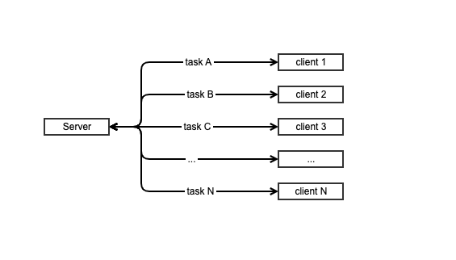
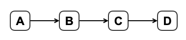
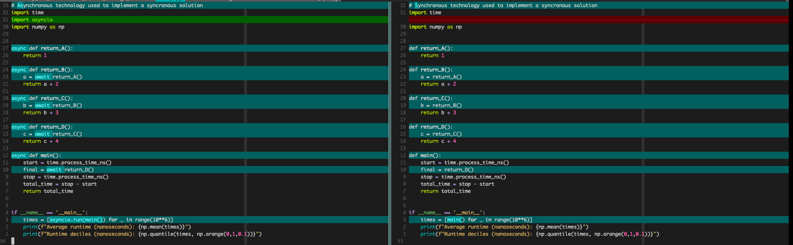

[TOC]

- ( 2023-10-28 ):
  - Understanding asynchronous structure is about understanding "Sub-Problem/Child-Problem Independence"
- ( 2023-07-27 ):
  - I do think part of my confusion comes from the fact that if _any_ part of your program is implemented asynchronously, you have to wrap the
    _entire_ program in `async`, which may give off the impression that the _entire_ program structure is asynchronous.

# Concurrency, Parallelism, Synchronous, Asynchronous and all that Jazz

## What is typically _missing_ from "asynchronous vs synchronous" explanations?

I was introduced to all these terms _through the lens of_ building a REST API.

My belief is that the reason I don't feel as though I have a firm understanding of these concepts is because I am trying to differentiate/"create some
space between" these terms **through that same lens**, and this is difficult to do because the structure of a RESTful API _is inherently
asynchronous_.

It would make such little sense to have an API be synchronous that it is glossed over

so lets zoom out, remove this lens, define some terms, and get a handle on what is going on...

- Terms:
  - concurrency
  - parallelism
  - asynchronous
  - synchronous
  -   * In this context, `synchronous == sequential`
  - threading
  - multiprocessing
  - processes
  - threads
  - multithreading

## Problem Domain & Solution Domain

| Layer Level | Layer Description       |
| ---         | ---                     |
| 2           | Solution Implementation |
| 1           | Solution Structure      |
| 0           | Problem Definition      |

- Problems...:
  - ...have _definitions_.
  - ...have multiple solutions.
- Solutions...:
  - ...have _structure_.
  - ...have _dimensions_.
- Implementations...:
  - ...can be in different _technologies_.
  - ...are _executed_ with these technologies.

Given this conceptual framework, a few statements can be made:

- Definition precedes Structure and Structure precedes Implementation.
- Problems are not inherently concurrent, parallel, synchronous or asynchronous. These words don't _belong_ to that layer.
- The words _"concurrent, parallel, asynchronous and synchronous"_ are _descriptors of the implementation of a particular structure._
- Certain Structures lend themselves to different Implementations.
  - Different Implementations are better/worse with respect to a different _dimension_ of a Structure

Let's go through some concrete examples

### Examples

Let's return to the REST API that brought us here and apply our framework to that situation.

**What is the problem definition?**

- We want our server to respond to as many requests as possible.

**General structure of an API:**


There are N clients requesting some service from 1 server

## What is our Guiding Question?

My hypothesis is:

A mismatch between the _structure_ of a solution and the _implementation_ of a solution will be slower than a match between the said structure

| Solution     | Implementation | "will be"   | Solution     | Implementation |
| ------------ | -------------- | ----------- | ------------ | -------------- |
| Synchronous  | Asynchronous   | Slower than | Synchronous  | Synchronous    |
| Asynchronous | Synchronous    | Faster than | Asynchronous | Synchronous    |

A solution whose _structure_ is asynchronous

1. A 'problem domain process' that is inherently synchronous will still be synchronous when written with asynchronous code.

2. Not only will a 'problem domain process' that is inherently synchronous still be synchronous when written with
   asynchronous code, it will be _slower_ than if it had been written with synchronous code.

```python
import asyncio

async def return_x(x):
    await asyncio.sleep(1)
    return x

async def return_y(y):
    await asyncio.sleep(1)
    return y

async def main(x, y):
    x = await return_x(x)
    y = await return_y(y)
    print(x + y)
    return x + y

if __name__ == '__main__':
    asyncio.run(main(1, 2))
```

True or not?: A mismatch between the _structure_ of a solution and the technology used to _implement_ that solution
usually results in an inefficiency with respect to a particular _dimension_ of that solution (e.g. time)....

## Examples

A problem gets broken down into tasks A, B, C and D, each of which must be completed for the problem to be completed.
1. If...

$$
\begin{align}
D & = h(C) \\
C & = g(B) \\
B & = f(A) \\
& A
\end{align}
$$

...then the _structure_ of the solution is sequential/linear. This means the _execution_ of the solution should be _synchronous_





- A note on how I'm measuring execution time:
  - I'm not measuring the time of the _entire_ program (`$ time python [ tmp.py | tmp2.py ]`)
    - This would not only measure the time of interpretation, but would also measure the time it takes to import
      `asyncio`
  - I'm not measuring the time to start and stop the event loop (`asyncio.run(<whatever>)`)
    - This doesn't feel like a fair comparison

**Results**
```bash
# Synchronous technology used to implement a synchronous solution
Average runtime (nanoseconds): 1242.164
Runtime deciles (nanoseconds): [   0.    0. 1000. 1000. 1000. 1000. 1000. 1000. 2000. 2000.]

# Asynchronous technology used to implement a synchronous solution
Average runtime (nanoseconds): 3336.65
Runtime deciles (nanoseconds): [1000. 2000. 2000. 3000. 3000. 3000. 3000. 3000. 3000. 4000.]
```

2. ## If...

and therefore neither concurrency nor parallelism are applicable descriptors of this solution.

- Examples:
  - **Chess:** A single chess match between two players. There is no way around the fact that each player must wait on
    the other player to make their next move.
  - **Medicine:**
  - **Programming (without I/O):**
  - **Programming (with I/O):**

The question is not:

> Should the solution be asynchronous or synchronous?

The question is:

<<<<<<< HEAD
> _Which_ parts of the solution can/should be asynchronous and _which_ parts _must_ be synchronous?

IT IS ABOUT UNDERSTANDING THE STRUCTURE OF THE SUBSOLUTION.....

Technologies are used to implement solutions.

## Lenses / Perspectives

These terms are best viewed through different lenses / from different perspectives. The following is a list of the the
lenses through which we will look at these concepts:

- Problem Domain
- Solution Domain
  - Hardware
  - Software
    - Layer 0
    - Layer 1
    - Layer 2
  - Programmer

### Viewed through the Hardware Lens

From the

### Viewed through the Programmer Lens

The key thing to understand/accept is _you are programming at a higher level of abstraction when you are programming
asynchronously._

When programming synchronously,

### Concepts

Concurrency & Parallelism are concepts that exist outside the domain of software and computer science. A good way of
separating these two concepts is asking the question:

<<<<<<< HEAD
> Is waiting _on external events_ an unavoidable part of the solution to a problem you are trying to solve?

The answer to this is **"yes" in a lot of situations**:

- Physical World Examples:
  - Chess Tournaments:
    - Player A must wait for Player B to move before he can move again.
  - Baking/Cooking:
    - You must wait for the oven to preheat before you can use it
  -
- Digital World Examples:

  - You must wait for an API response after you have sent a request
  - You must wait for a DB to return data you queried

- **Concurrency**: _Progress_ on two or more tasks is made _at the exact same time._
  - Concurrency is about the _design/structure_ of the solution
- **Parallelism**: _Actions_ need to make progress on two or more tasks are _performed at the exact same time._
  - Parallelism is about _action_

When I say "at the exact same time" I mean _at the exact same time_, the same way you can snap the fingers of both hands
_at the exact same time_.

The real questions is:

- Multiprocessing:
  - A means to implement parallelism.
  - The act of spreading operations over multiple cores on a computer
- ## Threading:

There are two perspectives/lenses through with we look at these terms:

- The "Problem Domain" Lens:
  - Definitions viewed through this lens:
    - Concurrency/Concurrent: **Progress** on two or more tasks is made _at the exact same time._
- The "Solution Domain" Lens:

  - Definitions viewed through this lens:
    - Parallelism/Parallel: **Actions** need to make progress on two or more tasks are **performed** _at the exact same time._

- All parallelism is concurrent, not all concurrency is parallelism.

## Programs, Processes & Threads

- Programs are what developers write...

  - Processes are executing instances of an application.
    - Threads are paths of execution _within_ a process.

- Processes setup the resources need

# Concurrency & Parallelism Through the Lens of Music

Music domain (piano being the instrument of choice):

- notes
- chords
- piece(song)
- hand (singular)
- hands (both)
- fingers (hardware?)
- fingering

Computer Science domain:

- concurrency
- parallelism
- threading
- multiprocessing
- asynchronous I/O
- process/task/threads
- processor
- core
- hyperthreading

# Initial Guesses

- `Music Domain <--> Computer Science Domain`
- `fingers <--> cores`
- `hands <--> processor`

**<u>How to read the below table:</u>**

"`X` _is/are to the_ **Music Domain** in the same way the `Y` _is/are to the_ **Computer Science Domain**"

Further definitions:

- "People create programs to direct processes." - SICP
  - Addition: "People create programs _which resemble solutions to problems_ to direct _computational_ process"
  - Addition: "People create programs to direct _computational_ process _whose outcome solves a problem_."

`Problem <--> Programs <--> Process`

`Real World <--> Programs <--> Computational World`

| `X`            | `Y`                  |
| -------------- | -------------------- |
| Pieces (songs) | Application Programs |
| Chords         | Parallelism          |
| Notes          | Concurrency          |
|                | Synchronous          |
|                | Asynchronous         |
| Fingers        | Cores                |
| Hands          | Processors           |

```python
import multiprocessing
import time
import random


def worker(number):
    sleep = random.randrange(1, 10)
    time.sleep(sleep)
    print("I am Worker {}, I slept for {} seconds".format(number, sleep))


for i in range(5):
    t = multiprocessing.Process(target=worker, args=(i,))
    t.start()


print("All Processes are queued, let's see when they finish!")
```

# IDK man...

You _can_ call non-async code from async code

> "Conversely you absolutely can call non-async code from async-code, in fact it’s easy to do so. But if a
> method/function call might “block” (ie. take a long time before it returns) then you really shouldn’t."

- [Part 5 Here](https://bbc.github.io/cloudfit-public-docs/)

...however, if that call that might "block" is necessary for all downstream operations, _there is no avoiding the
blocking...?_
