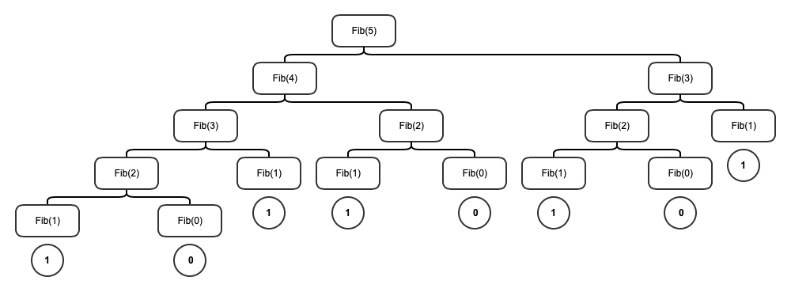

# From Bits to Bytes to Data Types

* A bit can have 2 states ("off" and "on") and therefore can store 2 values (0 and 1).
    * Therefore, 2 bits can have 4 distinct combinations of states and therefore 4 distince values (00, 01, 10, 11).
        * This pattern continues. There are $2^N$ unique states when working with $N$ bits:
            * 1 bits = $2^1$ = 2 distinct combinations, therefore 2 states.
            * 2 bits = $2^2$ = 4 distinct combinations, therefore 4 states.
            * 3 bits = $2^3$ = 8 distinct combinations, therefore 8 states.
            * 4 bits = $2^4$ = 16 distinct combinations, therefore 16 states.
            * 5 bits = $2^5$ = 32 distinct combinations, therefore 32 states.
            * 6 bits = $2^6$ = 64 distinct combinations, therefore 64 states.
            * 7 bits = $2^7$ = 128 distinct combinations, therefore 128 states.
            * 8 bits = $2^8$ = 256 distinct combinations, therefore 256 states.
* **8 bits is equal to 1 byte.**
    * Therefore 1 byte can store 256 unique values.
* 


# From Data Types to Bytes to Bits


4294967295 / 2

INT    | 4,294,967,295 (unsigned)
INT    | 2,147,483,647 (signed)

BIGINT | 18,446,744,073,709,551,615 (unsigned)
BIGINT | 9,223,372,036,854,775,807 (signed)


# Recursion


**Linear Recursive Process**
* A linear recursive process is one that has **one** base condition/references itself **once**.
* Example: 

```python
def factorial(n):
    if n == 0:
        return 1
    else:
        return n * factorial(n-1)
```

**Tree-Recursive Process**
* A tree-recursive process is one that has **more than one** base condition/references itself **more than once**
* Example:

```python
def Fib(n):
    if n == 0:
        return 0
    elif n == 1:
        return 1
    else:
        return Fib(n-1) + Fib(n-2)
```

This process can be represented with the following structure:




**Question to self (2021-08-31)**:
* Is the number of base conditions/axioms **always** equal to the number of times the procedure references itself in the
  function/procedure definition?
