# Unix and Git

## Unix

The piping operator "|" is different from Bash File Redirection "< or >" :

1. Piping operator - "|": Takes the output of one CLI command and "pipes" it directly into the next command (*without* any intermediate steps of saving the output as a separate file). **piping is used to pass an output to another program or utility**
        grep GOOG 2015_sp100.csv | sort | python <script_name.py>
    * explanation: Searches (grep) for GOOG in 2015_sp100.csv (file) and "pipes" that output directly into sort (sorts the data) and finally pipes that output into the python program <script_name.py>, whic is run by python

2. Bash File Redirection - ">" or "<": **redirection is used to pass output to a file or stream**
        grep GOOG 2015_sp100.csv > 2015_goog.csv
    * explanation: Searches (grep) for GOOG in 2015_sp100.csv and *saves* that output to the file 2015_sp100.csv

## Git

**Your master branch should ONLY be production code. ANY time you are working on code, create a separate branch, push/pull to/from Github as necessary, and only merge back onto master when you consider your code production ready**

    marsh$ git add <filename.ext> -p

The extension "-p" can used in conjunction with "git add <filename.txt>" in order to, "Interactively choose hunks of patch between the index and the work tree and add them to the index. This gives the user a chance to review the difference before adding modified contents to the index."

### Setting Multiple Remotes

When pair programming with one or more other developers, create a branch and then each developer should only work on their local copy of that branch, pushing/pulling to/from Github as necessary, and then only merging **and pushing** to master when the code is production ready.

To create a separate remote repo (other than the one you likely have on Github), do the following with the appropriate substitutions:

    marsh$ git remote add <name_for_remote> <SSH/URL for remote>

To push to that new remote:

    $ git fetch <partner-name>
    $ git checkout --track <partner-name>/pair
    $ git push <name_for_remote> <branch_name>

(Note that the difference between `git fetch` and `git pull` is that `git fetch` updates your remote tracking branches and `git pull` brings your current local branch up to date with the remote version, *while also updating your other remote-tracking branches*)

# Python

**To convert a Jupyter Notebook to a python script**

    $ jupyter nbconvert --to script [NOTEBOOK_NAME].ipynb

The "if \__name\__ == '\__main\__':" block of code usually appears at the end of a python script and allows the programmer to have code in their script that will only be run if the script is being run as the "main" program. If the script is being imported into another script and is being used as a module, then the code in this block will not be run.

What is happening *under the hood* is that, when the python interpreter reads a python script (anything.py file, either interactively in iPython or from the CL), it defines a few special variable before executing the script in a linear manner.

One of the variables that it sets up is "\__name\__" variable. At the very beginning of this process, Python sets this *\__name\__* variable equal to *\__main\__*, meaning that the script that you are running is the "main" script. Once that is done, it starts to execute the code in the main script. If you are importing any modules (which usually occurs at the top of the script), Python will go *into those external*, execute the code in them, and then return to the main script (If there are if \__name\__ == "\__main\__" blocks in the modules that are not the main script, they will not be run). When it gets to the end of the main script, it will execute the code in the if \__name\__ == "\__main\__" because it is the main script.

* This means that you could have an

        if __name__ == "__main__"

    in every script you write, and unless that script is the main script being run, the code within the if \__name\__ == "\__main\__" will not be run.

Example:

    # define functions and classes up here
    if __name__ == "__main__":
        # put code to test functions and classes here
        # only executed if this script is the 'main' script being run

## Unit Tests

### Test Driven Development

The "unittest" module is Python's framework for what is called Test Driven Development. Test Driven Development (TDD) is a paradigm from software engineering that allows you to test your code in a "blocked" manner; meaning you can specifically test each Class or function you write **without interference from any of your other code.** In other words, you don't need to test whether your entire script/program runs, you can test to see if the part that you are currently working on works how you are expecting it to work.

One of the goals behind TDD is that before you even write your code to accomplish the task that you are trying to accomplish, you write a test to test the code that you *will* write to accomplish that task. This has a couple of benefits:

1. It puts you in the "Top-Down" mindset of ensuring that your function, class, etc, will be set up to do **one** thing, and makes you think about some edge cases that could cause your code to output something unexpected.
2. In addition, there will be times when you are writing the test for your code and you realize that what you were going to have your code do does not serve your end goal, and you stop the process of trying to solve a meaningless problem before it starts in a sense.

Example:
```python
import unittest
from <directory_name>.<script_name> import <class_that_has_code_to_be_tested>

class TestStringMethods(unittest.TestCase):

def setUp(self):
    """
    setup is used when significant setup is required
    this is not always needed.
    """
    self.a = answer_1
    self.b = answer_2

def test<method_name>(self):
    """
    test multiplication functionality
    """
    test_result = <class_that_has_code_to_be_tested>.<method_to_be_tested(self.a, self.b)
    expected_result = self.a * self.b
    self.assertEqual(test_result, expected_result)

if __name__ == '__main__':
    unittest.main()
```

Explanation: What the above code is doing, when it is run from the terminal using,

    marsh$ python -m unittest -v test_module.py

is importing "class_that_has_code_to_be_tested" from "directory_name.script_name", where all the code that you want to be tested is. Then, from within test_module.py, it is using the test <methd_name> function to test the actual code. These test methods usually have a variable that is the expected result, and a variable that is the result from the code to be tested (using the same arguments), and then an assert statement to see if they are true of not.

Running the following code from the terminal...

    marsh$ pycodestyle <script_name>.py

...allows you to see if the code within script_name.py is "Pythonic," (i.e follows python code style, with spaces and indentation where appropriate). The output of this command tell you where your "non-Pythonic" code is within your script, along with an error message that states what should be adjusted to make that line more Pythonic.

To **interactively** reload a program that you are working on while within a Python environment (iPython) you can import the *importlib* module and then run reload from that module, with the script name as the argument.

Example:

    [1]: import importlib
    [2]: importlib.reload(<module_name_OR_module_alias)

*Note that if you gave your module an alias when you initially imported it, you will use the alias as the argument to importlib.reload(), otherwise use the module name itself*

To avoid files accidentally being kept open when your code is run, use "with() as..." instead of "open()...close()"

Example:

    # do this
    with(filename.ext) as file1:
        for line in file1:
            print(line)

    # don't do this
    file1 = open(filename.ext)
    for line in file1:
        print(line)
    file1.close()

## Recursive Algorithms/Functions:

Recursive Algorithms have three tenants that must be met:

1. **Base Case** - There must be a final condition, where, if the condition evaluates to True, the algorithm ceases calling itself, evaluates the current/final state of the data, and then uses that output to work its way back "up" the recursive call.

2. **Change State** - The algorithm must change the state of the data that flows through the algorithm, moving it towards the base case.

3. **Nested Calls** - The algorithm must call itself.

## Pandas, Numpy, Matplotlib

    # conventional aliases for packages
    [1]: import pandas as pd
    [2]: import numpy as np
    [3]: import matplotlib.pyplot as plt

### Pandas

Pandas is built on top of Numpy, one of the key differences being that a Panda Series (the columns in a pandas DataFrame) **can** have different data types within the same Series, while a Numpy array has to be all the same type. (However, this will lead to a decrease in speed, so if you can use a numpy array, use it.)

**Note that there will always be a trade-off between flexibility and speed when talking about the functionality of any programming module/package/library.**

**np.arrays have to all be one type, pd.series do NOT have to all be one type**

#### DataFrame

The DataFrame is the bread and butter of the Pandas module, analagous to data.frame's in R. There are a number of ways to create a DataFrame, three common way's being:

* Read in from a csv file:


    [1]: df = read_csv("<filepath>")


* Passing a dictionary to pd.DataFrame(), where the keys become the columns and the values becomes the values of their columns:


    [1]: df = pd.DataFrame({"col1": [1,2,3,4,5],
                            "col2": [6,7,8,9,10],
                            "col3": ["they","can","be",'any','type']})


* Passing a series of lists, where each lists represent an observation in the data set and then a separate list of column names as the columns argument:


    [1]: df = pd.DataFrame([[1,2,3,4,5],
                           [6,7,8,9,10],
                           [11,12,13,14,15]],
                           columns = ['col1','col2','col3','col4','col5'])


Creating date columns in Panda is easy using pd.date_range(start, stop, steoppd.date_range(start, stop, freq) allows you to add dates from start to stop, and the parameter freq allows you to step by days, weeks, months, years, even multiples of a unit. (Below is the month of January 2015, incremented by 2 hour steps.)


    [1]: date_column = pd.date_range('2015-01-01',
                                     '2015-01-31',
                                     freq = '2H')

##### Indexing Into DataFrames

Once again, there numerous ways to get specific observations or columns from a DataFrame, the two main ones being:

1. **df.loc[rows, columns]** - Locate based on labels (i.e column names, or indices of rows, if applicable)

2. **df.iloc[rows, columns]** - Locate based on positions in the index (i.e if the index of a data set are dates, you can still get the first 5 dates with pd.iloc[:6,:])

### Numpy

* **np.argmax()** returns the "absolute" index of the element with the maximum value within a numpy array. In order to get the actual value of the you need to use the ravel() method on the np array.


    [1]: index_corresponding_to_max_value = my_array.argmax()
    [2]: my_array.ravel()[index_corresonding_to_max_value]


The ravel() method "flattens" out your array so it will be a 1 x n dimensional array (where n is the number of observations in the dataset). Then indexing to that element is the same as a list

### Matplotlib

[matplotlib tutorials](https://matplotlib.org/users/tutorials.html)

No matter the situation, **Simple > Complex > Complicated**. Matplotlib is the workhorse of data visualization in python.

The general idea behind matplotlib is that when you instantiate a figure with  `plt.figure()`, it is equivalent to bringing a blank canvas up onto the painting stand for a painter.

Once you have instantiated your "blank canvas," you can define *where* on that canvas you want to paint with `ax = fig.add_subplot(rows,columns,selection)`, where you are conceptually dividing the canvas into rows and columns (integers in the function call) and the "selecting" the "section" of that subdivided canvas, where the subdivisions are numbered the same way you would read a page (1 starts at the upper left, go the number of columns to the right, drop a row, go to same number of columns to the right, and repeat untill you have reached the last (rows * columns) section)

    * Note that whenever you are adding a subplot to a canvas, any "painting" you have done on that canvas so far will remain there, so make sure you aren't painting over any existing visualizations by ensuring that your selection of subplot does not already have a plot in it.

    * If you would like to iteratively paint on the same canvas, you can instantiate your figure outside of a for loop and then add your subplots within the for loop (having the for loop iterate through the attributes you would like to plot)

### Basic Syntax

    [1]: import matplotlib.pyplot as plt
    [2]: fig = plt.figure(figsize=(8,6))
    [3]: ax = fig.add_subplot(1,1,1)
    [4]: ax.<some_drawing_functions>()
    [5]: ax.legend()
    [6]: ax.set_title(), ax.set_xlabel(), etc
    [7]: plt.show()

Note that matplotlib allows you to style all of your plots with a specific library, 'ggplot' being built in accordance with the ggplot package in R.

    [1]: plt.style.figure('ggplot')

# Databases

## SQL

Once a database is created in PostgreSQL, you can connect to that database from any directory on you machine (**assuming PostgreSQL is running, check, the elephant in the toolbar at the top of the screen**)

You can use bash file redirection to run a sql script from the CLI:

    marsh$ psql <database_name> < <script_name>.sql

### PostgreSQL Commands

* Create database:

        postgres=# CREATE DATABASE <database_name>

* Enter into the psql environment:

        marsh$ psql

* List databases:

        posgres-# \l

* Connect to database:

        postgres-# \c <database>

* Execute a query/script from within PostgreSQL:

        database=# \i <scriptname>

* Quit out of PostgreSQL:

        database=# \q

## NoSQL

**General analogies:**

**1. NoSQL databases = SQL databases**

**2. NoSQL collections = SQL tables**

**3. NoSQL documents = SQL records/observations/rows**

**4. NoSQL fields = SQL attributes/columns**


NoSQL stands for "Not only SQL (structured query language)" and allows for the storage and querying of unstructured data. One of the benefits of using NoSQL is when you might not know *exactly* the type of data that you want to store for future analysis, so using NoSQL allows you to cheaply store data, without worrying about how you are going to structure it immediately.

### MongoDB

**MongoDB is an instance of NoSQL, it is not the only system used to manage unstructured data.**

Start mongo from command line:

    marsh$ mongo

#### Commands

* Show databases

        > show dbs

* Connect to database

        > use <database>

* Show Connections (tables):

        > show connections

Once you have connected to a database, it becomes aliased as, "db" and all future queries/functions can be called with the format:

        > db.collections.<function>

        #example
        >db.log.findOne().pretty()

There are a numerous ways to query data using MongoDB, however the syntax is usually what will trip you up. **The general syntax is that the filter statement (analagous to WHERE in SQL), goes in position 1, the fields you want to select in position 2, and then any attributes/methods can be called at the end of the query using dot notation.**

        >db.collection.find({field: <condition>} [{field1: 1, field2: 2}]).pretty()

**Add .pretty() to all queries for pretty output where each d**

#### PyMongo

PyMongo is a module built to facilitate the interaction between Python and MongoDB and is the main way MongoDB will be accessed in a Python data pipeline.

    [1]: from pymongo import MongoClient
        # Establish connection to persistent storage
    [2]; client = MongoClient()
        # Access/Initiate database
    [3]: db = client['<database_name>']
        # Access/Initiate collection
    [4]: collection = db['<collection_name>']

When you are working with API's (i.e. not web-scraping) you are probably going to be working with the requests module when querying data, the syntax for which look like:

    [1]: import requests
    [2]: def single_query(endpoint, payload):
            response = requests.get(endpoint, params=payload)
            if response.status_code != 200:
                print('WARNING', response.status_code)
            else:
                return response.json()

**See "/Users/marsh/galvanize/dsi/ds-mongo" for pipeline of calling data from an API and pushing into MongoDB, all using PyMongo**

# Statistics

## Frequentist vs Bayesian Frameworks

In a frequentist world, there **are** global parameters that describe a population. That is to say that there is **one true mean** for some distribution. In a bayesian world, a distribution is defined by parameters that are based on **prior beliefs (current state of knowledge)**  of the values of those parameters (such as mean and variance). Evidence (data) is collected which then can be used to re-define the parameters of the bayesian distribution (now called the posterior distribution).

## Bayes Theorem

Bayes Theorem has names for each of the terms in the equation:

* **P(A|B) = P(B|A) * P(A) / P(B)**

where:

* P(A|B) = **Posterior**
* P(B) = **Normalizing Constant**
* P(B|A) = **Likelihood**
* P(A) = **Prior**

Bayes Theorem can be read (out loud) as, "The probability of a hypothesis given evidence **P(H|E)** for that hypothesis is equal to the the probability of that evidence given that hypothesis **P(E|H)** multiplied by the probability of the hypothesis **P(H)**, all divided by the probability of observing the evidence **P(E)**"

* When you are performing Bayes Theorem, every time you calculate it you update the prior to be equal to the posterior of the last iteration.

### Naive Bayes

The fundamental difference between Naive Bayes and "Regular" Bayes is that Naive Bayes makes strong ("naive ") assumption that the variables in a dataset are *independent*.

What this looks like in practice is that instead of the traditional Bayes Theorem from above, which when framed in the context of machine learning is

$$P(Class_k|evidence) = \frac{P(evidence|Class_k)P(Class_k)}{P(evidence)}$$

**Naive Bayes transforms this so that the likelihood $P(evidence|Class_k)$ can be propogated *across all the the feature values*.** This transforms the above equation to be

 $$P(Class_k|evidence) = \frac{P(X_{[i, 0]}|Class_k)P(X_{[i, 1]}|Class_k)P(X_{[i, 2]}|Class_k)P(X_{[i, p]}|Class_k)P(Class_k)}{P(evidence)}$$

 The naivete of this equation is assuming that $P(X_{i,j}|Class_k)$ is independent of $P(X_{i,j'}|Class_k)$. Despite this, Naive Bayes usually contends with more complex methods in classification problems.

 One of the potential problems with this approach is that, if one of the $P(X_{i,j}|Class_k)$ has never been observed in your dataset before, $P(X_{i,j}|Class_k) = 0$, thus making the entire numerator zero. **Laplace Smoothing** is a simple way to account for this, by adding 1 to both the numerator and the denominator. In addition to this, to prevent underflow issues during computation, take the log of both sides, and since our denominator becomes a constant, we can remove it from the calculation. After all this is performed, the Naive Bayes classifier becomes

 $$log\left( P(Class_k|evidence) \right) = log\left( P(Class_k) \right) + \sum_{j=1}^P log\left( P(X_{i,j}|Class_k) \right)$$

```python
from sklearn import naive_bayes
```

## Estimation

Broadly speaking, you can estimate using a parametric or non-parametric approach, each approach having different methods, each method having different benefits and consequences:

1. Parametric Estimation:
    * Method of Moments (MOM)
    * Maximum Likelihood Estimation (MLI)
    * Maximum A Posteriori

2. Non-Parametric Estimation:
    * Kernel Density Estimation

### Parametric Estimation

#### Method of Moments (MOM)

With MOM, **the moments are synonymous to parameters** of any given distribution.

The process is as follows:

1. Assume a distribution (Poisson, Exponentional, Binomial, Normal, etc).

2. Compute the relevant moments (read "parameters")
    * Note that you can **usually** calculate the sample mean and sample variance (and therefore the sample standard error) of any numeric attribute. **These values are then used to calculate the parameters that are specific to your assumed distribution**

3. Use the moments to calculate the parameters of your assumed distribution, then overlay a PDF or PMF on top of the histogram of your data and see if it makes sense.

Example: Given a vector that measures the number of mistakes a restaurant makes in an hour, you would be able to calculate the mean of that vector very easily. Then, *knowing that the Poisson distribution models rates particularly well**, you would assign the mean that you measure equal to lambda, and then overlay the Poisson PMF with parameter lambda on top of your histogram, seeing how well the theoretical distribution fits the data.

#### Maximum Likelihood Estimation (MLE)

The fundamental concepts underlying MLE can be broken down into three steps:

1. Assume a distribution (Poisson, Exponentional, Binomial, Normal, etc).

2. Define the likelihood function:
    * This will be the the probability of observing that data that you collected **given** a certain parameter or set of parameters

3. *Turn the conceptual knobs of each of of the parameters that defines the distribution that you assumed, until you get a parameter (or set of parameters i.e. mean, lambda, variance, etc)* **that maximizes your likelihood function**
    * This is saying that you are going to choose the parameter or set of parameters where the probability of observing the data *that you did in reality observe* **given that parameters or set of parameters** is greatest compared to any other parameter or set of parameters.

#### Maximum a Posteriori (MAP)

MAP can be considered the inverse of MLE: While MLE finds the parameter or set of parameters that maximize the probability of observing the observed data, *given those parameters*, MAP finds the parameters or set of parameters that are most probable, *given our observed data*.

### Non-Parametric Estimation

Non-parametric estimation is used when your data does not fit a known distribution well enough. So instead of assuming your data follows some known distribution, you take your data, "as is."

#### Kernel Density Estimation (KDE)

KDE, generally speaking, smooths the histogram of a distribution of data by summing "kernel functions" (which are usually Gaussian). KDE's have a bandwidth parameters that allows you to determine the variance of each individual kernel function.

    * As your bandwidth increases, your KDE will become smoother, likely leading to underfitting the data and not capturing some of the signal in your model. When plotted this will look overly 'smooth,' not capturing some of the subtleties of your data.
    * As your bandwidth decreases, your KDE becomes much less robust to noise, and overfitting is much more likely. What this looks like when plotted is a "spiky" graph.

## Sampling

The most basic form of sampling is a random sample, where you randomly sample from the population of interest, **making sure that the manner in which you sample does not lend itself to biasing your sample**

**Stratified Sampling** is when you want each of K groups equally represented in your sample, even though they might not be equally represented in your population. You select an equal number of people randomly from each group

**Cluster Random Sampling** is used when you want to analyze some refined population (i.e. women making > $100,000 that live in Boulder). Cluster sampling is an instance of basic random sampling where your population of interest is a very specific subset of some other total population

## Central Limit Theorem (CLT)

The CLT states that, given a large enough number of samples, the sampling distribution (of the mean) will be approximately normally distributed, *even if the underlying distribution is NOT normally distributed*, given that the underlying distribution has a finite mean and variance.

    * see illustrate_clt.py

## Bootstrapping

Bootstrapping allows a statistician to calculate the mean and a confidence interval for that mean with only one sample from their population, by re-sampling from the original sample **with replacement**.

Process:

1. Draw a sample of size *N* from the population of interest

2. Draw a value/event from your sample, record it and **replace it**

3. Repeat step 2 *N* times; this will be one "Boostrapped" sample.

4. Record the mean of your bootstapped sample.

5. Repeat steps 2 - 4 *R* times. (creating *R* means, from *R* boostrapped samples, each boostrapped sample of size *N*)

6. Calculate the confidence interval for the mean by arranging all the means in a sorted order, dropping the top and bottom (alpha / 2) percent. This gives you your confidence interval

## Hypothesis Testing

*By default, use a two-tailed test (more conservative). If you are expecting the change in a certain direction you,* **can** *use a one-tailed test, however its always better to be statistically conservative*

General Notes:

* For all intensive purposes, t-tests are more conservative than z-tests, therefore t-tests > z-tests.

Process:

1. State your *highly refined question* in a scientific manner.
    * "Science does not prove, it disproves"
    * The only scientific way to conclude that something is the truth, is to eliminate **all other possibilities** and only, then, no matter how unlikely, the truth is what remains.
    * In data science and statistics, eliminating all other possibilities is usually not a possibility, so framing your question in a scientific manner is important. This will take the form of defining a significance level and doing your best to only look at one changing variable, while all others remain constant.

2. Define your **Null hypothesis** and **Alternate hypothesis**.
    * The Null hypothesis is usually a hypothesis along the lines of "there is no difference/effect" when two measurements, and the Alternate hypothesis would be the effect that you hope to detect, or are testing for.
        * Example:
            * H_0: There is not difference in the rate the cars pass by this point between 8-9 AM and 11-12pm.
            * H_A: The average rate from 8-9 AM is greater than the average rate from 11-12pm

3. Define your significance level.
    * Convention is 0.05, which is interpreted as falsely rejecting the null hypothesis 5% of the time.
    * the cut-off level for statistical significance

4. Choose a statistical test and find the test statistic.
    * If you are testing whether two measurements are *different*, meaning you are not sure if the effect will be in one direction or another, you will use a two-tailed statistical test.
        * Example: I want to test to see gas consumption among households on the east coast against households on the west coast (since I have to prior knowledge/inkling that either group might be greater than the other group, using a two-tailed test allows me to see if there is statistically significant evident that they are *different* at all).

    * If you are expecting the effect to be in a certain direction, then you can use a one-tailed statistical test.
        * Example: I would like to see if the weights of males dogs are **larger** than those of female dogs. Since I have some premonition that the average male weights will be larger than those of females, I would be able to use a one-tailed statistical test if I wanted. However, **Two - tailed tests are always more conservative than one - tailed tests, and if you are testing significance, its better to be too conservative than not conservative enough**

5. Reject or fail to reject the Null hypothesis.
    * Continuing the example from above, you would use a Poisson Distribution with Lambda = (the rate from 11-12pm), and then find the test-statistic of the rate between 8-9am. If the area to the right of the test-statistic is less than or equal to your pre-defined level of alpha, then you reject the null hypothesis.

### Bonferroni Correction

Due to the very nature of P-Values, when you are performing multiple tests, the probability that you observe a P-Value that leads to a Type I Error increases; as more tests are performed the probability of observing a "significant" test-statistic **purely due to chance** increases.

To account for this, you need to adjust the significance level of each of the individual tests so that the overall experimental significance remains the same.

The Bonferroni Correction is one of the ways to account for this. By simply dividing your overall significance level by the number hypotheses you are testing, and then only rejecting the Null hypothesis of any given test if it it passes this adjusted significance level, you retain the overall significance level of the experiment.

Example: You want to test whether the mean death rate due to drunk-driving accidents is the same across all days of the week. You want an overall experimental significance level of 0.05, so you will need to divide 0.05 by the number of tests you are performing (7 choose 2 = 21, Monday vs Tuesday, Monday vs Wednesday,..., Tuesday vs Wednesday, Tuesday vs Thursday,...Saturday vs Sunday.) 0.05/21 = 0.00238. So, when comparing the mean death rate of any given day against the mean death rate of any other day, if the P-Value <= 0.00238, you can reject the Null hypothesis (that the death rate across days are equal) and accept the Alternate hypothesis.

### T-tests

[MIT T-tests](https://ocw.mit.edu/courses/mathematics/18-05-introduction-to-probability-and-statistics-spring-2014/readings/MIT18_05S14_Reading19.pdf)

**T-tests ALWAYS assume the data are normally distributed**

#### 1 Sample T-tests

Used to test if the observed mean equals a hypothesized mean. **Assumes data are independent and normally distributed**. Determines if there is statistically significant evidence that the sample mean is different than the population mean, given the assumptions.

	[1]: scipy.stats.ttest_1samp(a, popmean)

#### 2 Sample T-tests

Used to test if the **difference** between sample means is statistically significant. **By default, assume unequal variance** between the two samples.

	[1]: scipy.stats.ttest_ind(a, b, equal_var=False)

#### Paired T-tests

Paired t-tests are used when you are comparing two samples from the same population **with the same expected values**. This is used often in medical studies where the researchers are testing whether some treatment has a *statistically significant* effect on some variable. Since, you are measuring some statistic *on the same group of people*, you are measuring the **difference** between two sets of values, and testing **if this difference is significant**.

	[1]: scipy.stats.ttest_rel(a, b)

* Think, "before and after" test

### Chi-Squared Tests

#### Chi-Squared Goodness of Fit

[Chi-Squared Goodness of Fit](http://www.jbstatistics.com/chi-square-tests-goodness-of-fit-for-the-binomial-distribution/)

**Tests to see if observed data follows a specified theoretical distribution.**

Generally speaking, a chi-squared goodness of fit test allows the statistician to see if he will be able to approximate their data with a known distribution.

Process:

1. Define your Null and Alternate Hypothesis.

	* HO: The observed data approximately follows a X distribution. (where X is replaced with Binomial, Normal, Poisson, Exponential, Gamma, etc. Any distribution that the statistician would like to use for further statistical analysis.)

	* HA: The observed data can not be approximated by a X distribution.

2. Calculate any parameters needed for the hypothesized distribution

	* If Binomial, calculate *p*
	* if Poisson or Exponential, calculate *lambda*
	* If Normal, calculate the mean and variance
	* etc.

3.  Calculate the **expected values (using the hypothesized distribution and the parameters estimated using your data (step 2) for each observation**

4. Calculate the chi-squared test statistic. *For each observation*: **Take the square of the difference between the observed value and the expected value, and divide by the expected value.** Sum all these values, and you have the chi-squared test-statistic

5. Take this test-statistic and calculate the P-value, using the chi-squared distribution with *k* degrees of freedom.

	* Note that by default, degrees are defined as *N* - 1, however, **for every parameter you estimate with your data, you lose one more degree of freedom.**

	* Example: Assuming you hypothesized that your data could be modeled with an Exponential Distribution (parameterized by lambda), your chi-squared distribution would be parameterized by *N* - 1 - 1 = *N* - 2 degrees of freedom. (the second subtraction of one due to the fact that lambda was estimated using your data)

**Note that a statistically significant P-value in a Chi-Squared Goodness of Fit Test means that your data does NOT fit your hypothesized distribution well. If you are to approximate your data with a known distribution, you want an INSIGNIFICANT  P-value. A high P-value means that the probability of observing your sample given the distribution of your null hypothesis is high, and vice versa**

To perform a chi-squared test of goodness of fit in python used the below method from the scipy.stats module.

	[1]: scipy.stats.chisquare(f_obs, f_exp, ddof)

*Note that the array of expected values "f_exp" will have to be calculated separately, and the ddof parameter is the* **delta degrees of freedom,** *which is any further adjustments adjustments to the degrees of freedom* (from parameter estimation; see step 5)

#### Chi-Squared Test of Independence (also called Pearson's Chi-Squared Test)

[Chi-Squared Test of Independence](https://onlinecourses.science.psu.edu/stat500/node/56)

**Tests to see if two categorical variables are independent**

As with any hypothesis test, the Null and Alternative Hypothesis need to be stated at the outset. With the Chi-Squared Test of Independence, they can be phrased in different ways, however, the general structure of the two are the same.

	* HO: Variables X_1 and X_2 are independent (there is no relationship between them)

	* HA: Variables X_1 and X_2 are not independent (there is a relationship between the two)

Process:

1. After the Null and Alternate Hypothesis have been defined, you create a contingency table. A contingency table is a table of counts, with the categories of X_1 on the left and the categories of X_2 on the top. The data within the table is the count of observations where each category occurs.

2. Calculate the expected counts **using your observed counts**. For each cell in the table, **the expected count is calculated by taking the row total of that cell, multiplying it by the column total of that cell, and dividing by the total number of observations in the table**

	*The interpretation of the values in the expected values contingency table is that the **proportions** between categories are equal.*

3. Calculate the chi-squared test statistic. *For each observation*: **Take the square of the difference between the observed value and the expected value, and divide by the expected value.** Sum all these values, and you have the chi-squared test-statistic

4. Take this test-statistic and calculate the P-value, using the chi-squared distribution with *k* degrees of freedom.

	* **In the test of independence, the degrees of freedom are calculated as: (# rows - 1) * (# columns - 1)**

5. In contrast to the Chi-Squared Goodness of Fit, the P-value of the Chi-Squared Test of Independence is interpretted Normally. If the P-value is low, there is evidence against the null hypothesis i.e. there is evidence that X_1 and X_2 are **not** independent. If the P-value is high, then there is not statistically significant evidence that the two variables are **not** independent.

	[1]: scipy.stats.chi2_contingency()

## ANOVA

[Intro](http://www.jbstatistics.com/one-way-anova-introduction/)
[Formulas](http://www.jbstatistics.com/one-way-anova-the-formulas/)

Anova (Analysis of Variance) is used when you are comparing the means of more than two groups. **The overall goal is to see if there is a statistically significant difference between the means of more than two groups.**

Assumptions:
	* *Constant variance across all groups/treatments*
	* *Data are nomally distributed in groups*

The process:

1. Define the Null and Alternative hypotheses:

	* *H0: The means of all k groups are the same*
	* *HA: At least one of the groups has a mean that is not equal to that of the other groups*

2. Calculate the overall mean (sum the means of each group and divide by the number of groups)

3. Calculate the total sum of squares (SST) - Sum the squared difference between each observation (no matter the group) and the overall mean across all groups.

4. Calculate the sum of squares *between* groups - Sum the product of [the  squared difference between the group mean and the overal mean], with the [number of observations in the group], across all groups.

5. Calculate the sum of squares *within* groups - Sum the product of the variance of the group with the degrees of freedom of the group (number of observations within the group minus one), across all groups.

6. Calculate the F-Statistic - [sum of squares *between* groups divided by the number of groups minus one] divided by [sum of squares *within* groups divided by the number of observations minus the number of groups]

7. Use the F-Statistic (along with the F-Distribution) to calculate the P-value - if the P-value is low, then there is statistically significant evidence that the means between groups are different.


## Confusion Matrix

                ```
                			 |_H0:true_|_H0:false_|
                accept H0____|___345___|____29____|
                reject H0____|___45____|___412____|		
                ```

Hypothesis Testing Framework:

* **Alpha** - (Type I Error, False Positive) - Divide the number of times you would reject H0, *given it is true*, (45) by the sum of the the *H0:true* column (or row) (390) = 45 / 390 = 0.1154

* **Beta** - (Type II Error, False Negative) - Divide the number of times you would accept H0, *given it is false*, (29) by the sum of the *H0:false* column (or row) (441) = 29 / 441 = 0.0658

* **Power** - (P(reject H0 | H0:false)) - 1 - **Beta** or divide the number of times you would reject H0, *given it is false*, (412) by the sum of the *H0:false* column (or row) (441) = 412 / 441 = 0.9342

* **Precision** - (P(accept H0 | H0:true)) - 1 - **Alpha** or divide the number of times you would accept H0, *given it is true*, (345) by the sum of the *H0:true* column (or row) (390) = 345 / 390 = 0.8846

Condition/Classification Framework:

                ```             
                                             Condition
                                      |____Pos___|____Neg___|
                    Classified Pos____|____TP____|____FP____|
                    Classified Neg____|____FN____|____TN____|		
                ```

* **Accuracy** - TP + TN / TP + TN + FN + FP
    * *Note that his weights False Positives and False Negatives equally. In practice, the costs associated with each of those errors are rarely equal.*

* **Recall** - TP / TP + FN
    * Of all the events that are in fact positive, the proportion that are classified as positive.
    * aka Sensitivity or True Positive Rate (TPR)

* **Precision** - TP / TP + FP
    * The proportion of all positively classified events that are actually positives.
    * aka Positive Predictive Value (PPV)

* **False Discovery Rate** - FP / FP + TP
    * Of the all positively classified events, the proportion that were *incorrectly* classified as positive.

* **False Positive Rate** - FP / FP + TN
    * Of all the negative events, the proportion that were *incorrectly* classified as positive.

* **False Negative Rate** - FN / FN + TP
    * Of all the positive events, the proportion that were *incorrectly* classified as negative.

### Errors

There are two types of error in hypothesis testing:

1. **Type I Error** - Rejecting the Null hypothesis when it is in fact true.
    * This is equivalent to a **False Positive**. Your test incorrectly identifies a test-statistic as *from a separate distribution/population,* when it is in fact just a statistical fluke; an extremely unlikely event given your Null hypothesis, but from the distribution/population of your Null hypothesis nonetheless.
        * Suppose you calculate a test statistic that would lead you to reject the Null hypothesis in favor of the Alternate hypothesis. This means that the probability of observing the test-statistic that you observed, given the Null hypothesis, was less than or equal to the significance level that you previously set. **However, there is still the probability that it did come from your Null hypothesis.** This interpretation is found within the definition of a P-Value; since a p-value is the probability of observing a test-statistic as or more extreme than the one you observed, **there is still some probability of that happening**, no matter how small.

2. **Type II Error** - Failing to reject the Null hypothesis when it is in fact False. (*Beta*)
    * Equivalent to a **False Negative**. Your test incorrectly identifies a test-statistic as *being from the distribution/population of your Null Hypothesis*, when it is in fact from a the distribution population of your Alternate hypothesis.
        * When you calculate a test-statistic that would lead you to fail to reject the null hypothesis, the interpretation is that observing a test-statistic as or more extreme than the one you observed is not that unlikely (test-stat does not fall in the area of rejection). However, there is still some probability that it came from you Alternate distribution/population, **but was just an extreme event under your Alternate hypothesis**. When this occurs, you are mislead to believe that your test-statistic is within reasonable bounds of your null hypothesis, and therefore from your null hypothesis, **when in fact it is an extreme event from you Alternate hypothesis, but from your Alternate hypothesis nonetheless.**

## Power

The Power of any given hypothesis test is defined as **the probability of rejecting the Null hypothesis when it is in fact false.** There are 4 things that affect the power of any given hypothesis test.

Power is equal to one minus Beta, or one minus the probability of a Type II Error. There are 4 things that affect Power:

1. **Difference in means of the Null and Alternative hypothesis** - *As the difference in means between the Null hypothesis and the Alternative hypothesis become farther and farther apart, your power increases.* The intuition behind this is that, as they grow farther apart, your probability of a Type II Error becomes smaller, and since power is equal to one minus the Type II Error, your power becomes larger.

2.  **Alpha** - *As your significance level decreases, your power increases.* The trade-off of this is, obviously that you have decreased your significance level, therefore raising the probability of a Type I Error.

3. **Sigma** - *As Sigma decreases, your power increases.* The intuition behind this is that Sigma (or, more formally, the *sample* standard deviation) is the numerator of the standard error of the mean. So, as Sigma decreases the overall fraction that is the standard error decreases as well. This means that the sampling distribution of the mean will be narrower, thus decreasing your Type II Error rate, which in turn increases your Power.

4. **N** - *As N increases, your power increases*. Since the square root of N is the denominator in the fraction that is the standard error, as you increase the denominator, the value of the overall fraction decreases. So, as you increase N, your standard error of the mean decreases (having the same effect as decreasing Sigma, from above). Thus, as your standard error decreases, your Type II Error rate decreases, which increases power.

More often than not, you will use R (whether natively or call it from Python) **to calculate the sample size needed to achieve a certain Power in you hypothesis test**. [R pwr package](https://www.statmethods.net/stats/power.html)

Within R, the "pwr" library allows you to calculate this.

To calculate the power of an anova test or *to determine the parameters needed to reach a certain target power*, use the following code (within R), **leaving one of the arguments blank...the one to be calculated**

    [1]: pwr.anova.test(k, n, f, sig.level, power)

* k = number of groups
* n = number of observations per group
* f = effect size
* sig.level = 0.05 (default)
* power = power

To calculate the power of a t-test or *to determine the parameters needed to reach a certain target power*, use the following code (within R), **leaving one of the arguments blank...the one to be calculated**

    [2]: pwd.t.test(n, d, sig.level, power, type)

* n = number of observations
* d = effect size (difference between the means divided by the pooled variance)
* sig.level = 0.05 (defualt)
* power = power
* type = "one", "two", or "paired-samples"

## Experimental Studies vs. Observational Studies

**Experimental study results > Observational study results...ALWAYS**

* With observational data, *your subjects "self-assign" themselves into groups*, whereas in an experimental study, you (the scientist) are able to randomly assign your subject into groups, which greatly decreases the probability of confounding variables.

* *Results from observational data are suggestive, but never definitive.*
    * Since the presence of unknown *confounding variables* is always a possibility (and even a likelihood) with observational data, **causality can NEVER be determined.**

* An experimental study is structured around the scientific method, *where you change one variable* **and control EVERYTHING else**. With this method, **causality CAN be determined.**

* In general, given unlimited rescources and time (which is never the case), an ideal data science to experiment pipeline would be:

	1. Use EDA on *observational* data to investigate and correlations/relationships where you would want to know if attribute A **causes** a change in attribute B (for any variables in the data set).

	2. Design an *experiment* where you are able to test whether attribute A **causes** the observed change in attribute B.


# Supervised Machine Learning

## Non-Parametric Methods

Non-parametric methods, in contrast to parametric methods, make no assumptions about the functional form of the relationship between the predictors and the response. In other words, they let the data "speak for itself"

* Likely to overfit with a small sample size.
* Lower bias than parametric methods, higher variance.

### KNN

* Performs poorly in high dimensional space
* **Features must be scaled** - (since distance is being used)

    1. Calculate the distance (usually Euclidean) from a (set of) test observation(s) to every other training observation.
        * Distance measures:
            * Euclidean
            * Manhattan
            * Cosine Distance (1 - Cosine Similarity)
                * Cosine Similarity: Divide the dot product of **A** and **B** by the product of the Frobenius Norms of **A** and **B**.

    2. Order the training observations be their respective distance to the test obsveration(s), with the closest first.

    3. Pick the top K observations, and take the mode (classification) or mean (regression) of the response of those K observations, and predict the response of the test observation to be the mode or the mean.
        * Best to use an odd value of K to break any ties in a classification setting

```python
from sklearn.neighbors import KNeighborsClassifier, KNeighborsRegressor

knn = KNeighborsClassifier(n_neighbors=5)
knn.fit(x_train, y_train)
y_hat = knn.predict(x_test)
```

### Tree Based Methods

#### Decision Tree

* Implements **recursive binary splitting**

    1. Find the best feature and split-value by iterating over all the features and all possible split values for each feature, and splitting on the feature and split-value that leads to the greatest information gain.

    2. For each internal node that is produced from step 1, recursively repeat step 1 at each internal node until some stopping criterion is reached.

* Entropy:

    * Measure the *diversity/disorder* in a sample.

        * High entropy = high diversity in sample
        * Low entropy = low diversity in sample (very "pure")

    * Classification: $$H(X) = - \sum_i^N p_i log_b p_i$$ where $p_i$ is the proportion of class $i$ in the sample (i.e node of interest)

    * Regression: $$H(X) = - \sum_i^N \sigma_i^2 log_b \sigma_i^2$$ where $\sigma_i^2$ is the squared difference between $x_i$ and $\bar x$ withing the sample (i.e. node) of interest.

* Gini Index:

    * Similar to Entropy in measurement of node purity, however the Gini Index measures the probability of misclassifying a single observation if it was randomly labeled according to the distribution of the classes in the sample.

$$G = \sum_i^K p_{mk}(1~-~p_{mk})$$ where $p_{mk}$ is the proportion of class $k$ in the $m$th node.

* Information Gain:

    * Note that in the below equation, $H(S)$ and $H(C_i)$ can be **either** the Entropy of the parent ($S$) and child ($C_i$) or the Gini Index of the parent ($S$) and child ($C_i$).

$$IG(S, C) = H(S)~-~\sum_{C_i\epsilon C} \frac{| C_i|}{|S|}H(C_i)$$

"The Information Gain of a split given the sample space and the 'children' (divisions of the sample space) of the split ($IG(S, C)$) is equal to the entropy/gini of the total sample space ($H(S)$) minus the summation over all splits (children) of the sample space of the size of the child node divided by the size of the sample space (parent node) ($\frac{|C_i|}{|S|}$) multiplied by the entropy/gini of the child node (division of sample space.)"

```python
import numpy as np
from collections import Counter

def discrete_entropy(y):
    '''
    INPUT:
        - y: 1d numpy array
    OUTPUT:
        - float

    Return the entropy of the array y.
    '''
    counter = Counter(y)
    total = len(y)
    ent = 0
    for i in counter.keys():
        ent += counter[i]/total * np.log2(counter[i] / total)
    return -1 * ent

def continuous_entropy(y):
    '''
    INPUT:
        - y: 1d numpy array
    OUTPUT:
        - float

    Return the entropy of the array y.
    '''
    ent = 0
    for x in np.arange(y.shape[0]):
        ent += (y[x] - y.mean())**2 * np.log2((y[x] - y.mean())**2)
    return -1 * ent

def gini(y):
    '''
    INPUT:
        - y: 1d numpy array
    OUTPUT:
        - float

    Return the gini impurity of the array y.
    '''

    counter = Counter(y)
    total = len(y)
    gini = 0
    for i in counter.keys():
        gini += counter[i]/total * (1 - (counter[i] / total))
    return gini

def information_gain(y, y1, y2, criteria='entropy'):
    '''
    Calculates the Information Gain from a binary split of y into y1
    and y2.

    INPUT:
        - y: 1d numpy array
        - y1: 1d numpy array (labels for subset 1)
        - y2: 1d numpy array (labels for subset 2)
    OUTPUT:
        - float

    Return the information gain of making the given split.
    '''
    counter = Counter(y)
    children = [y1, y2]
    summation_term = 0
    if criteria == 'entropy':
        for x, i in enumerate(counter.keys()):
            summation_term += counter[i] / len(y) * discrete_entropy(children[x])
        return discrete_entropy(y) - summation_term
    elif criteria == "gini":
        for x, i in enumerate(counter.keys()):
            summation_term += counter[i] / len(y) * gini(children[x])
        return gini(y) - summation_term


def continous_info_gain(parent_array, child_array_1, child_array_2):
    parent_var = np.var(parent_array)
    child_1_var = np.var(child_array_1)
    child_2_var = np.var(child_array_2)
    return parent_var - (len(child_array_1)/len(parent_array) * child_1_var) - (len(child_array_2)/len(parent_array) * child_2_var)

```

#### Bagging

* **Note that Bagging can be used for non tree based methods as well**

1. Create bootstrapped samples
2. Build one tree per bootstrapped sample
3. mean/mode over all the trees to reduce variance

* low bias, high variance
* trees are highly correlated
* overfitting to training data likely

#### Random Forests

* Exact same algorithm as Bagging, however **at each node, only a subset of the features are even considered**. This de-correlates the trees, so that when averaged(mean/mode), a large reduction in variance occurs.

* low bias (for overall model), lower variance than bagging (averaging many un-correlated methods reduces variance more than averaging highly correlated methods [individual trees in a bagged model])

#### Boosting

* *See algorithm 10.1 of ESL on page 339 (print)*

1. Initialize the weights for the first model to be uniformly distributed over all observations $$w_i = \frac{1}{N}~for~all~x_i$$

2. Learn a model that **weights the error of $x_i$ by $w_i$, the weight for that observation** (in iteration one, all errors will be the same)

3. Calculate the error of that model. $$err_m = \frac{\sum_{i=1}^Nw_i\cdot I(y_i\ne \hat{y_i})}{\sum_{i=1}^Nw_i}~~~where~m = model_i$$

    * The $I(y_i\ne \hat{y_i})$ in the classification setting will be $1$ if the predicted class is not equal to the actual class, where as if the predicted class is equal to the actual class, the result wil be $0$. In the regression setting, the $I(y_i\ne \hat{y_i})$ will usually be the squared difference between the predicted response and the actual response.

4. Calculate alpha $$\alpha_m = log\left( \frac{1 - err_m}{err_m} \right)$$

5. **Reset the weights for the next recursive call using the current weights, alpha and the error of the model** $$w_i = w_i \cdot \epsilon^{\alpha_m \cdot I(y_i\ne \hat{y_i})}for~all~x_i$$

6. Repeat steps 2 - 5 for *M* total models

7. Output the **sign** of the summation (over all models) of the product of each model's alpha (estimator weight) and the prediction vector of each individual estimator. The sign (**should be -1 or 1**) will determine the class prediction for each observation.

* Unlike bagging and random forest, boosted models learn **slowly**, weighting the errors of the last model to help build the new model.

* **General concept being that combining many weak predictors can lead to a strong overall predictor (aka Ensemble Method)**

### Support Vector Machines (SVM's)

The term SVM is generally used to describe the group of three slightly different models. All three of these models divide your data by using a $hyperplane$, which is a $p$ dimensional point/line/plane for 1, 2 and 3+ dimensions respectively.

All three of the below classifiers are defined by their $support~vectors$, which are training observations that have the shortest orthogonal distance to the hyperplane. This distance is the $margin$ of the hyperplane. **Since the hyperplane is only defined by a few training observations, it is memory efficient.**

1. Maximal Margin Classifier

    * If a hyperplane exists that *perfectly* separates the classes in a data set, then there are an infinite number of hyperplanes that would separate the data.

    * The **best** hyperplane out of the set of these hyperplanes is the one that is farthest from its support vectors, which in other words, maximizes the margin. The hyperplane is the *Maximal Margin Classifier*.

    * If there is not hyperplane that **perfectly** separates the classes, then the Maximal Margin Classifier does not exist, and one of the other methods will need to be used.

2. Support Vector Classifier (SVC)

    * The SVC seeks to find the hyperplane that correctly classifies **most** of the training observations. It does allow some of the observations to be on the wrong side of the margin and to even be on the wrong side of the hyperplane (misclassified).

    * The Tuning parameter $C$ can be described as the *budget for error*. **The larger the budget for errors to the hyperplane and to the margin, the higher the bias of your classifier and the lower the variance.** So, "turning the knob" of $C$ widens and narrows the margin around the hyperplane.

        * So, when you set $C$ equal to zero, that is you allow for no violations to the hyperplane or the margin, you end up with the Maximal Margin Classifier.

    * Note that whether a *large* $C$ corresponds to a "wider" or "narrower" margin is **not** consistent across textbooks or programming languages. In `sklearn`, a high $C$ corresponds to a narrow (low bias, high variance) margin, and a low $C$ corresponds to a wide (high vias, low variance) margin. This is in agreement with "Elements of Statistical Learning," and contradicts "Introduction to Statistical Learning."

3. Support Vector Machine (SVM)

    * SVM's utilizes $kernels$, which are **functions that project the feature space into a higher dimension where a hyperplane can be drawn between the classes.**

    * The easiest way to visualize how a $kernel$ works is by thinking of adding polynomial terms to each of the predictors in the original space, which projects them into a higher dimensional space [Youtube Visualization](https://www.youtube.com/watch?v=3liCbRZPrZA). Note that when the kernel doesn't project the feature space into a higher dimension, the result is the Support Vector Classifier.

    * Kernels don't have to be a polynomial expansions of the feature space, the can be **any function that manipulates the pairwise inner product of the support vectors.**

```python
import math as m
import pandas as pd
import numpy as np
from sklearn.metrics import confusion_matrix, precision_score, recall_score, accuracy_score, mean_squared_error, r2_score
from sklearn.model_selection import train_test_split, cross_val_score, GridSearchCV
from sklearn.tree import DecisionTreeClassifier, DecisionTreeRegressor
from sklearn.ensemble import GradientBoostingRegressor, GradientBoostingClassifier,RandomForestRegressor, RandomForestClassifier, AdaBoostRegressor, AdaBoostClassifier, BaggingClassifier, BaggingRegressor
from sklearn.svm import SVC

def score_model(x_train, y_train, x_test, y_test, model):
    """
    Returns the accuracy, precision, recall of test data with model.
    """
    model.fit(x_train, y_train)
    y_hat = model.predict(x_test)

    #scoring
    acc = accuracy_score(y_test, y_hat)
    prec = precision_score(y_test, y_hat)
    recall = recall_score(y_test, y_hat)

    name = model.__class__.__name__

    print("{} | test accuracy: {}".format(name, acc))
    print("{} | test precision: {}".format(name, prec))
    print("{} | test recall: {}".format(name, recall))

    return acc, prec, recall

x_train, x_test, y_train, y_test = train_test_split(x, y)

rf = RandomForestClassifier()
score_model(x_train, y_train, x_test, y_test, rf)

ada_boost = AdaBoostClassifier()
score_model(x_train, y_train, x_test, y_test, ada_boost)
ada_boost.fit(x_train, y_train)

gradient_boost = GradientBoostingClassifier()
score_model(x_train, y_train, x_test, y_test, gradient_boost)
gradient_boost.fit(x_train, y_train)

svc = SVC()
score_model(x_train, y_train, x_test, y_test, svc)
```

## Dimension Reduction Methods

Dimension reduction methods can not only be useful for reducing the size of you data set for machine learning purposes, but also for visualization purposes (a lot easier to look at $PC_1~vs~PC_2$ than $\! \binom{p}{2} \!$ pairwise plots of the features.

* *Both $PCA$ and $SVD$ require your data to be scaled*

### Principal Components Analysis (PCA)

[Visualization](https://stats.stackexchange.com/questions/2691/making-sense-of-principal-component-analysis-eigenvectors-eigenvalues?utm_medium=organic&utm_source=google_rich_qa&utm_campaign=google_rich_qa)

PCA is a dimension reduction method that constructs new features out of existing features in an effort to not only reduce the features in the data set, but also to remove collinearity among the features.

* *Note that PCA does not* **choose** *the best features out of the existing features, it* **constructs** *new features using existing features.*

* Every "Principal Component" is a **linear combination** of at least 2 (although could be, and often is, more than 2) existing features and is an **eigenvector** of the existing covariance matrix.

* $PC_1$ (principal component 1) will be orthogonal to $PC_2$, $PC_2$ will be orthogonal to $PC_3$, etc. **Each $PC_i$ is orthogonal to all other $PC_{i'}$; this ensures that the $PC$'s aren't collinear.**

Algorithm:

1. Standardize your matrix (column-wise)
2. Compute $\frac{1}{2}X^TX$
3. The principal components are the eigenvectors of the covariance matrix
4. The *magnitude* of the eigenvalues denotes the amount of variance captured by the corresponding eigenvector
    * to find the percent of the variance captured by each eigenvector, divide the eigenvalue by the sum of all the eigenvalues.

```python
from sklearn.decomposition import PCA
pca = PCA(n_components=5)
```

### t-distributed Stochastic Neighbor Embedding (t-SNE)

[Original Paper](http://jmlr.org/papers/volume9/vandermaaten08a/vandermaaten08a.pdf)

[R & Python Implementation](https://www.analyticsvidhya.com/blog/2017/01/t-sne-implementation-r-python/)

t-SNE is similar to PCA, however *it doesn't enforce the "principal components" to be* **linear** *combinations of the existing features.*

**"A major problem with, linear dimensionality reduction algorithms is that they concentrate on placing dissimilar data points far apart in a lower dimension representation. But in order to represent high dimension data on low dimension, non-linear manifold, it is important that similar datapoints must be represented close together, which is not what linear dimensionality reduction algorithms do."**

The reason this is important is that, with PCA, as shown in the image below, PCA will project the data onto the vector that captures the most **global** variance in the data that is a **linear** combination of existing features. So, if we were to map the data shown in the figure to one of the (hypothetical) $PC_i$'s shown by the dotted lines, the relationship would be complete lost. However, the operative letters "N" and "E" in t-SNE stand for neighborhood embedding. This means that t-SNE seeks to map the existing data to a lower dimension by converting the similarities of data points in the high dimensional space to joint probabilities, and then showing the data in a lower dimension where these probabilities are determine the "closeness" of the data points.

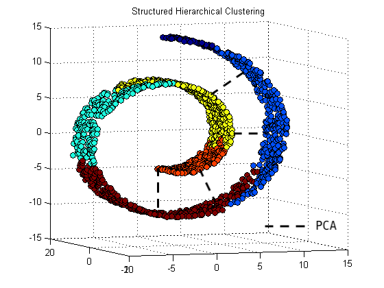

* t-SNE has a **Stochastic** final solution, meaning that with different initializations you will end up with different results. This is in contrast to PCA, which is **deterministic**; you will get the same results every time.

* Computationally expensive compared to PCA or SVD, therefore if it might be necessary to perform PCA to get the number of features down to a reasonable number (50), and the perform t-SNE.

```python
from sklearn.manifold import TSNE
tsne = TSNE(n_components=2)
```

### Singular Value Decomposition (SVD)

SVD is widely applicable in finding *latent features* in data sets. Every matrix $M$ can be decomposed into thee parts $$M = U\Sigma V^T$$

1. $U$ - The observation to axis (underlying/latent feature) matrix, where each value represents the "association" of each observation to each axis, or the amount by which you scale the diagonal values in Sigma.

    * Has dimensions $N~x~L$, where $L$ is the number of latent features and $N$ is the number of observations.

2. $\Sigma$ - The singular values for each axis in the matrix, where each diagonal value is the square root of the eigenvalue whose corresponding axis is one of the eigenvectors.

    * This columns of this matrix can be thought of as the *latent features* or the underlying / unmeasured features that account for the variance in the matrix $M$. This will be a diagonal matrix, with values decreasing along the diagonal

3. $V^T$ - The feature to axis (underlying/latent feature) matrix, where each value represent each features "association" to each axis, or the amount by which you scale the diagonal value in Sigma.

    * Has dimensions $L~x~P$, where $L$ is the number of latent features and $P$ is the number of actual (measured) features.

By setting some of the lower values in $\Sigma$ to 0, we are effectively removing some of the latent features. When we reconstruct the data after doing this, we should get a matrix that is quite similar to our original matrix, *even though we have reduced the "dimensions" of the matrix*.

```python
import numpy as np
from sklearn.decomposition import TruncatedSVD
trunc_SVD = TruncatedSVD(n_components=2)
# or (better)
u, sigma, vt = np.linalg.svd(df.values)
u, sigma, vt = np.linalg.svd(X)
```

# Natural Language Processing (NLP)

Fun fact: For some form of AI to pass the *Turing Test*, a human evaluator must speak to the AI, and while not being able to see the AI, be unable to distinguish it from a human.

Definitions:

* Corpus: the collection of documents that you are working with

* Stop-words: Words so common in any language that they are not going to help differentiate between documents

* Tokens: The set of non stop words that define a document (must be stemmed / lemmatized, meaning brought down to their root form i.e. hiking --> hike & hiked --> hike)

* n-grams: sequence of n words

**One** of the many ways to approach a NLP project (when classifying/clustering documents in a corpus is the goal) is as follows:

1. lowercase all your text

2. Strip out miscellaneous spacing and punctuation

3. Remove stop words

4. Stem/Lemmatize the remaining words

5. Convert words to numbers using term-frequency ($tf$) and an inverse document frequency matrix ($idf$)

    * Create a matrix where the observation are the documents in your corpus and the attributes are the tokens in the entire corpus. Start by finding counts of **all** words in corpus in each document (will be a sparse matrix).

    * To normalize word-counts for documents of different lengths, divide all word-counts by the L2 norm, which will give you the term frequency $tf$ $$tf(t,d) = \frac{f_{t,d}}{\sqrt{\sum \left( f_{i,d} \right)^2}}$$

    which can be read as, "The term frequency of term *t* in document *d* $tf(t,d)$ is equal to the count of term *t* in document *d* $f_{t,d}$ divided by the square root of the sum of the squares of the word-counts across all words in the document. $\sqrt{\sum \left( f_{i,d} \right)^2}$"

    * Calculate the inverse document frequency *idf* by first finding the document frequency for each term $$df = \frac{| docs~containg~t|}{|docs|}~where~t = term$$ then taking the log of of the inverse with a 1 in the denominator gives the inverse document frequency $$idf(t, D) = \log\left( \frac{|docs|}{|1 + docs~containing~t|} \right)$$

    * Once this is calculated, you can obtain the $tf-idf$ by multiplying the term frequency by the idf.

6. Train / cluster your data to determine what documents in your corpus are similar.

```python
import nltk
import spaCy
```

# Unsupervised Machine Learning

Defined as machine learning where you don't have a response variable to predict on, you are simply trying to understand how all the over variables interact with one another and whether there are any interesting relationships between them.

## Clustering

There are (broadly) two types of clustering procedures:

### KMeans

* The goal of KMeans is to find $K$ centroids that group your data into clusters.

* *Note that the analyst has to explicitly determine the number of clusters $K$ there should be ("injecting" your bias into the data)*

* The process goes as follows:
    1. Determine $K$, how many clusters you want your data to be grouped into.
    2. Randomly$^1$ initialize your $K$ centroids.
    3. Calculate the distance$^2$ between every observation and each of the $K$ centroids.
    4. Assign every observation to the closest$^3$ centroid.
    5. Recompute the centroids as the mean of the data points assigned to that cluster.
    6. Repeat steps 1 - 5 until convergence.


$^1$ There are a few ways to initialize your centroids:

* The simplest is to randomly pick $K$ observations and use those as your initial centroids.

* You can also randomly assign each observation to one of your $K$ classes and then initialize the centroids as the mean of the observations that were assigned to that class (downside being that this could lead to the centroids being constrained, therefore only finding the local minimum and not the true minimum).

* kmeans++ Initializes the first centroid randomly, and instantiates the other $K - 1$ centroids so that the spread between the centroids is maximized.

$^2$ Your distance metric is usually the Euclidean distance, however cosine similarity ($\frac{a \cdot b}{||a|| \cdot ||b||}$) and Manhattan distance can also be used.

```python
from sklearn.cluster import KMeans

# 3 centroids
km = KMeans(3)
km.fit(x_train, y_train)
y_hat = km.fit(x_test)
```

### Hierarchical Clustering

<pass>

### Gaussian Mixture Models

[Youtube Walkthrough](https://www.youtube.com/watch?v=qMTuMa86NzU)

$$Mixture(aka~Grand)~Model:~f(x) = (1 - \pi)g_1(x) + \pi g_2(x)$$

$$Gaussian~Mixture:~g_j(x) = \phi_{\theta_j}(x), ~~ \theta_j=(\mu_j, \sigma_j^2)$$

Mixture Models (**which can be generalized to more than just Gaussian distributions**) are a form of "soft" KMeans. Instead of definitively saying that observation $x_i$ is *definitely* from cluster $j$, we can assign a probability that observation $x_i$ is from **each** of the clusters (distributions). This is the essence of mixture models.

###### Expectation Maximization (EM)

EM is a generalization of Maximum Likelihood Estimation and can be used when MLE is rather complex.

Algorithm:

1. Take initial guesses at how many distributions describe your data. For each of those distributions, you are going to initialize $\pi_c$ to be the probability that an observation $x_i$ came from distribution $c$. (Note that these probabilities will sum to 1) $\pi_c$ is referred to as the **mixing parameter**

2. Take initial guesses for the parameters that parameterize each of your distributions (If your model is composed of three Gaussians, you will take initial guesses $\mu_1,~\sigma_1^2,~\mu_2,~\sigma_2^2,~\mu_3,~\sigma_3^2,~$)

4. **Expectation Step** - (For every observation) The responsibility (probability) $\hat{\gamma_i}$ that $x_i$ is from the distribution that is parameterized by $\phi_{\hat{\theta_c}}$ is equal to the probability of that distribution $\hat{\pi_c}$ multiplied by the probability of that observation being observed within distribution $c$, $\phi_{\hat{\theta_c}}(y_i)$, divided by the summation of that observation being observed from **any** of the distributions $\sum_{c=1}^C \hat{\pi_c}\phi_{\hat{\theta_c}}$ (normalizing constant, sums to one.)

$$\hat{\gamma}_i(\phi_{\theta_c}) = \frac{\hat{\pi_c} \phi_{\hat{\theta_c}}(y_i)} {\sum_{c=1}^C \hat{\pi_c}\phi_{\hat{\theta_c}}}$$

5. **Maximization Step** - The responsibilities calculated in the expectation step are then used to update the parameters $\hat{\theta_c}$ for each distribution in your model (equations can take various forms depending on the parameters that define the distributions you are using). In addition to updating $\hat{\theta_c}$, you update $\hat{\pi_c}$, the probability/mixing parameters for distibution $c$.

6. Iterate over steps 3 and 5 until convergence.

# Big Data

At some point the quantity of data that you are going to be working with will be too large to work with on a single machine and you will have to make use of multiple machines. Big Data frameworks are built for working with large (100's of Terabytes or more); storing them and analyzing them.

## Apache Spark

A tool for managing and coordinating the execution of tasks on data across a cluster of machines acting as one.

## AWS

[Short Tutorials](https://aws.amazon.com/start-now/)

### Launching a Virtual Machine (VM)

Connecting to a VM allows you to make use of more computing power than your local machine may have, making working with large data a lot easier to deal with.

[Step by step Walkthrough](https://aws.amazon.com/getting-started/tutorials/launch-a-virtual-machine/)

Process:

1. Navigate to the [AWS EC2 Console](https://us-west-2.console.aws.amazon.com/ec2/v2/home?region=us-west-2#Home:) and click Launch Instance

    * After you click Launch Instance, you will be able to choose the AMI (Amazon Machine Image aka server template) best suited to the task you would like to accomplish.

    * You will then be able to configure the instance type, options including memory, storage, CPU's, etc.

    * You will either have to use an existing key pair (analogy: Cloud VM is your house with a lock, your SSH key is the key to enter the house and use everything inside) or create a new one (when creating new, move to `~/.ssh/`)

    * click Launch Instances

2. Once your instance is launched, click View Instances and copy the Public IP address

3. Connect your local machine to your VM:

    * from the home directory `~/` (on your local machine), type:

        `$ ssh -i ~/.ssh/<keypair_name_used_to_launch_instance> ec2-user@<public_ip_address_you_copied>`

    * When asked whether you would like to continue, type `yes` and hit Return

    * you will know you have successfully connected to your VM when something similar to the following appears in your command line:

        `[ec2-user@ip-172-31-30-75 ~]$`

4. Terminate your Instance

    * **Note that it is safest to terminate your instance from your EC2 Console**; doing so will automatically disconnect your local machine from the instance whereas disconnecting from your local machine will not actually terminate the instance, it will simply disconnect your machine and the instance could keep running (charging your money for doing so)

    * From your EC2 Console, click Actions, then Instance State, and click Terminate (NOT the same as stop)

    * When asked to confirm, click *Yes, Terminate*

### Storing/Retrieving Files with Amazon Simple Storage Solution (S3)

Process (pretty self-explanatory):

1. Navigate to your [S3 Console](https://s3.console.aws.amazon.com/s3/home?region=us-west-2)

2. Click Create Bucket (location where files/objects will be stored)

    * You can configure multiple aspects of your bucket such as permissions, versioning, etc (defaults usually sufficient). To accept defaults, click Next

    * Click Create Bucket when prompted

3. To upload a file to your S3 Bucket:

    * From the S3 Console, click the bucket in which you would like to store your file.

    * Click Upload and select files

        * You can configure permissions, encryption, etc here, once again defaults are usually sufficient (click Next to accept defaults).

4. To Download a file from your S3 Bucket to your local machine:

    * From the S3 Console, click the bucket from which you would like to download a file.

    * Select the checkbox next to the file you would like to download and a dialogue box will pop up; click Download.

5. **Delete Files and Buckets when they aren't needed**

    * Same as VM, you will be charged if they are left up.

    * To delete a file/data object within a Bucket:

        * Select the checkbox next to the object and click More --> Delete

        * Confirm Deletion

    * To delete a Bucket:

        * click to the right of the bucket name you would like to delete (selects and highlights the bucket), and click Delete Bucket

### AWS EMR (Elastic Map Reduce)

"Amazon EMR provides a managed Hadoop framework that makes it easy, fast, and cost-effective to process vast amounts of data across dynamically scalable Amazon EC2 instances. You can also run other popular distributed frameworks such as Apache Spark, HBase, Presto, and Flink in Amazon EMR, and interact with data in other AWS data stores such as Amazon S3 and Amazon DynamoDB"

#### Running Spark Using EMR

* *Note that the following process assumes that you have already created a EC2 Key Pair for your Spark Cluster*

    * After you move your key pair file (<whatever_you_called_it>.pem) to your `~/.ssh/` directory, you will need to change the permissions of that file. To do so, run the following from the command line

        `$ chmod 400 ~/.ssh/<whatever_you_called_it>.pem`

    * **If you do not perform the above step, you will get an error when you try to connect to your cluster that looks like the following**:

    `@@@@@@@@@@@@@@@@@@@@@@@@@@@@@@@@@@@@@@@@@@@@@@@@@@@@@@@@@@@`
    `@         WARNING: UNPROTECTED PRIVATE KEY FILE!          @`
    `@@@@@@@@@@@@@@@@@@@@@@@@@@@@@@@@@@@@@@@@@@@@@@@@@@@@@@@@@@@`
    `Permissions 0644 for '/path/to/you/pem/file' are too open.`

To connect using the AWS GUI:

1. Go to the [AWS EMR Console](https://console.aws.amazon.com/elasticmapreduce/home?region=us-east-1)
2. Enter the following as settings:

* *Note that since your bucket name has to be universally unique across all bucket names on AWS, your bucket name will look something like this:*
    `s3://my_super_sick_bucket_name/`

| *Setting* | *Value* |
| ------- | ----- |
| Cluster name (*) | <name_for_your_cluster> |
| s3 Folder | <bucket_name_for_your_cluster> |
| Launch Mode | Cluster |
| Vendor | Amazon |
| Release | emr-5.3.1 |
| Applications (*) | Spark: Spark 2.1.0 on Hadoop 2.7.3 YARN with Ganglia 3.7.2 and Zeppelin 0.6.2 |
| Instance type | m3.xlarge |
| Number of instances | <however_many_you_need> |
| EC2 key pair (*) | <key_pair_name_you_created> |
| Permissions | Default |
| EMR Role | EMR_DefaultRole |
| EC2 instance profile | EMR_EC2_DefaultRole |

3. Click Create Cluster at bottom right of page.

4. Wait for your cluster status to change to waiting

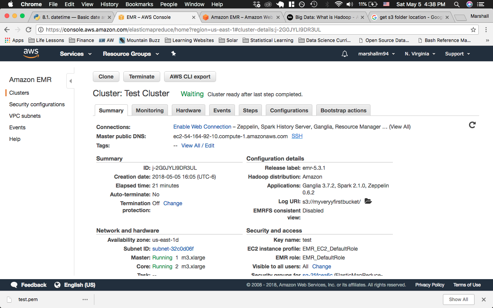

**NOTE**: Occasionally your cluster will fail to launch with the error message **Terminated with errors**: Failed to provision ec2 instances because 'The requested instance profile EMR_AutoScaling_DefaultRole is invalid'.  If this happens, just try and launch the cluster again and it should work.

5. To connect to your spark cluster, click the SSH link next to the Master Public DNS (see picture below)

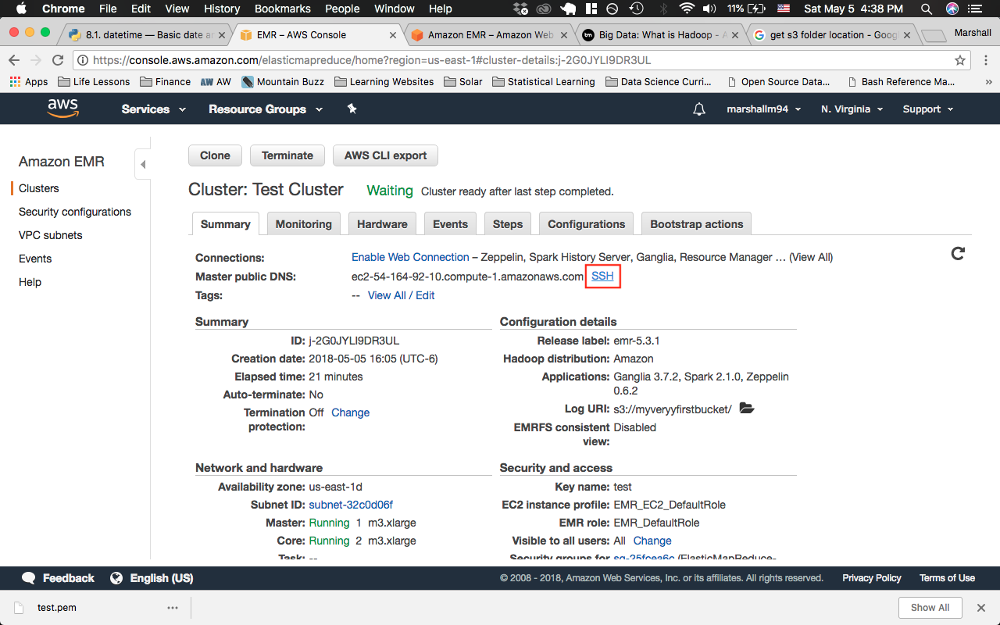

6. When you do this, the below dialogue box will pop up. Copy the code that is shown in the red box, and run it from the command line. This should connect you to the mainframe.

    * Note that you will have to edit to path to your pem file to be where it is on you machine, most likely `~/.ssh/test.pem` (in the example shown below, `test.pem` is assumed to be in the home directory `~/`).

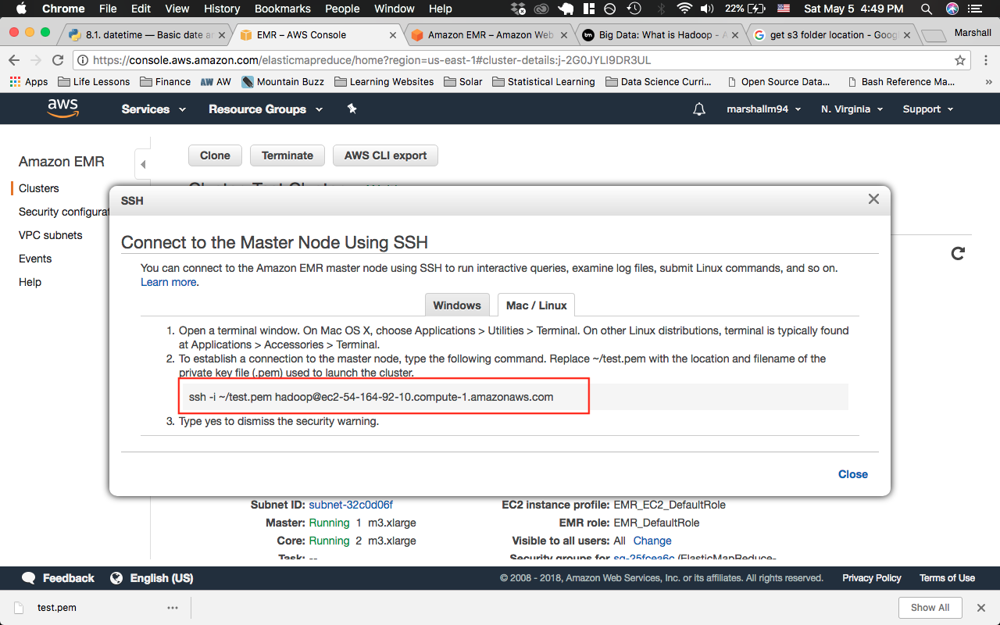

* Note that if you are going to be using this cluster frequently, it could be useful to add it to the config file in your `.ssh/` directory, in the format shown below.

    ```
    # First Spark Cluster
    Host example_name
        HostName ec2-XX-XXX-XX-X.compute-1.amazonaws.com
        User hadoop
        IdentityFile ~/path/to/your/keypair/file/used/to/start/cluster
    ```

    * After you have done this, you will need to edit the inbound rules for the Master node. Click on the link in the red box below

    

    * This will bring to the Security groups page for you cluster. Click Edit inbound rules from the Actions drop down menu when the Master node is selected (see picture below)

    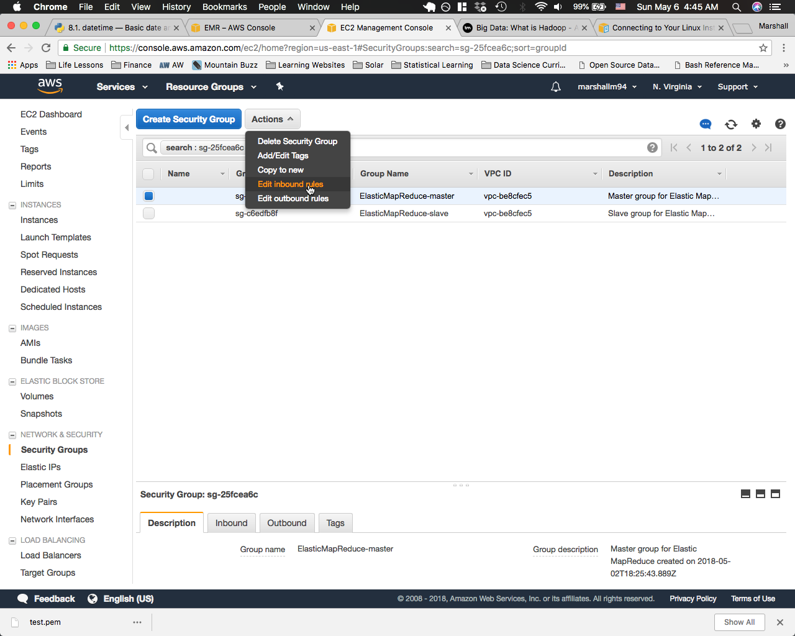

    * This will open another dialogue box that allows you to specify rules for your cluster. Change one of the rules (**not one of the first two**) to be SSH under Type and Anywhere under Source (see picture below). Save your changes at the bottom of the dialogue box.

    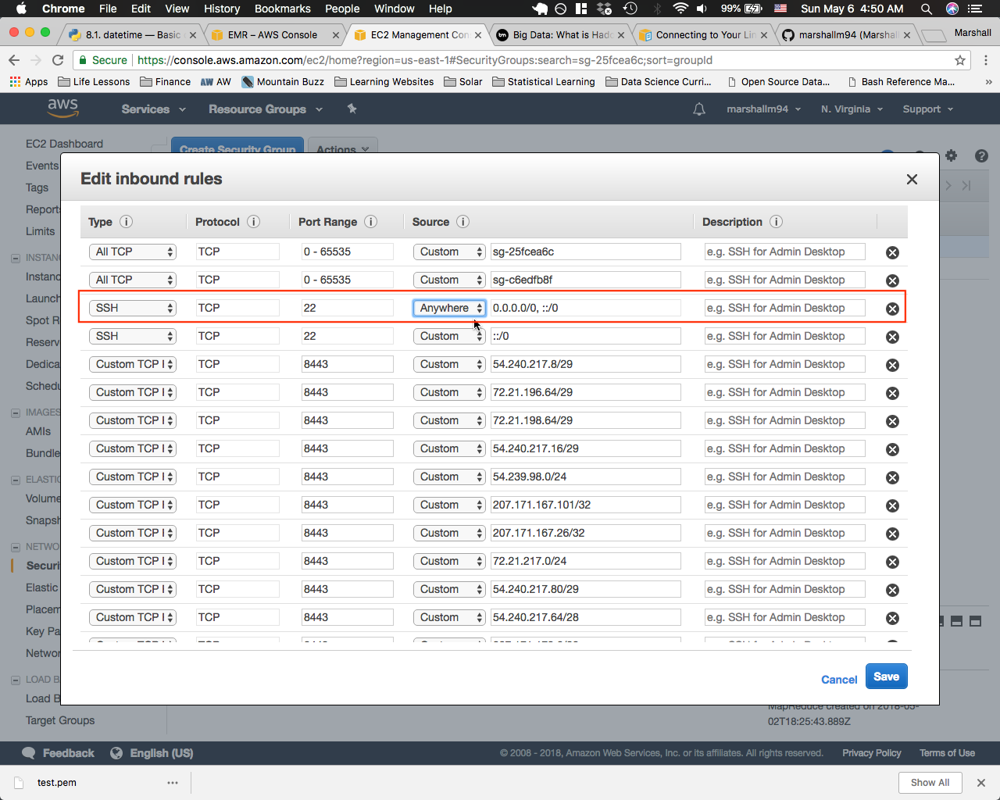

    * Once all of the above is complete, you will be able to run `ssh example_name` from the command line and connect to your cluster    

7. When your terminal header (for lack of a better word) has changed to look something like `[hadoop@ip-172-31-90-207 ~]$`, you can type `$ pyspark`, and you will now be running Apache Spark on your EMR Cluster.


##### Bootstrapping Your Cluster

The above process gets you running spark on a remote cluster. However, this cluster doesn't have much else on it in terms of data science capability. To create an OS environment that allows for more data science computing, you will want to install some application, namely Anaconda, on your cluster.

The `galvanize_notes/bash_scripts/` directory has two bash scripts, that can be run from the command line.

#### `launch_cluster.sh`

The `launch_cluster.sh` file allows you to launch an EMR cluster from your command line. The syntax you will use is:

    $ bash launch_cluster.sh (your_bucket_name) (your_key_pair_name) (number_of_worker_nodes_desired)

* This creates an EMR cluster that uses (your_bucket_name), (your_key_pair_name), whether that is one that you just created or one that you already had. This cluster will have (number_of_worker_nodes_desired) worker nodes.

* **Note that (your_key_pair_name), which is a .pem file, does NOT have the .pem extension when being run from the command line.**

* Example:

    `bash launch_cluster.sh myfirstbucket test 3`

    * By running the above command at the command line, you are creating a cluster that has 3 worker nodes, that utilizes the "test" key pair and the S3 bucket called "myfirstbucket".

Once you have run the above code from the command line, go to the [EMR Dashboard on AWS](https://console.aws.amazon.com/elasticmapreduce/), and you should see a cluster named "PySparkCluster" spinning up.

#### `bootstrap-emr.sh`

When the status of "PySparkCluster" has changed to "Bootstrapping" (see image below), the `bootstrap-emr.sh` script is being run on your cluster. As it is currently written, it is installing Anaconda, Git and tmux.

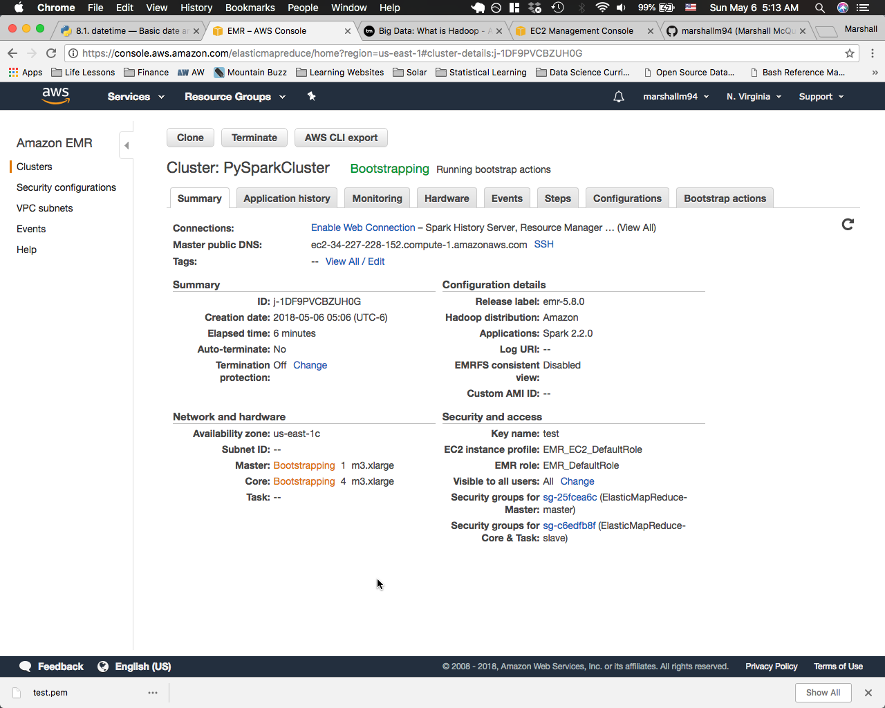

Once the status of "PySparkCluster" has changed from "Bootstrapping" to "Waiting", you can connect to your cluster using the SSH command provided (see step 6 of "Running Spark Using EMR")

You are now connected to your bootstapped cluster.

##### Copying Files to Your Cluster

There are two ways to copy files to your cluster:

1. **Using Git**

    * Assuming you have git installed on your cluster from the previous Walkthrough, you can go to Github and clone the repo that you are working on using standard syntax (**you will have to use the https:// version**)
    * From there, you can run/work on any file in that repo using IPython/nano.

2. **Using `SCP`**

    * `scp`(Secure Copy Protocol) allows you to transfer files from a local host to a remote host. The syntax to do so (from the local host) is as follows:

    `$ scp ~/path/to/you/file hadoop@ec2-34-227-228-152.compute-1.amazonaws.com:/path/to/your/remote/file`

    * You will replace the `ec2-34-227-228-152.compute-1.amazonaws.com` above with the Master Public DNS shown on your cluster's status page, shown in the red box in the image below.

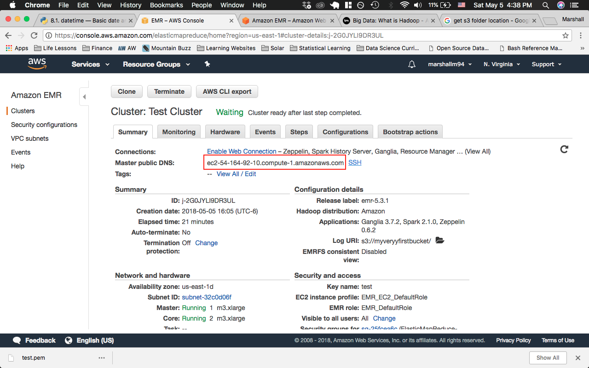

### Amazon RDS - PostgreSQL

[Tags for the AWS CLI](https://docs.aws.amazon.com/cli/latest/reference/rds/create-db-instance.html)

1. Navigate to your [AWS RDS Dashboard](https://console.aws.amazon.com/rds/home?region=us-east-1)

2. Scroll down and select Create Database (red arrow in image below) from the Create Database section of the Dashboard.

    * Also note where your RDS will be hosted; the closer it is to you, the faster your queries/application will run (can be changed from the dropdown shown by the blue arrow).

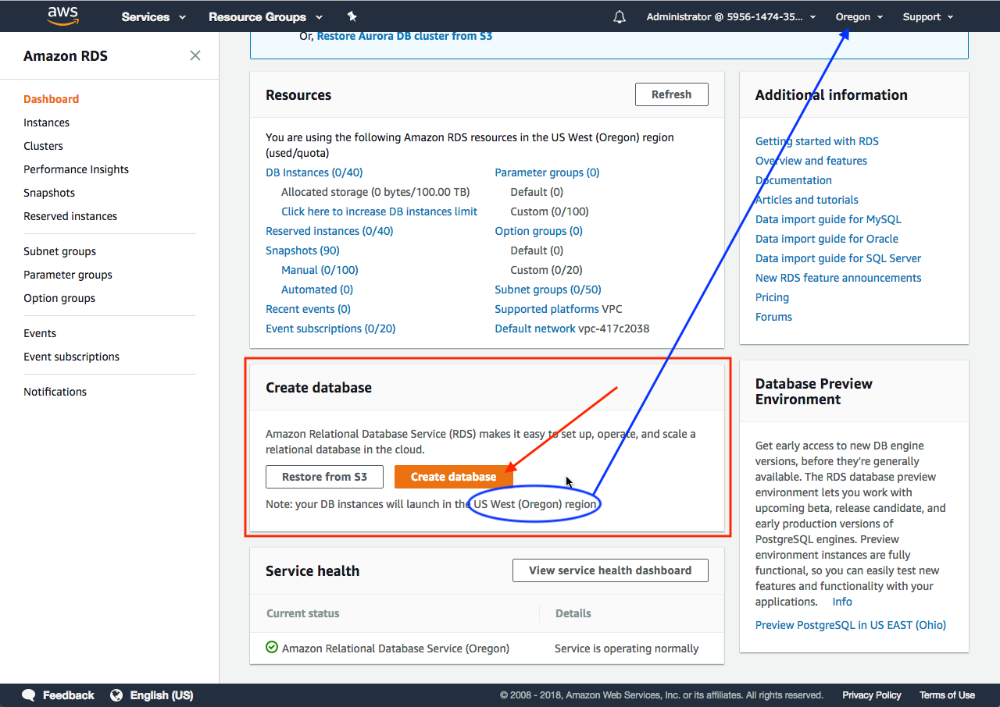

3. Select PostgreSQL (or other framework if desired)

4. Select Production or Dev/Test depending on the development stage.

5. Select your DB details; defaults can be found on step 7 in the [AWS PostgreSQL RDS Set Up Instructions](https://docs.aws.amazon.com/AmazonRDS/latest/UserGuide/CHAP_GettingStarted.CreatingConnecting.PostgreSQL.html)

6. In Step 4: Configure Advanced Settings, **set the Public accessibility to Yes**

7. Continue through and click Create Database

8. Go to your [RDS Instances](https://us-west-1.console.aws.amazon.com/rds/home?region=us-west-1#dbinstances:) and wait for the status of the DB Instance to change to available.

9. Once the status changes to available, click on the name of the DB Instance and find the Connect Section. Make note of the endpoint (red box in image below) and the port number.

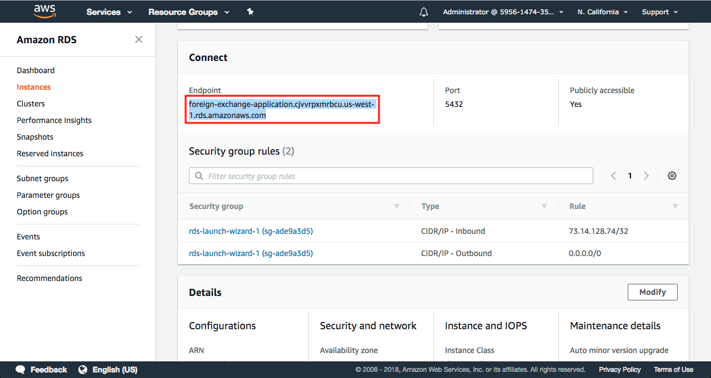

10. Connect to your database via the command line, using the syntax below, replacing:

    * <DB_instance_endpoint> with the endpoint on your screen
    * <port> with the port shown next to your endpoint
    * <username> with the username in the Details Section of the DB Instance page (shown below)
    * <database_name> with the DB Name in the Details Section of the DB Instance page (shown below)

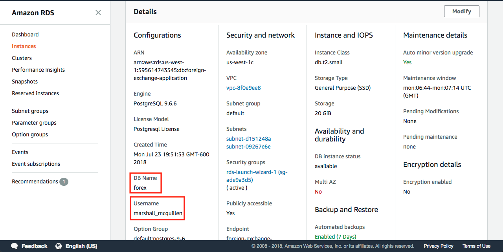

```
psql \
   --host=<DB_instance_endpoint> \
   --port=<port> \
   --username=<username> \
   --password \
   --dbname=<database_name>
```

11. `$ Password for user <username>:` should pop up. Enter the password you used for this user when setting up the DB Instance.

###### Helpful Links

[Set Up](https://docs.aws.amazon.com/AmazonRDS/latest/UserGuide/CHAP_SettingUp.html)

[AWS VPC Tutorial](https://docs.aws.amazon.com/AmazonRDS/latest/UserGuide/CHAP_Tutorials.WebServerDB.CreateVPC.html)


[AWS Virtual Private Cloud (VPC) Dashboard](https://console.aws.amazon.com/vpc/home?region=us-east-1)


[Step by Step Instructions](https://docs.aws.amazon.com/AmazonRDS/latest/UserGuide/CHAP_GettingStarted.CreatingConnecting.PostgreSQL.html)

# General Code Snippets

```python

## Imports

import math as m
import matplotlib.pyplot as plt
import numpy as np
import pandas as pd
from pandas.tools.plotting import scatter_matrix
from sklearn.linear_model import LinearRegression, LogisticRegression
from sklearn.pipeline import Pipeline
from basis_expansions.basis_expansions import (
    Polynomial, LinearSpline, NaturalCubicSpline)
from regression_tools.dftransformers import (
    ColumnSelector, Identity, FeatureUnion, MapFeature, Intercept)
from regression_tools.plotting_tools import (
    plot_univariate_smooth,
    bootstrap_train,
    display_coef,
    plot_bootstrap_coefs,
    plot_partial_depenence,
    plot_partial_dependences,
    predicteds_vs_actuals)
plt.style.use('bmh')

# Plotting

def distribution_plot(df, column_name, target_column, xlab, ylab, title, filename=False, plot_type="box", order=None):
    """
    Create various plot types leverage matplotlib.
    Inputs:
        df: (Pandas DataFrame)
        column_name: (str) - A column in df that you want to have on the x-axis
        target_column: (str) - A column in df that you want to have on the y_axis
        xlab, ylab, title: (all str) - Strings for the x label, y label and title of the plot, respectively.
        filename: (str) - the relative path to which you would like to save the image
        plot_type: (str) - "box", "violin" or "bar"
        order: (None (default) or list) - the ordering of the variable on the x-axis
    Output:
        None (displays figure and saves image)
    """
    fig = plt.figure(figsize=(13,6))
    ax = fig.add_subplot(111)
    if plot_type == "box":
        ax = sns.boxplot(df[column_name], df[target_column], order=order)
    elif plot_type == "violin":
        ax = sns.violinplot(df[column_name], df[target_column])
    elif plot_type == "bar":
        ax = sns.barplot(df[column_name], df[target_column], palette="Greens_d", order=order)
    ax.set_xlabel(xlab, fontweight="bold", fontsize=14)
    ax.set_ylabel(ylab, fontweight="bold", fontsize=14)
    plt.xticks(rotation=75)
    plt.suptitle(title, fontweight="bold", fontsize=16)
    if filename:
        plt.savefig(filename)
    plt.tight_layout()
    plt.subplots_adjust(top=0.9)
    plt.show()

def multi_class_scatter_plot(arr_1, arr_2, y, color_list=False):
    classes = np.unique(y)
    if color_list:
        continue
    if not color_list:
        import matplotlib.colors as colors        
        color_list = np.random.choice(list(colors.cnames.keys()), len(classes))

    fig, ax = plt.subplots(figsize=(8,6))
    for i in classes:
        color = np.random.choice(color_list)
        mask = y == i
        ax.scatter(arr_1[mask], arr_2[mask], c=color, label=f"{i}")

    ax.legend()
    plt.show()

def horizontal_bar_plot(arr_1, y, title, color_list=False, savefig=False):
    classes = np.unique(arr_1)

    if color_list:
        continue
    if not color_list:
        import matplotlib.colors as colors                
        color_list = np.random.choice(list(colors.cnames.keys()), len(classes))

    desc_idx = np.argsort(y)[::-1]
    classes = classes[desc_idx]
    y = y[desc_idx]

    y_axis = np.arange(len(classes))
    fig, ax = plt.subplots(figsize=(8,6))
    for x in range(len(classes)):
        color = color_list[x]
        ax.barh(y_axis[x], y[x], color=color, label="{}".format(classes[x]))

    ax.set_yticks([])
    ax.invert_yaxis()
    ax.set_xlabel("Count", fontsize=16)
    plt.suptitle(title, fontsize=18, fontweight="bold")
    plt.legend()
    if not savefig:
        plt.show()
    else:
        plt.savefig(savefig)

def multi_class_bar_plot(arr_1, y, title, color_list=False):
    classes = np.unique(arr_1)
    if color_list:
        continue
    if not color_list:
        import matplotlib.colors as colors        
        color_list = np.random.choice(list(colors.cnames.keys()), len(classes))

    x_axis = np.linspace(0, len(classes), len(classes))
    fig, ax = plt.subplots(figsize=(8,6))
    for x, i in enumerate(classes):

        color = color_list[x]
        mask = arr_1 == i
        ax.bar(x_axis[x],height=y[x], color=color, label=f"{i}")

    plt.xticks([])
    ax.legend()
    plt.suptitle(title, fontsize=18, fontweight="bold")
    plt.show()

def scatter_plot(x, y, df, xlab, ylab, title):
    fig = plt.figure(figsize=(8,6))
    ax = fig.add_subplot(111)
    ax.plot(x, y)
    ax.set_ylabel(ylab)
    ax.set_xlabel(ylab)
    plt.suptitle(title)
    plt.show()

def histogram(x, df, title):
    fig = plt.figure(figsize=(8,6))
    ax = fig.add_subplot(111)
    ax.hist(df[x])
    plt.suptitle(title)
    plt.show()

def plot_one_univariate(ax, var_name, target_name, df, mask=None):
    if mask is None:
        plot_univariate_smooth(
            ax,
            df[var_name].values.reshape(-1, 1),
            df[target_name],
            bootstrap=200)
    else:
        plot_univariate_smooth(
            ax,
            df[var_name].values.reshape(-1, 1),
            df[target_name],
            mask=mask,
            bootstrap=200)

_ = scatter_matrix(df, alpha=0.2, figsize=(20, 20), diagonal='kde')

# Pipelines

def add_spline_pipeline(column, knots):
    return Pipeline([
    (f'{column}_select', ColumnSelector(name=column)),
    (f'{column}_spline', NaturalCubicSpline(knots=knots))
    ])
```

### Roc Curve Plot

```python
import numpy as np
import matplotlib.pyplot as plt
from sklearn.metrics import roc_curve, auc
from scipy import interp
from sklearn.cross_validation import KFold
from sklearn.preprocessing import StandardScaler


def plot_roc(X, y, clf_class, **kwargs):
    scaler = StandardScaler()
    X = scaler.fit_transform(X)
    kf = KFold(len(y), n_folds=5, shuffle=True)
    y_prob = np.zeros((len(y),2))
    mean_tpr = 0.0
    mean_fpr = np.linspace(0, 1, 100)
    all_tpr = []
    fig = plt.figure(figsize=(8,6))
    for i, (train_index, test_index) in enumerate(kf):
        X_train, X_test = X[train_index], X[test_index]
        y_train = y[train_index]
        clf = clf_class(**kwargs)
        clf.fit(X_train,y_train)
        # Predict probabilities, not classes
        y_prob[test_index] = clf.predict_proba(X_test)
        fpr, tpr, thresholds = roc_curve(y[test_index], y_prob[test_index, 1])
        mean_tpr += interp(mean_fpr, fpr, tpr)
        mean_tpr[0] = 0.0
        roc_auc = auc(fpr, tpr)
        ax = fig.add_subplot(111)
        ax.plot(fpr, tpr, lw=1, label='ROC fold %d (area = %0.2f)' % (i, roc_auc))
    mean_tpr /= len(kf)
    mean_tpr[-1] = 1.0
    mean_auc = auc(mean_fpr, mean_tpr)
    plt.plot(mean_fpr, mean_tpr, 'k--',label='Mean ROC (area = %0.2f)' % mean_auc, lw=2)
    plt.plot([0, 1], [0, 1], '--', color=(0.6, 0.6, 0.6), label='Random')
    plt.xlim([-0.05, 1.05])
    plt.ylim([-0.05, 1.05])
    plt.xlabel('False Positive Rate')
    plt.ylabel('True Positive Rate')
    plt.title('Receiver operating characteristic')
    plt.legend(loc="lower right")
    plt.show()

def count_nulls(df, columns, verbose=True):
    """
    Calculates null value percentages per column in a pandas DataFrame.

    Parameters:
    ----------
    df : (Pandas DataFrame)
    columns : (list)
        A list of strings of the columns to check for null values. Note
        that even if you are checking only one column, it must be
        contained within a list. (Pass df.columns to check all columns)
    verbose : (bool)
        If True (default), prints column names and NaN percentage

    Returns:
    ----------
    col_nulls : (list)
        List containing tuples of column names and percentage Null for
        that column.
    """
    col_nulls = []
    for col in columns:
        percent_null = pd.isnull(df[col]).sum()/len(pd.isnull(df[col]))
        col_nulls.append((col, percent_null))
        if verbose:
            print("{} | {:.2f}% Null".format(col, percent_null*100))

    return col_nulls

def count_nans(df, columns, verbose=True):
    """
    Calculates nan value percentages per column in a pandas DataFrame.

    Parameters:
    ----------
    df : (Pandas DataFrame)
    columns : (list)
        A list of strings of the columns to check for null values. Note
        that even if you are checking only one column, it must be
        contained within a list. (Pass df.columns to check all columns)    
    verbose : (bool)
        If True (default), prints column names and NaN percentage

    Returns:
    ----------
    col_nans : (list)
        List containing tuples of column names and percentage NaN for
        that column.
    """
    col_nans = []
    for col in columns:
        percent_nan = pd.isna(df[col]).sum()/len(pd.isna(df[col]))
        col_nans.append((col, percent_nan))
        if verbose:
            print("{} | {:.2f}% NaN".format(col, percent_nan*100))

    return col_nans    

def normalize(df):
    for col in df.select_dtypes(exclude=['object']).columns:
        new_name = col + "_scaled"
        df[new_name] = (df[col] - df[col].values.mean()) / np.sqrt(df[col].values.var())
    return df
```
