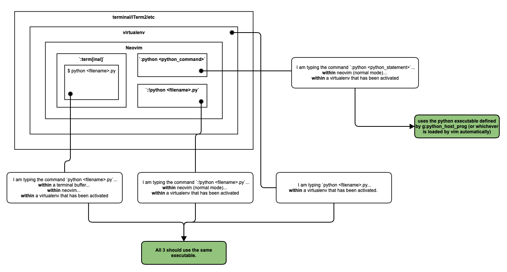

# Some Context

It is June 2021. Python 2 has been officially deprecated for over a year. I am personally  **never** in a position where
I want to call the python2 executable.

# How do I work with Python, Neovim and Virtual Environments?

If I am working in a `virtualenv`, I start the `virtualenv` from the shell **and then open Neovim.** I am **never** in a
position where I activate or change a `virtualenv` from within Neovim.

# What do I want?

1. From the shell (`/bin/bash` for me) (i.e. **NOT** within Neovim):
	* If a `virtualenv` is **not** activated, both `python` and `python3` should point to the python executable.
	* If a `virtualenv` is activated, both `python` and `python3` should point to the python executable defined by the
	  `virtualenv`.
	* `python <python_script>` and `python3 <python_script>` should both execute `<python_script>` with the same executable.
	* `python` and `python3` should both start a REPL using the same python executable.

2. From within Neovim:
	* `:!python <python_script>` and `:!python3 <python_script>` should use the same python executable.
	* From within a `:terminal` within Neovim:
		* `python <python_script>` and `python3 <python_script>` should both execute `<python_script>` with the same executable.
		* `python` and `python3` should both start a REPL using the same python executable.
Below is a diagram of what I want:



# How do I get what do I want?

1. Put the below in `init.vim`:

```
let &shell='/bin/bash --login'
```

What does this do?
* Makes the `:term[inal]` neovim command read `~/.bash_profile` when a terminal buffer is started.

2. Put the below in `~/.bash_profile`:

```
if [[ -n $VIRTUAL_ENV && -e "${VIRTUAL_ENV}/bin/activate" ]]; then
  source "${VIRTUAL_ENV}/bin/activate"
fi
```

What does this do?
* (In combination with #1) Activates the `$VIRTUAL_ENV` that was present when `nvim` was started.
