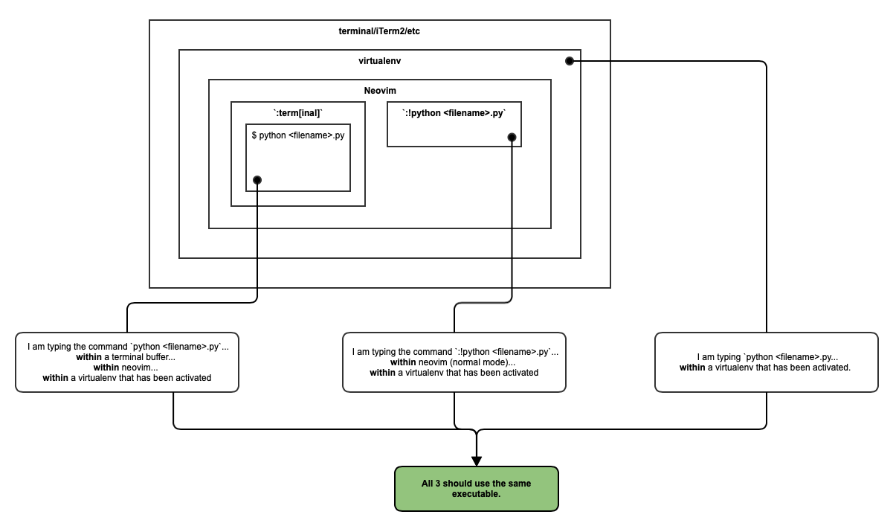

# Some Context

It is June 2021. Python 2 has been deprecated or over a year. I am personally  **never** in a position where I want to
call the python2 executable from the command line.

# How do I work with Python, Neovim and Virtual Environments?

If I am working in a `virtualenv`, I start the `virtualenv` from the shell **and then open Neovim.** I am **never** in a
position where I activate a `virtualenv` from within Neovim.

# What do I want?

1. From the shell (`/bin/bash`) (i.e. **NOT** within Neovim):
	* If a `virtualenv` is **not** activated, both `python` and `python3` should point to the python executable.
	* If a `virtualenv` is activated, both `python` and `python3` should point to the python executable defined by the
	  `virtualenv`.
	* `python <python_script>` and `python3 <python_script>` should both execute `<python_script>` with the same executable.
	* `python` and `python3` should both start a REPL using the same python executable.

2. From within Neovim:
	* `:!python <python_script>` and `:!python3 <python_script>` should use the same python executable.
	* `python <python_command>` and `python3 <python_command>` should use the same python executable.
	* From within a `:terminal` within Neovim:
		* `python <python_script>` and `python3 <python_script>` should both execute `<python_script>` with the same executable.
		* `python` and `python3` should both start a REPL using the same python executable.

# Thoughts

* When a `virtualenv` is activated, the shell adds the path to the python executable to the **front** of $PATH.
* In `:terminal` within vim, `echo $PATH` shows that the path to the python executable is at the **end** of $PATH.
* Where does `shell` in neovim get the $PATH from?

# What happens when you `source` the `activate` file in a `virtualenv` directory?

* `source <file>` runs the commands in `<file>` in the *current* shell (i.e. as if you typed them in yourself).
*
