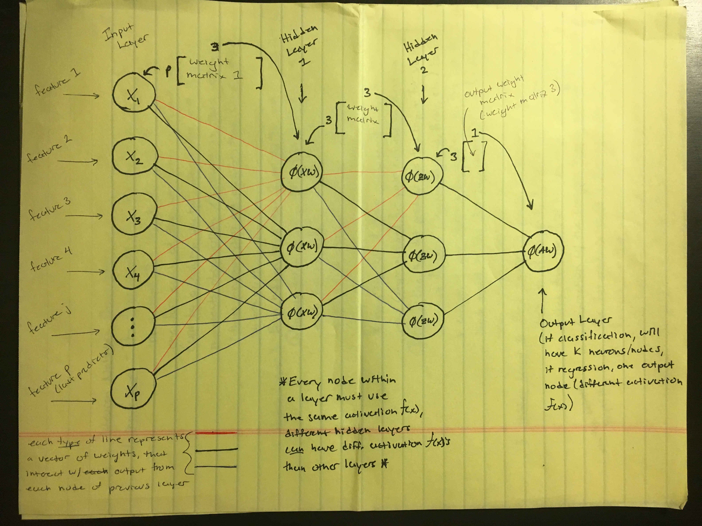
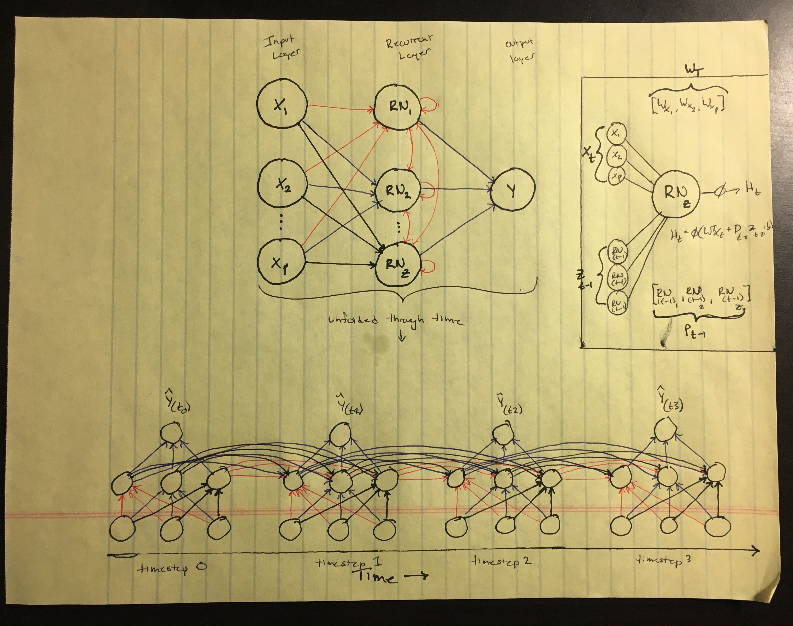

### Neural Networks

[Tuning Neural Networks Post](https://machinelearningmastery.com/grid-search-hyperparameters-deep-learning-models-python-keras/#comment-436150)

For each type of NN, an image is provided and repeated throughout the explanation. Although it is the same image, this is done in order to prevent unnecessary scrolling.

#### Multi-Layer Perceptron (MLP)

MLP's are the "simplest" of all Neural Networks, and are sometimes simply called *Dense* Networks/Layers when referred to from more advanced models.

##### General Architecture

*see image at end of MLP section*

###### Input Layer

The first layer, called the **Input Layer**, will always have as many nodes/neurons as their are attributes in your data set and is the start of the *feed-forward* process of a Neural Network. The nodes in this layers don't perform any operations on the values that are fed to them; the simply take the values of each attribute for one observation.

* example: If you were working with a data set that contained height, weight and shoe size of a number of people, you would have 3 nodes in your input layer; one for height, one for weight and one for shoe size.

###### Hidden Layers

* **There can be any number of hidden layers in a Neural Network, and each hidden layer can have any number of nodes/neurons (thus their power).**

* All nodes within a hidden layer must have the same activation function, but activation functions can vary from hidden layer to hidden layer

* There are various [activation functions](https://en.wikipedia.org/wiki/Activation_function#Comparison_of_activation_functions), common ones include:

    * Relu
    * Sigmoid
    * Tanh
    * Softmax

 <b> Abstract </b> 

**Each** node in a hidden layer has a vector of weights which has as many elements as there are nodes in the previous layer in the network. This vector of weights is used to calculate a *weighted sum* (dot product, $\sum w_i x_i$) using the outputs of the nodes of the previous layer and the weights associated with a node in the current layer. This **single number** (dot product) is used as the input for the activation function of the node in the hidden layer, which transforms the input in some way (activation function dependent) to create a **single** output number. This output is then used in the next hidden layer (or output layer).     

 <b> Example Specific </b> 

 <b> <small> Hidden Layer 1 </small> </b> 

In the example picture shown below, the first hidden layer has three nodes, each connected to all of the nodes in the input layer (origin of the word "Dense" in Dense Neural Network).

The first node in the first hidden layer has red lines connecting it to each of the nodes in the input layer. Each of these red lines symbolizes a weight being multiplied by the value that is in the connected input layer node.

* example:

    * The first red line is the value that is in input layer node $X_1$, (call that *specific* value $x_1$), being multiplied by the first weight, $w_1$, in the weight vector associated with the first node in the first input layer

    * The second red line is the value that is in input layer node $X_2$, (call that *specific* value $x_2$), being multiplied by the second weight, $w_2$, in the weight vector associated with the first node in the first input layer

    * This process continues for all the red lines connecting the first node in hidden layer one to all the nodes in the input layer.

    * All of these values ($x_i \cdot w_i$ for each red line) are then added together to make **one** number, which is then passed into the activation function of the first node in hidden layer 1.

    The process above is repeated for **each** of the nodes in hidden layer 1, where each node has a separate vector of weights, denoted by a different color of lines.

    * *Note that these vectors of weights are combined to create a weight matrix in practice*

 <b> <small> Hidden Layer 2 </small> </b> 

In the example picture shown below, the second hidden layer has three nodes, each connected to all three of the nodes in the first hidden layer.

The first node in the second hidden layer has red lines connecting it to each of the three nodes in the first hidden layer. Each of these red lines symbolizes a weight being multiplied by the output value of the activation function of each node in hidden layer 1.

* example:

    * The first red line is the value of the output of the activation function of the first node in hidden layer 1, being multiplied by the first weight in the weight vector associated with the first node in hidden layer 2.

    * The second red line is the value of the output of the activation function of the second node in hidden layer 1, being multiplied by the second weight in the weight vector associated with the first node in hidden layer 2.

    * This process continues for all the red lines connecting the first node in hidden layer 2 to all the nodes in hidden layer 1.

    * Once again, all of these values are then added together to make **one** number, which is then passed into the activation function of the first node in hidden layer 2.

    The process above is repeated for **each** of the nodes in hidden layer 2, where each node has a separate vector of weights, denoted by a different color of lines.

    * *Note that these vectors of weights are combined to create a weight matrix in practice*

###### Output Layer

The architecture of the output layer of a MLP will depend on whether the target variable is continuous (regression) or discrete (classification).

* **Regression**

    * In the case of regression, the output layer will have a single node/neuron, and the "activation function" of that single node will simply add the outputs of all the activation functions of the last hidden layer together. This sum will be the estimate of the Network, $\hat{y}$.

* **Classification**

    * In the case of classification, the output layer will have $K$ nodes/neurons, one for each of the $K$ possible classes in the data set. Each of the nodes in the output layer has vector of weights associated with it, and the same process is used to calculate the input to the activation function of the $k_{th}$ output node. **Depending on the activation function**, the output of the activation function will resemble a probability that the observation is the class that corresponds to that specific node.

        * example: If the output layer has 10 nodes, then their are 10 possible classes. When an observation passes through the Neural Network, each of the nodes in the output layer will produce an output. The node with the highest output corresponds to the class with the highest probability for that observation.

#### Recurrent Neural Networks (RNN's)

Standard NN's aren't able to look at previous information during the training phase. When the order of the data doesn't matter, this isn't that much of a problem, however when the order of the data *does* matter (time series data, words in a sentence, **any type of data where $X_{i - 1}$, $X_{i - 2}$, $X_{i - 3}$ etc, will add some predictive power for $X_i$**), remembering information from the previous $Z$ observations can greatly increase the predictive power of our model. This is the benefit of Recurrent Neural Networks.

[Explanatory Video](https://www.youtube.com/watch?v=WCUNPb-5EYI&t=924s)

[Explanatory Article](https://deeplearning4j.org/lstm.html)

##### General Architecture

In the picture below, the RNN as one recurrent layer.

###### Input Layer

Similar to MLP's, the input layer of an RNN has $p$ neurons/nodes, where $p$ is the number of attributes of your data set.

###### Hidden Layers

As stated previously, **what separates RNN's from MLP's is that they are able to use information from the previous pass (time-step, step-in-sequence, etc.) through the network as input for the current pass (time-step, step-in-sequence, etc.) through the network**.

Hidden layers in a RNN are composed of recurrent neurons/nodes. These neurons accept input from the data set at the current pass (time-step, step-in-sequence, etc.) through the network, *in addition to the output of the recurrent neurons/nodes from the previous pass (time-step, step-in-sequence, etc.) through the network.*

This implies that every recurrent neuron/node in a recurrent layer has two vectors of weights; one vector for the data coming from the data set at the current pass (time-step, step-in-sequence, etc.) through the network, and the other vector for the output of the recurrent neurons from the **same** recurrent layer **at the previous pass (time-step, step-in-sequence, etc.) through the network**.

$$upper~right~of~picture$$

$$
H_t = \phi(W_t \cdot x_t ~+~ P_{t~-~1} \cdot z_{t~-~1} ~+~ b)
$$

* $H_t$ - *The output of a recurrent neuron/node at time-step $t$*
* $\phi$ - *The activation for the recurrent neuron/node*
* $W_t$ - *Vector of weights for data from data set at current pass (time-step, step-in-sequence, etc.)*
* $x_t$ - *The vector of values from the input layer or previous layer*
* $P_{t~-~1}$ - **Vector of weights used for output of recurrent neurons/nodes at previous pass (time-step, step-in-sequence, etc.) through network**
* $z_{t~-~1}$ - **Output of recurrent neurons/nodes at previous pass (time-step, step-in-sequence, etc.) through network**
* $b$ - Bias (usually a scalar)   

Note that since the output of a recurrent neuron/node at time-step $t$ is a function of the output of the neurons/nodes at time-step $t-1$ (which in turn are a function of the output of the neurons/nodes at time-step $t-2$, and so on), **a recurrent neuron/node at time-step $t$ has traces of all the previous passes through the network for as long as memory persists**.

If you "un-roll" a RNN over passes (time-steps, steps-in-sequence, etc.) through the network, you get a diagram similar to the one at the bottom of the picture above. As you can see, the neurons/nodes at time-step 1 take as input the output of the recurrent neurons/nodes from the previous time-step in addtion to data from the data set at the current time-step.

###### Output Layer

Output layers of RNN's work in the same way as those of MLP's:

* In a **classification** setting, the number of neurons in the output layer will be equal to the number of possible classes $k$ (unless the classification is binary, in which case there will only be one neuron/node, and the output will be 0 or 1)

* In a **regression** setting, there will be one neuron/node in the output layer and the activation function will be linear in some manner.

* In both cases, the neuron(s) in the output layer each have a

#### Long Short Term Memory Networks (LSTM's)

[Explanatory Article](http://colah.github.io/posts/2015-08-Understanding-LSTMs/)

*subset of RNN's*
