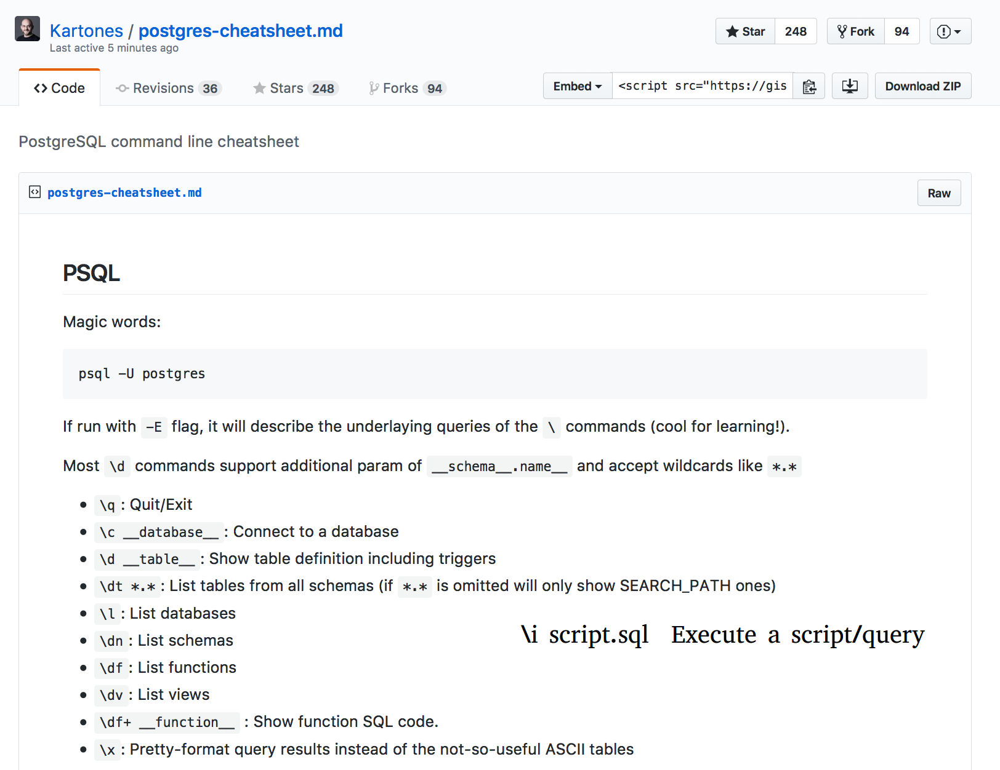

[TOC]

# Data Storage

* [row-stores vs columnar-stores](https://medium.com/bluecore-engineering/deciding-between-row-and-columnar-stores-why-we-chose-both-3a675dab4087)

OLTP (online transactional processing)

OLAP (online analytical processing)

# SQL (Structured Query Language)

"An RDBMS (Relational Database Management System) is a database management system based on the relational model...,
which in turn is based on two mathematical branches: set theory and predicate logic" - *T-SQL Fundamentals | Itzik
Ben-Gan*

# Dialects

## MySQL

* In most SQL languages, schemas are "conceptually within" databases. **In MySQL, "...physically, a schema is synonymous
  with a database"** - [Documentation](https://dev.mysql.com/doc/refman/8.0/en/glossary.html#glos_schema)

##

# Useful Links

* [DBML](https://www.dbml.org/home/#intro)
* Entity-Relationship (ER) Diagram Tools:
    * [Option 1](https://dbdiagram.io/home)
    * [Option 2](https://erdplus.com/#/)

## Overview

ER diagrams allows one to visualize how a concept might map into a  RDBMS layout, or visualize an existing RDBMS layout.

**SQL is case and whitespace insensitive**

* DML = Data manipulation Language
    * Examples: `INSERT, UPDATE, DELETE` (sometimes SELECT)
* DDL = Data Definition Language
    * Examples: `CREATE, DROP, ALTER`
* When referencing an object in SQL, proper convention is to **explicitly** call the entire object (i.e.
  database_name.schema_name.table_name, etc)

## Querying

Basic structure:

```SQL
SELECT ...
FROM ...
JOIN ...
ON ...
WHERE ...
GROUP BY ...
HAVING ...
ORDER BY ...;
```

Logical processing order of a SQL query:

```SQL
FROM ...
ON ...
WHERE ...
GROUP BY ...
HAVING ...
SELECT ...
DISTINCT ...
ORDER BY ...
TOP(LIMIT, OFFSET, FETCH, etc) ...
```

### Strings

To return rows that match a certain string/character sequence:

```SQL
WHERE <COLUMN> LIKE '%b'
# return all observations that end with a 'b' (can have any
# characters preceding the 'b')
```
```SQL
WHERE <COLUMN> LIKE 'b%'
# return all o0bservations that start with a 'b' (can have any
# characters following the 'b')
```
```SQL
WHERE <COLUMN> LIKE '%b%'
# return all observations that contain a 'b' (can have any
# characters before or after the 'b')
```

### JOINS

* **LEFT (OUTER) JOIN** - Return all observations in the left table, along with the rows from the right table **that have a match in the left table.**

* **RIGHT (OUTER) JOIN** - Return all observations in the right table, along with the rows from the left table **that have a match in the right table.** (More commonly one will see a LEFT JOIN with the tables switched as opposed to a RIGHT JOIN)

* **INNER JOIN** -  Return observations where all information is present in both tables

* **FULL JOIN** - Return all observations from both tables, regardless of whether the information is present in the other table.

* **SELF JOIN** - When joining a table to itself, table aliases must be used along with the `JOIN` keyword.

    ```SQL
    SELECT alias_1.employee_id, alias_2.manager_id
    FROM table_1 alias_1
    JOIN table_2 alias_2
        ON alias_1.id = alias_2.id;
    ```
    Joining a table with itself is traditionally used when one wants to compare the values in one column to a value to another column **within the same table.**

## Database Management/Creation

## Stored Procedures

At its most basic, stored procedures are chunks of code that are saved (hence "stored") as objects in a SQL database.
They allow a user to execute that code without having to retype it every time they want to use it. (analogous to writing
functions in Python vs writing a script that can't be generalized to other tasks).

Stored procedures can be used to `INSERT, UPDATE, DELETE, SELECT` and are called with the `EXEC` statement (short for
execute):

```SQL
EXEC <stored_procedure_name>
```

To create a stored procedure:
```SQL
CREATE PROC <procedure_name>
AS
    <T-SQL code>
GO
```

To alter a stored procedure:
```SQL
ALTER PROC <procedure_name>
AS
    <T-SQL code>
GO
```

## SSMS (SQL Server Management Studio)

* Many table will start with 'dbo' - this is the default schema in SSMS
* Using a `TOP` clause (synonymous to `LIMIT` in PostgreSQL) allows you to not overload the system
* use `NOLOCK`
  * Ensures your queries have as little impact on other processes as possible.
  * The risk of running your query with `NOLOCK` is that you might get "dirty/phantom" reads (observations that are not
    yet *committed* to the database, but is in an indeterminate state of being inserted, updated or deleted)
  * Should be used primarily for ad-hoc queries, but not in development (NEVER use when updating or deleting
    observations from a table).
* Check the estimated query plan before executing your query
* Knowing the indexes a table has can be helpful in determining what columns to efficiently filter and sort on
* `ORDER BY` clauses restrict the performance of queries


**To connect to SSMS from the commmand line:**

    `Z: \> SQLCMD -S <server_instance>`

if you are connected the command prompt will change to:

    `1>`


### Execution Plans

**Execution Plan**: The result of the query optimizer's attempt to calculate the most efficient way to implement the
request represented by the T-SQL query you submitted. Execution plans are the **primary** means of troubleshooting an
inefficient query.

* The Query Optimizer parses your query and generates an execution plan (in binary) that is sent to the storage engine.
* Highlight a query and press CTRL + L (Windows) to view the execution plan
* The Query Optimizer determines the best exectution plan based on required CPU usage and I/)


## Resources

[PostgreSQL Practice](https://pgexercises.com/)


